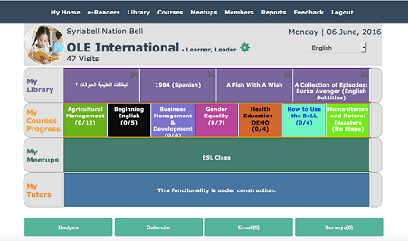

#Welcome! 

This is a MDwiki for our Virtual Interns program. Please feel free to explore and offer suggestions on our [gitter.im chat](https://gitter.im/open-learning-exchange/chat). If you are new, please go to the "First Steps" tab and select ["NEW Start Here"](pages/newfirststeps.md) to get going! We are available to help you via chat. 

Our Virtual Interns program is part of the software development strategy by [Open Learning Exchange](http://www.ole.org/) (OLÉ). We are a non-profit and for-purpose organization based in Cambridge, Massachusetts. We strive to provide universal quality education using open source materials and technology to address educational barriers.

