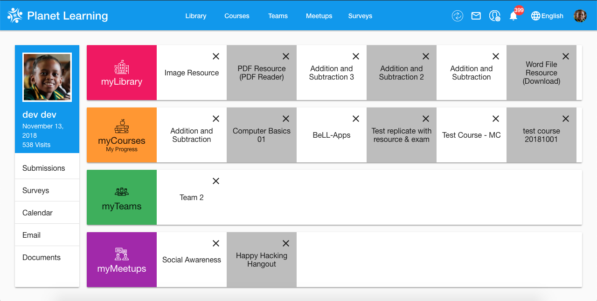

# Welcome!

This is a MDwiki for our for our support program. Please feel free to explore and offer suggestions on our [gitter.im chat](https://gitter.im/open-learning-exchange/chat).

The support program is divided into several parts to meet the needs of different users including those participating in our Virtual Intern program and Tech Genius' who are supporting our product in the field. If you are a new Virtual Intern or a new Tech Genius please go to the "First Steps" tab and select ["Start Here"](pages/vi/vi-first-steps.md) to get started! Please remember that many people are available to help you via chat.

The [Open Learning Exchange](http://www.ole.org/) is a social benefit and for-purpose organization based in Cambridge, Massachusetts. Our mission is to provide universal quality education using open source materials and technology to over come educational barriers. More specifically, Planet (formerly known as the Basic E-Learning Library/BeLL system). To learn more about how it works, check out the [Planet User Manual](pages/techgenius/tg-planet-user-manual.md).

