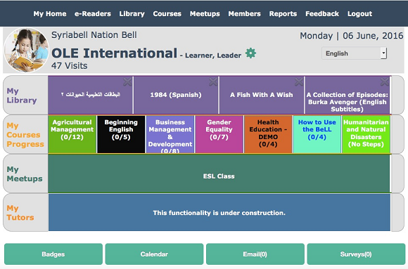

#Welcome!

This is a MDwiki for our **Virtual Interns program**, **Volunteers program** ,**Tech geniuses** and **Users**. Please feel free to explore and offer suggestions on our [gitter.im chat](https://gitter.im/open-learning-exchange/chat). We are available to help you via chat.
If you are new, please goto "First Steps" tab and select ["Start"](pages/firststeps.md ) to get going and for new Users select ["planetusermanual."](pages/planetusermanual.md )   
Our Virtual Interns program is part of the software development strategy by [Open Learning Exchange](http://www.ole.org/) (OLÉ). We are a non-profit and for-purpose organization based in Cambridge, Massachusetts. We strive to provide universal quality education using open source materials and technology to address educational barriers. The Open Learning Exchange (OLE) envisions a world in which every person has open and unfettered access to those learning resources they need in order to flourish to the very best of their abilities. OLE's mission is to ensure learning for all - not only universal basic literacy and numeracy but also vital knowledge and skills concerning health, nutrition, work, community and the peaceful management of our differences.