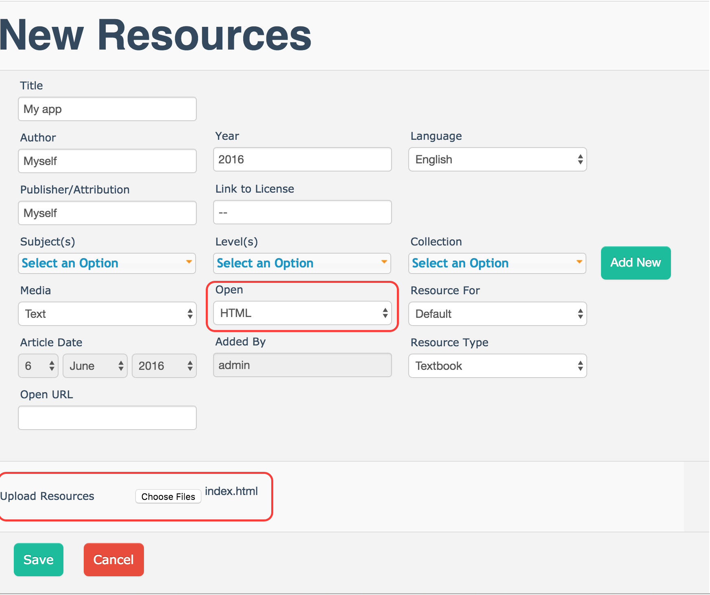
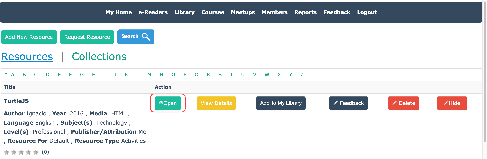
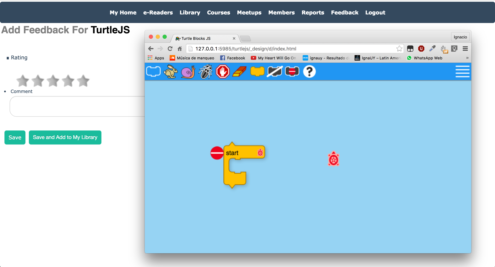

## Porting HTML App to CouchApp

Prerequisites:

* [Couchapp](#couchapp-installation)
* [Couchdb Instance](#couchdb-instance)
* Desired JavaScript/HTML application


### Couchapp Installation
Clone the [couchapp repository](https://github.com/couchapp/couchapp.git), build and install it. With the following commands (from a terminal):

```
git clone https://github.com/couchapp/couchapp.git 
cd couchapp
python setup.py build
sudo python setup.py install
```

### Couchdb Instance
Using the SimpleInstall script done by Group C, you should be able to get a working CouchDB instance

### Generating the couchapp
Using `couchapp generate` command you will be able to generate the structure of a couchapp, but first, you need to create a folder with the app name and then, access to it.

```
$ mkdir test
$ cd test
$ couchapp generate test
```

In this case I will generate the app called *"test"*

```
$ couchapp generate test
[WARNING] "genrate app" will be deprecated in future release. Please use "init -t TEMPLATE" instead.
[INFO] /Users/ignacio/Desktop/ole/test created.
```


After you run it, you will need to edit the file `.couchapprc` in order to add the server path.

The file should be like the one shown below. In this file, `db` is the server path, in my case it is `http://127.0.0.1:5985`, followed by `testapp`. Where `testapp` is the database where I want to insert the app.

> The database name can only contain lowercase characters (a-z), digits (0-9), and any of the characters _, $, (, ), +, -, and / are allowed. It must begin with a letter.


```
{ 
    "env" : {
        "myserver" : {
            "db" : "http://127.0.0.1:5985/testapp"
        } 
    }
}
```

Also you can edit some fields, like `name` and `description`  in the file `couchapp.json`

```
{
    "name": "Test app",
    "description": "Testing couchapps"
}
```

### Adding content to the app and pushing it
Now that you have generated the app, you will need to add the original app data ~~(the one you're porting)~~ to `_attachments` folder. You may want to remove everything inside that folder before you add the new content. You can remove all items inside it and copy the data with the following terminal commands:

```
rm -rf _attachments/*
cp -r /home/user/myoriginalapp/* _attachments/
```

Now that you have done all those steps, you will need to upload the app to the server: `couchapp push myserver` where `myserver` is the one you specified in the `.couchapprc` file.

```
$ couchapp push myserver
[INFO] Visit your CouchApp here:
http://127.0.0.1:5985/testapp/_design/test/index.html
```

After this, The app will be available on the specified link. You should be able to see the database in http://127.0.0.1:5985/_utils/database.html?testapp

## Adding the app as resource to Bell App Library 
### Using redirect in index.html file
This is not really the best way to, but it works.<br>
Create a file: `index.html` with a redirect to the app

index.html content

```
<meta http-equiv="refresh" content="0; url="/testapp/_design/test/index.html*" />
```

If you forget the URL, you can push to server (couchapp push myserver) to get.
As you can see, the server path should not be written in the redirect.

Once you have this file, you need to add a [New Resource](http://127.0.0.1:5985/apps/_design/bell/MyApp/index.html#resource/add).

Set the `Open` parameter to HTML, and write the additional info required.
In `Upload Resources` section, you need to add your `index.html` previously created.



Then, save.

You will be able to open your app now, selecting it from `Library`.





### Uploading your app through Console as Resource
WIP

