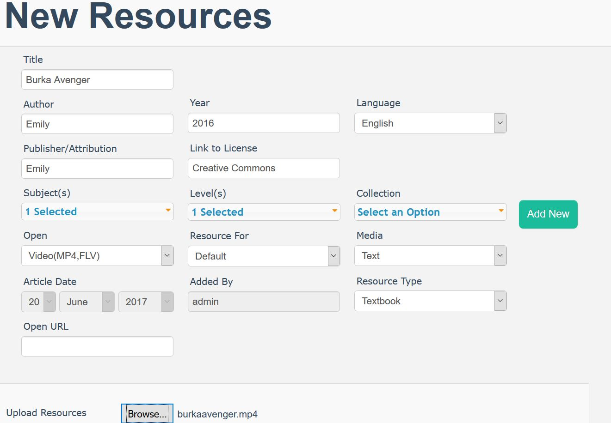
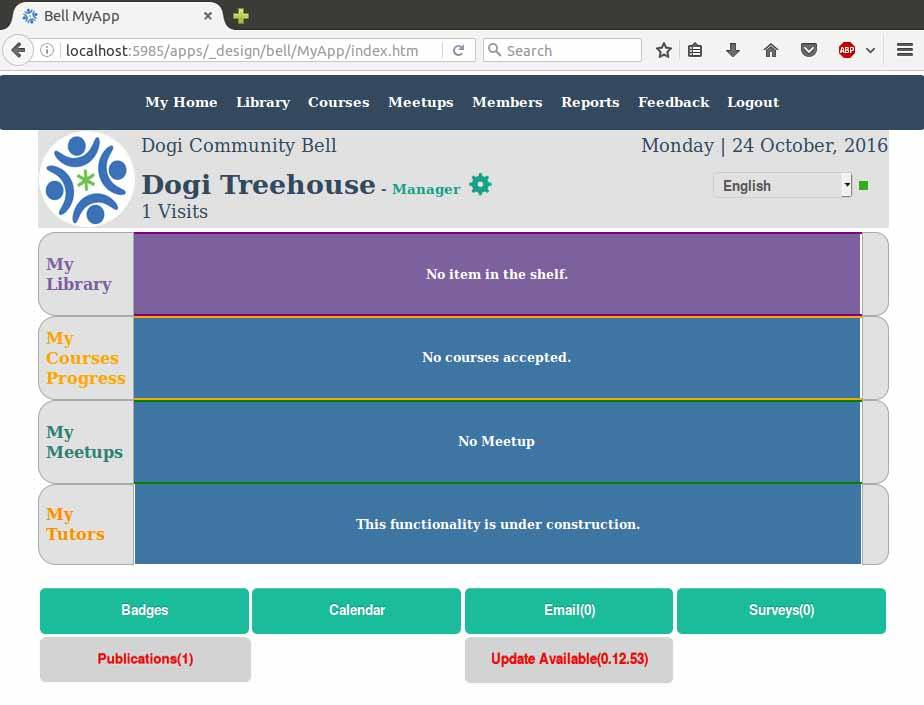

# BeLL-Apps: Communities and Nations
## Objectives
* Understand how the BeLL-Apps interface is structured
* Add resources to your Community in order to get accustomed to the BeLL-Apps interface
  
After submitting your configurations in step 1, you should be registered by now. Open the main dashboard of the BeLL.

Watch the videos below to learn the basic functions of your BeLL. These videos are a little old as they were created 2 years ago, but they should do a decent job of orienting you to the BeLL.   

[My Dashboard Video](uploads/movies/mydashboard.mp4)

[Library](uploads/movies/library.mp4)

[Feedback](uploads/movies/feedback.mp4)

[Generating Activity Reports](uploads/movies/generatingactivityreports.mp4)

We advise you to play around a bit, as well. Try to explore and feel comfortable with the software, as you'll be using it quite a bit during your internship.

We also want you to practice uploading resources to the BeLL. Although there are several different kinds of resources, most of them are either PDFs, mp3s, or mp4s. We provided you with some resources (linked below) that you can download and then upload to your BeLL.

[Here is the first page of the PDF "Feelings"](uploads/pdf/feelings.pdf)
[Here is the song "Opposite Song"](uploads/music/oppositesong.mp3)
[Here is the video "Burka Avenger"](uploads/movies/burkaavenger.mp4)

Click on each one of these links and right-click to save them to your desktop.

From there, go to your Vagrant BeLL. Select `Library` from the dashboard and then select `Add a Resource`. You will then be prompted to go to this page:

Fill out the information, although as we are just doing this as a test, accuracy of information/source of content is not very important. Just be sure to put something, even if it is your name (as in the example above). The important thing is that you have something in all of the drop-down menus and that you choose the correct format for the `Open` menu (e.g., PDF, mp3, or mp4). Then, click on `Save`. You have now uploaded the resource. Next, you should find it and make sure that you can open it. Repeat the same process for all three resources.

>Do not forget to send the screenshot of your community configurations (from earlier when you registered your configurations) to our chat.

In case you forgot to take the screenshot of your configurations, go to http://127.0.0.1:5985/apps/_design/bell/MyApp/index.html, then click on manager, click on the configurations tab, take a screenshot of the page, and submit it to the Gitter chat.

## Different Kinds of Updates to Your Community
There are three other important kinds of updates that you receive on the community side: updates, publications, and surveys. 

As you can see from the image below, there is an update ready to be downloaded. Usually, next to the update, you should also see  publication(s) ready to be downloaded.

First, click the "Update Available" button and it will reload your homepage with a successful update message. An update refers to a new software update which improves the software. Next, click on "Publications", under the Manager page, and sync the publications. Publications add new resources or courses to your library. Last, repeat the process of sending an activities sync to the nation.

**NOTE**: If there is an "internet connection" error when you click the "Update Available" button, change your browser to Firefox or Chrome.

## Take the Course
We developed a course for aspiring virtual interns so that we could test the software used to build courses and find bugs/things to improve. It is your job to take the course and find out what needs to be fixed/improved from the student standpoint.

To get to Publications, click on "Manager" from the dashboard, then the publications button. Take the course and note things that don't work or could be improved upon in this [google doc](https://docs.google.com/document/d/1HgITKOW2uMKy1Ec_gKc6Zl6tsv-RkD2j7vzRgheLR7g/edit?usp=sharing).

## Useful Links

[Helpful links and videos](faq.md#Helpful_Links)

#### Return to [First Steps](firststeps.md)
