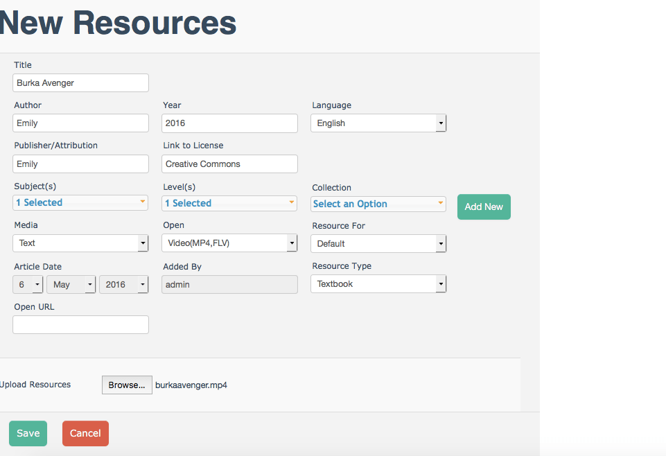

#BeLL-Apps: Community and Nation

The BeLL (Basic e-Learning Library) is not only a library, but also an individualized learning system, where students can select their own books and courses to target their individual goals. We have two kinds of BeLLs: nations and communities. In step 1, you already created a community on your system. Communities are how the BeLL functions via intranet, as users connect to a community using either a laptop or a RPi and a router. Communities connect and sync back to a larger nation which is used on the Internet. You can send materials and information between the communities and nations to complete our feedback loop.

As previously mentioned, you created a community (which we will now refer to as a Vagrant BeLL) on your system. 
To access your community, please follow the instructions for your system.

##MacOS(X) and Ubuntu
Please, check that your vagrant is up and running with `vagrant global-status`. Assuming that it's running or you launch it using `vagrant up`, open Firefox (please download if you don't already have it - it is VERY important that you always use the BeLL in Firefox to limit errors). Go to http://127.0.0.1:5985. You could also use http://localhost:5985, meaning that 127.0.0.1 refers to your machine. Both localhost:5985 and 127.0.0.1:5985 are interchangeable. Please, make sure to have the correct port number (5985), otherwise it will not work correctly.

Your first page will look like this:

##Windows
Please, double click on the MyBeLL icon on your desktop. It will open up a Firefox browser and show you the user interface (see below). 

##Database
[CouchDB](https://en.wikipedia.org/wiki/CouchDB) (also known as Apache CouchDB) is a database software that we use for the BeLL. You can see the backend interface of our CouchDB at http://127.0.0.1:5985/_utils. In _utils, you have the opportunity to see all of the software dev of your vagrant BeLL.

##User Interface
To see the actual user interface, go to http://127.0.0.1:5985/apps/_design/bell/MyApp/index.html. 
You will be shown the page below. Make sure you fill it out completely.

Next, you will need to fill out your configurations. Make sure you write your name all in lowercase letters and your code all in uppercase letters, as in the example below:

Please, note that your name and code must be the same and should correspond to your GitHub username. 
This is because we should be able to know who owns each community from the nation side. 
Also, make sure you pick the correct nation, Virtual Intern Nation (vi).
After you finished filling out your configurations, remember to take a screenshot of the configuration page. 
Then, click on the **"Register"** button and you will receive a confirmation that your community has been successfully registered (see below).

Then, post to the Gitter chat the screenshot you took earlier, so an admin can accept your registration request.
When your registration request will be accepted from the nation side, as long as you are logged in and online, you will see the following message.

  

After submitting your configurations, you will be able to see the main dashboard of the BeLL. 

Please, watch the videos below to learn the basic functions of your BeLL. These videos are a little old as they were created 2 years ago, but they should do a decent job of orienting you to the BeLL.   

[My Dashboard Video](uploads/movies/mydashboard.mp4)

[Library](uploads/movies/library.mp4)

[Feedback](uploads/movies/feedback.mp4)

[Generating Activity Reports](uploads/movies/generatingactivityreports.mp4)

We advise you to play around a bit, as well. Please, try to explore and feel comfortable with the software, as you'll be using it quite a bit during your internship.

We also want you to practice uploading resources to the BeLL. Although there are several different kinds of resources, most of them are either PDFs, mp3s, or mp4s. We provided you with some resources (linked below) that you can download and then upload to your BeLL.

[Here is the first page of the PDF "Feelings"](uploads/pdf/feelings.pdf)
[Here is the song "Opposite Song"](uploads/music/oppositesong.mp3)
[Here is the video "Burka Avenger"](uploads/movies/burkaavenger.mp4)

Please, click on each one of these links and right-click to save them to your desktop.

From there, go to your Vagrant BeLL. Select `Library` from the dashboard and then select `Add a Resource`. You will then be prompted to go to this page:

Fill out the information, although as we are just doing this as a test, accuracy of information/source of content is not very important. Just be sure to put something, even if it is your name (as in the example above). The important thing is that you have something in all of the drop-down menus and that you choose the correct format for the `Open` menu (e.g., PDF, mp3, or mp4). Then, click on `Save`. You have now uploaded the resource. Next, you should find it and make sure that you can open it. Please, repeat the same process for all three resources.

>Please do not forget to send the screenshot of your community configurations (from earlier when you registered your configurations) to our chat.

In case you forgot to take the screenshot of your configurations, go to http://127.0.0.1:5985/apps/_design/bell/MyApp/index.html, then click on manager, click on the configurations tab, take a screenshot of the page, and submit it to the Gitter chat.

##Useful Links

[Helpful links and videos](faq.md#Helpful_Links)

####Return to [First Steps](firststeps.md)
