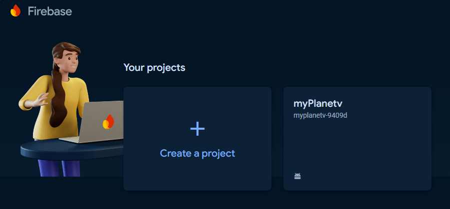
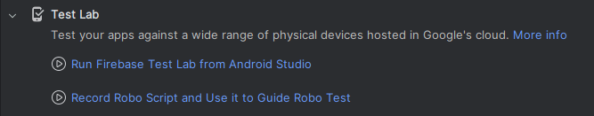
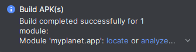
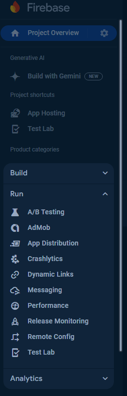
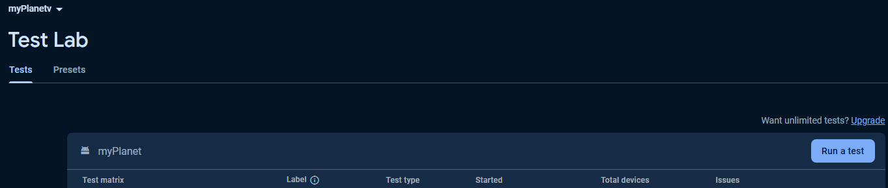
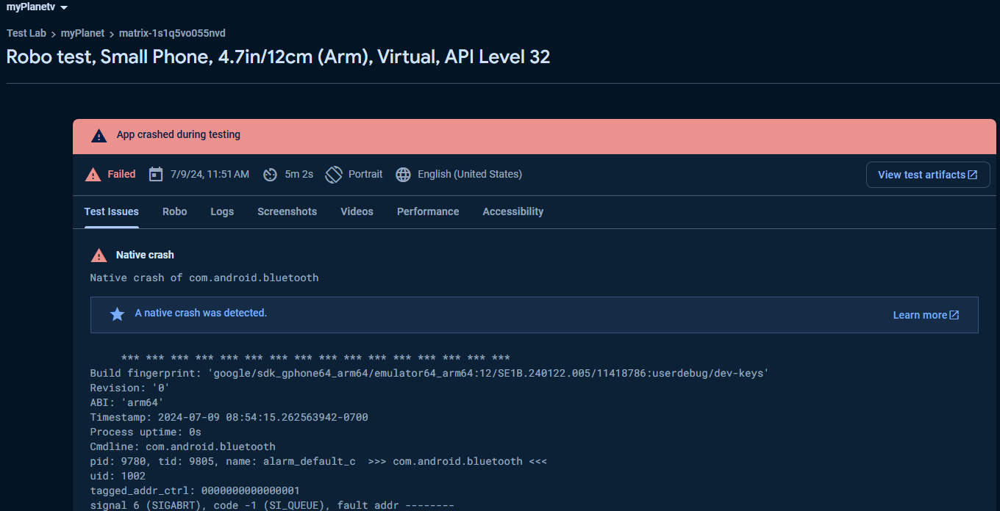

# A Guide to Using RoboScripts
August 20, 2024 • [strawberrybread](https://github.com/strawberrybread)

## Introduction

In the rapidly evolving world of Android development, automation is key to maintaining efficiency and productivity. RoboScripts, combined with Android Studio and Firebase, provide a powerful way to automate tasks, streamline testing, and manage backend services. This guide will walk you through the process of setting up and using RoboScripts within your Android development environment, integrating seamlessly with Firebase for enhanced app functionality.

### What are RoboScripts?

RoboScripts are automated scripts designed to perform repetitive tasks within Android applications. They can be used for a variety of purposes, such as automated UI testing, data seeding in Firebase, or continuous integration tasks. RoboScripts help developers save time, reduce manual errors, and ensure consistency across development and testing environments.

## Setting Up Your Environment

### Step 1: Setting Up Firebase in Your Android Project

1.  **Create a Firebase Project**:
    
    -  Visit the [Firebase](https://firebase.google.com/) website and create an account.
    - Go to the Firebase Console.
    - Click "Add Project" and follow the setup instructions.

    
    
2.  **Add Firebase to Your Android App**:
    
    -   In the Firebase console, select your project and navigate to the "Project Settings."
    -   Click "Add App" and choose Android. 

## Creating Robo Scripts and APKs

1.  **Create a new Robo Script**:
    
    - In Android Studio, navigate to `Tools` and select `Firebase`. 
    - Expand the `Test Lab` dropdown and select `Record Robo Script...`

    

    - For `myPlanet` app you want to create a basic script that is able to log into the app. Any further actions will result in the test failing.

2. **Download APK**:
	- Navigate to `Build`, select `Build App Bundle(s) / APK(s)`, select `Build APK(s)`
	- An alert will popup when the build is finished. Select `locate` in the alert to bring up the file location of the APK.

    

## Running Robo Scripts
	
1. **Navigate to Test Lab**:
	- Select the project you created earlier.
	- Expand the `Run` tab in the left toolbar and select `Test Lab`.

    

2. **Run a new test**:
	- Click on `Run a Test` and select `Robo` from the dropdown list.

    

	- Upload the APK and robo script you created earlier and select continue.
	- Select `Customize` and choose what devices you would like to run the test with. Keep in mind Firebase has a daily quota of 5 physical and 10 virtual device test executions per account.
	- Finally, you can select `Start` to begin the test(s).

3. **Reviewing Robo Script Tests**:
	- Navigate back to the `Test Lab` page and select the test result you want to view
	- From here you can view test issues, logs, video recording/screenshots of the test, accessibilitiy issues, and more.

    
