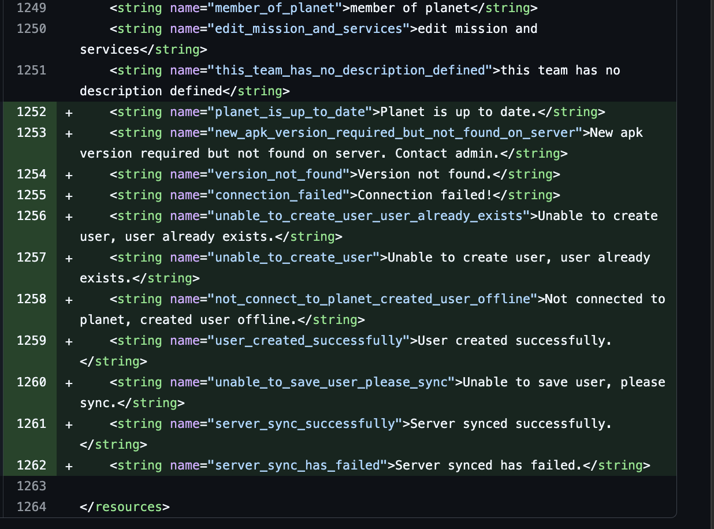
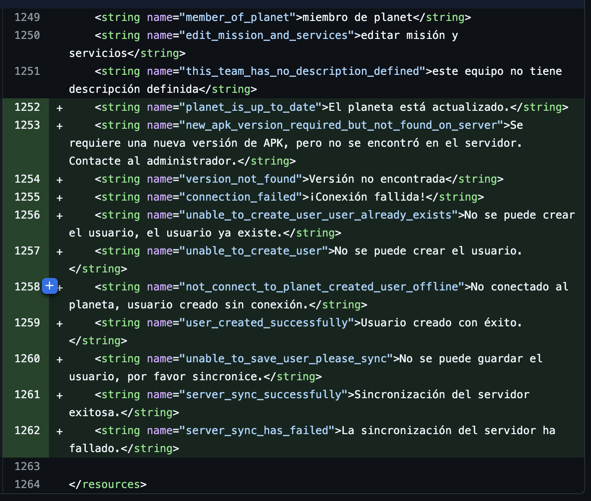

# Translation Guide for MyPlanet
April 25, 2025 • [huitk](https://github.com/huitk)

In myPlanet Android Application, six languages are supported. It is important to ensure that all strings are translated into these six languages whenever new strings are added. The supported languages and their corresponding resource files are:

    English in res/values/strings.xml
    Arabic in res/values-ar/strings.xml
    French in res/values-fr/strings.xml
    Nepali in res/values-ne/strings.xml 
    Somali in res/values-so/strings.xml 
    Spanish in res/values-es/strings.xml

## How to translate
How to translate

When you create a string for example, 
`callback.onError(“planet is up to date”)`. 
This string is currently compatible with only one language, English. To make the application support all six languages, you need to:

- Translate each string using chapGPT or any translator you have.
- Add the translated strings to each string.xml file for the six languages.
- Make sure that the translations are on the same line number across all language files. For example, in English:
`<string name="planet_is_up_to_date">Planet is up to date.</string>` appears on line 1252. The translations for the other five languages should also be placed on line 1252 in their respective files.

  
  

