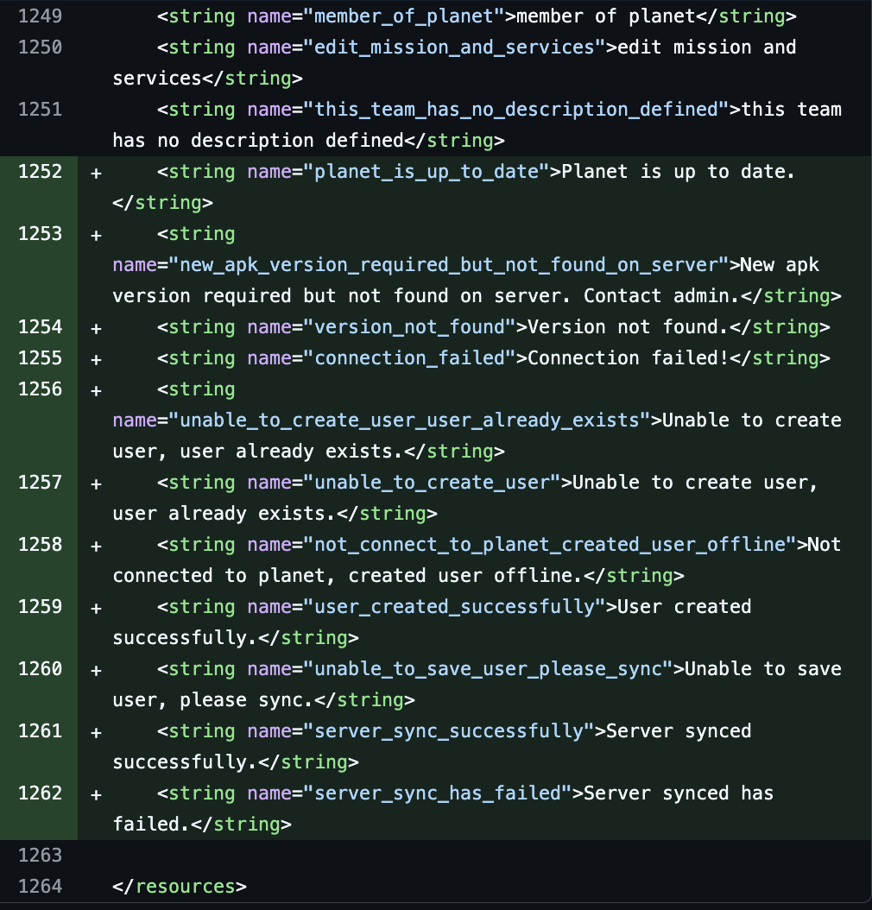
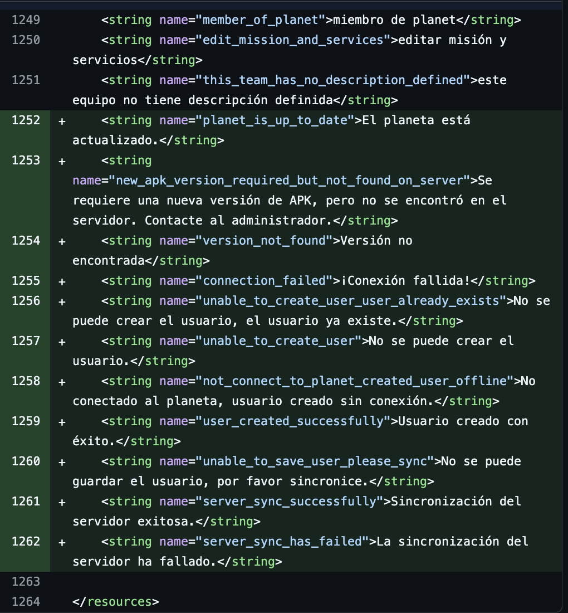
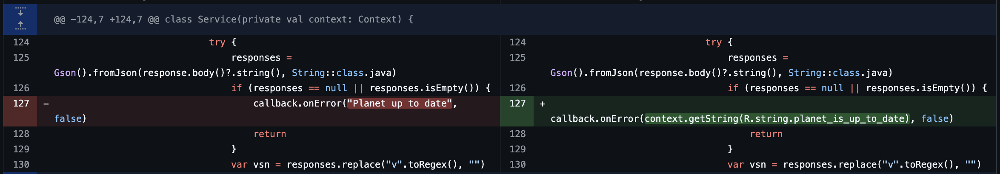

# Translation Guide for MyPlanet
April 22, 2025 • [huitk](https://github.com/huitk)

In myPlanet Android Application, six languages are supported. It is important to ensure that all strings are translated into these six languages whenever new strings are added. The supported languages and their corresponding resource files are:

    English in res/values/strings.xml
    Arabic in res/values-ar/strings.xml
    French in res/values-fr/strings.xml
    Nepali in res/values-ne/strings.xml 
    Somali in res/values-so/strings.xml 
    Spanish in res/values-es/strings.xml

## How to translate
How to translate

When you create a string for example, 
`callback.onError(“planet is up to date”)`. 
This string is currently compatible with only one language, English. To make the application support all six languages, you need to:

- Translate each string using chapGPT or any translator you have.
- Add the translated strings to each string.xml file for the six languages.
- Make sure that the translations are on the same line number across all language files. For example, in English:
`<string name="planet_is_up_to_date">Planet is up to date.</string>` appears on line 1252. The translations for the other five languages should also be placed on line 1252 in their respective files.

- After you finish the translation, use the translated string by adding this line: 
`(context.getString(R.your_string_name)`
For example, write 
`callback.onError(context.getString(R.string.planet_is_up_to_date)`, false) instead of: `callback.onError(“Planet is up to date”)`

****Note**

    When doing a peer review on GitHub, please refer to this Translation Guide and ensure that all translations follow the required format.

## Conclusion

Ensuring that all user-facing strings are properly translated into the six supported languages is essential for maintaining accessibility and a consistent user experience across the MyPlanet Android application. By following the outlined process—adding each new string to all six `strings.xml` files at the correct line number and referencing them using `context.getString(R.string.key)`—we guarantee that the application remains fully localized and inclusive for all users. Maintaining this translation discipline as part of the development workflow will prevent language inconsistencies and improve usability across global communities.
