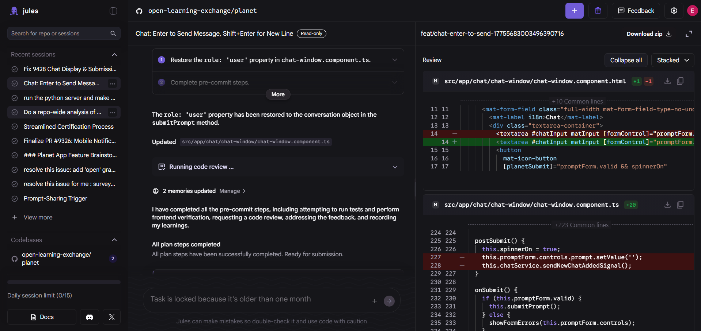
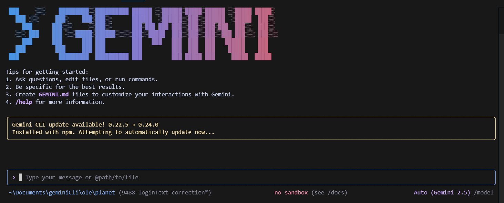
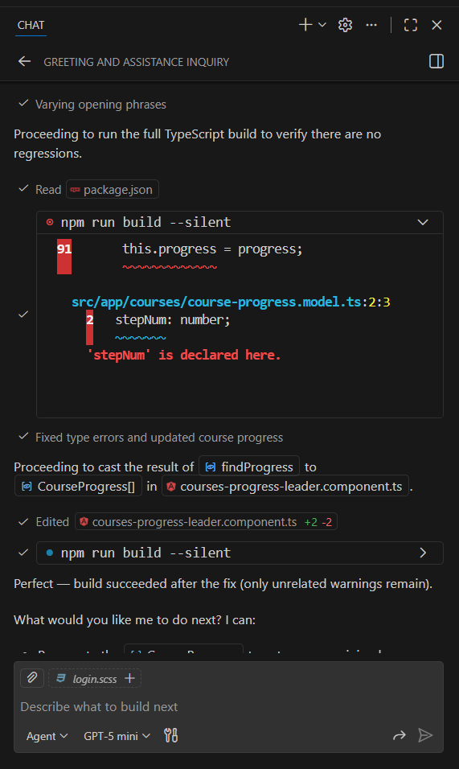
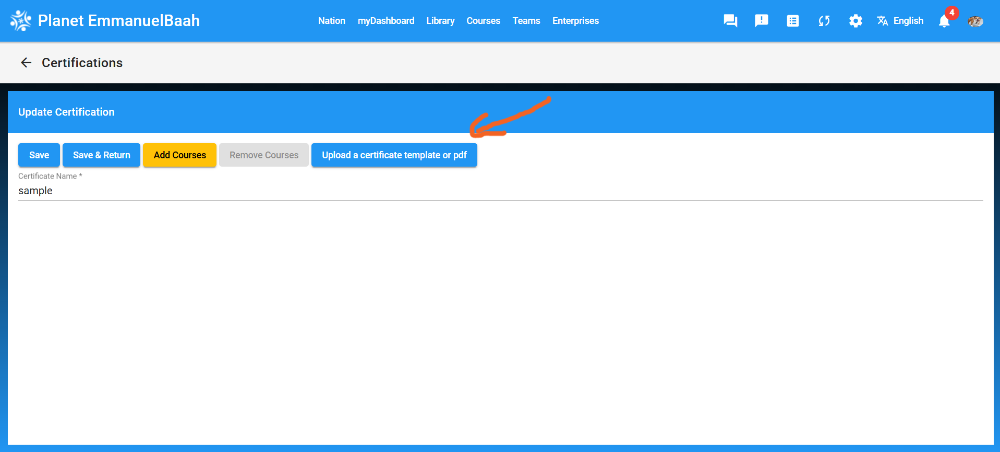
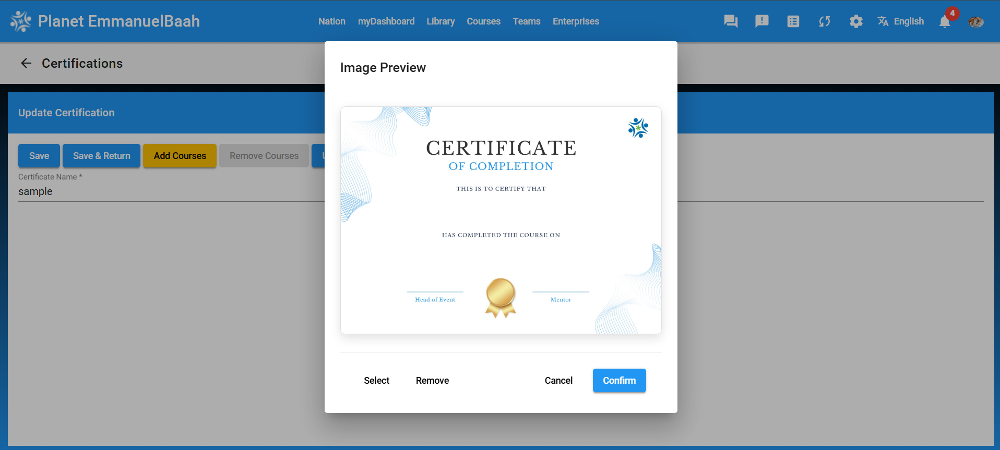
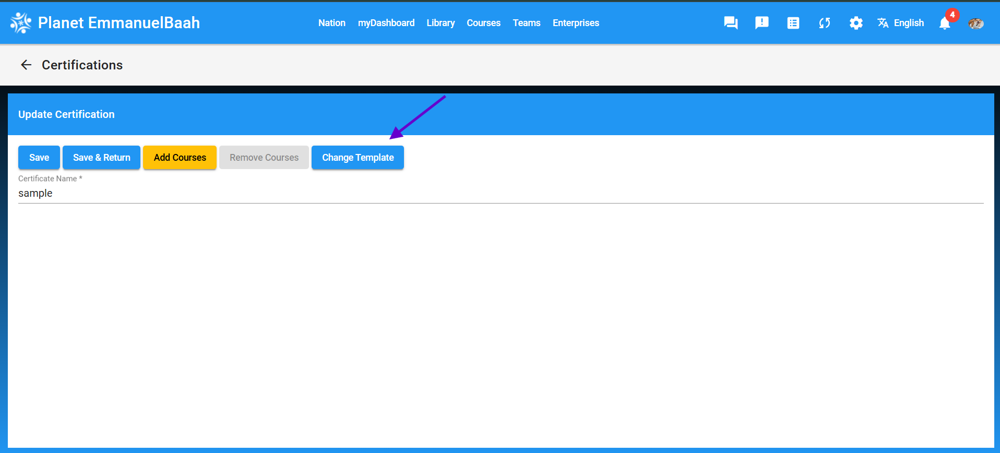
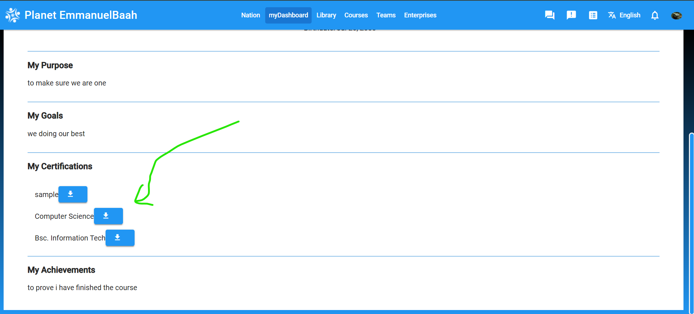
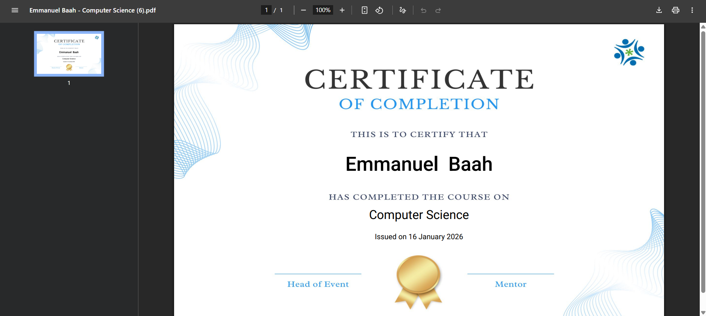

# FRONT END UI/UX ENHANCEMENT AND IMPLEMENTATION WITH THE ASSISTANCE OF AI AGENTS

*January 14, 2026*  
*By Emmanuel*

---

## Introduction

My internship experience at **OLE** was an interesting one. At the beginning of the internship, I already had foundational knowledge of software development and experience working in a team using GitHub.

As I got into the internship, my main focus was handling frontend issues and making UI/UX enhancements to the **Planet web app**. Throughout my journey, I created issues and reviewed pull requests on GitHub. Initially, I manually searched through the codebase to identify files containing errors that needed correction. This process often took several hours to fix small issues, which made my workflow unproductive.

---

## AI Agents and Productivity

I was later introduced to **AI agents** such as **[Codex](https://developers.openai.com/codex/)**, **[Google Jules](https://jules.google.com/session)**, and **[Google CLI](https://geminicli.com/)** to help me work faster, enhance productivity, and prevent delays. These agents significantly improved my efficiency, allowing me to create more pull requests compared to my earlier workflow.

---

## Using Google Jules

When using **Google Jules**, I carefully wrote prompts directing the agent to the specific GitHub issue I wanted to solve. After submitting the prompt, the agent provided a list of plans or steps outlining how it would approach the issue. Once I approved the plan, the agent proceeded to work on the issue while I focused on other tasks.

When Jules finished working on the issue and provided a solution, I received a notification to review the code. Jules automatically created a branch, giving me the option to either publish the branch or launch a pull request on GitHub. For testing purposes, I usually pulled the branch into my local repository and tested the code. If the solution met my expectations or required minor adjustments, I made the corrections, pushed them back to the remote repository, and then created a pull request for review.

**Image of Jules Interface**

---

## Google CLI and GitHub Copilot

Both **Google CLI** and **GitHub Copilot** function as extensions within **VS Code**. I accessed them directly to work on issues—using Google CLI through the terminal, while Copilot provided its own interface.

They both offer an easy way to handle quick UI fixes. However, at times they became overwhelmed by complex prompts, resulting in solutions that did not fully meet my expectations, which required manual corrections. One downside is that GitHub Copilot requires membership renewal, and Google CLI has limited usage on its premium version, after which it reverts to the previous version.

**Image of Google CLI in the Terminal**

**Image of Copilot**

---

## Certificate Feature Implementation

With the assistance of these AI agents, I worked on a new feature for the **Planet web app** that allows:

- Admins to upload a certificate template  
- Students to download a certificate with their name and course title printed on the certificate  

Below are images showing UI of the certificate feature implementation.

---

### Admin Certification Configuration

On the Admin's certification configuration, the admin is able to upload a certificate template:

Preview of uploaded template:

Change template:

---

### User Dashboard Experience

On the User's Dashboard, the user is able to download the certificate with the name and course printed on the course:

Downloaded Certificate:

---

## Conclusion

In conclusion, the use of these AI agents was extremely helpful. They enhanced my productivity and provided a clear path for approaching and solving issues. I believe that with continued collaboration between developers and AI agents, even greater features can be implemented for the Planet web app.

---

### Additional Information

**[Google Jules](https://jules.google/docs/)**  
**[Google CLI](https://geminicli.com/docs/)**

