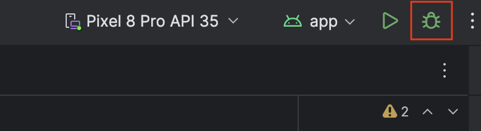
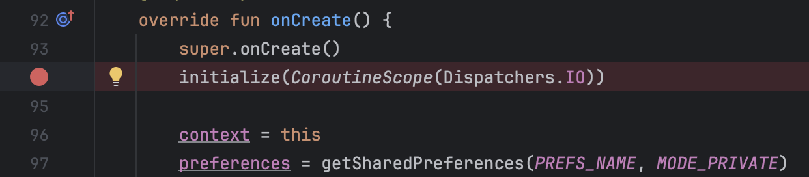
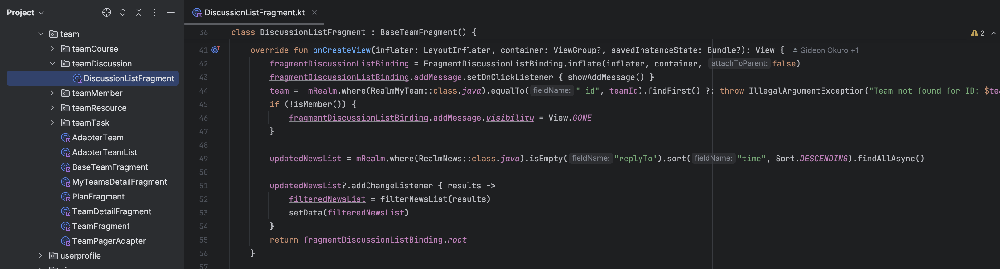
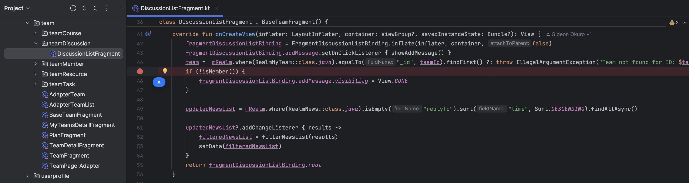
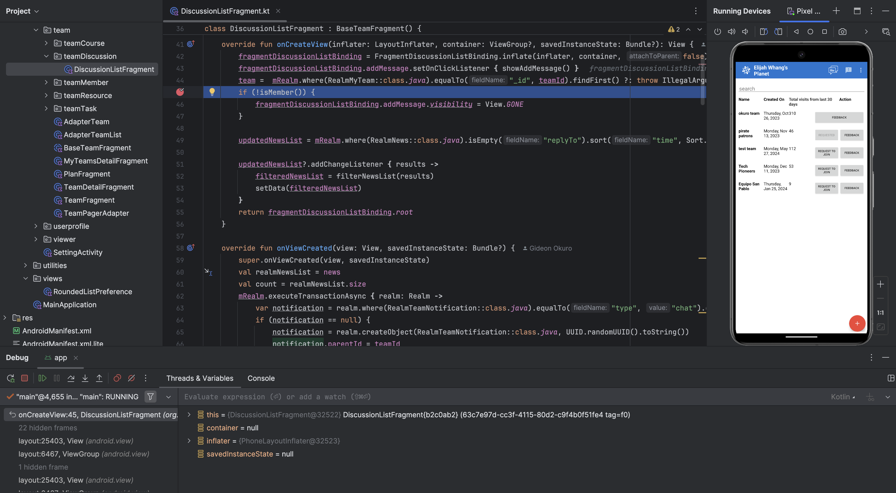
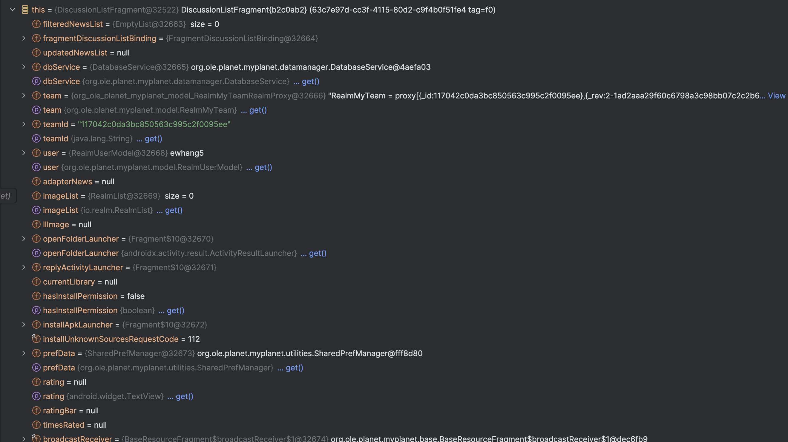
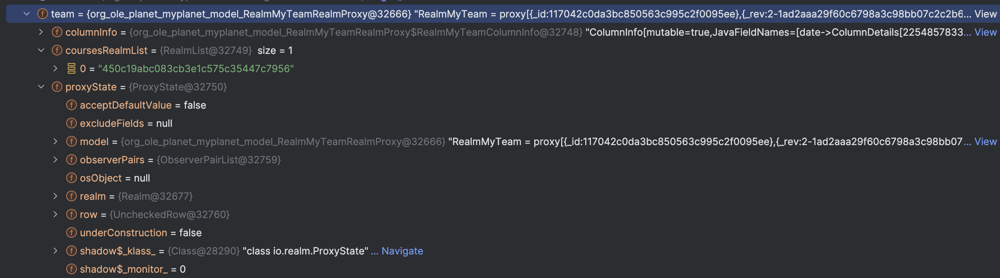
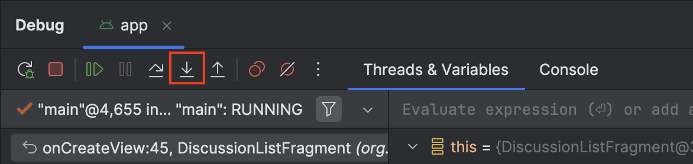
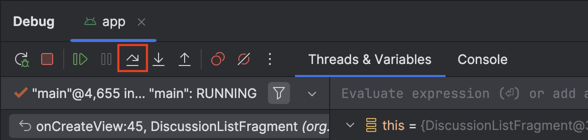
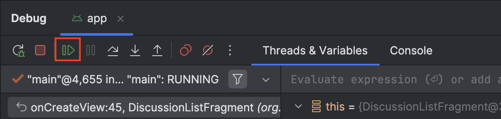

# Utilizing the Android Debugger
August 5, 2018 • [ewhang5](https://github.com/ewhang5)

The debugger is a powerful but often underutilized tool that helps in identifying issues and observing the step-by-step execution of a program. To use the debugger, click the button shown below.

This button will run as a normal emulator until it encounters a breakpoint. A breakpoint is an intentional stopping or pausing place in a program, set for debugging purposes. To set a breakpoint, simply click on the line number on the side, and it will be replaced with a breakpoint.

To demonstrate the thought process behind using the debugger, I will walk through an example. In this example, the goal is to allow only team members to add messages to a team. I have found the following method inside of ‘DiscussionListFragment’ that handles the view of the chat area for a team.

Since I want to debug the functionality of this method, I will set a breakpoint at the following line, which seems to handle differentiating between members and non-members.

When running the code through the debugger, it pauses once it reaches this breakpoint (which happens right before the chat window in a team is opened).

At this point, the debugger provides several options. First, you can check the variables in your code. This is useful to ensure that certain variables have the correct values. By clicking on the arrows next to each variable, you can also expand and see more detailed information.

Next, you can step into functions. If you look at the line we are stopped at, it calls another method, ‘isMember()’. By clicking the button below, you can step into the method and see its functionality performed step-by-step.

To progress the code step-by-step, the step over button allows you to move on to the next line of code. This lets you carefully check variables values and ensure that each line runs as expected.

Finally, you can continue running the debugger. This will bypass the current paused stage and continue until hitting another breakpoint. In most cases, this will unpause your emulator and allow you to continue navigating the app.

I hope this gives a good overview of how to utilize the debugger! During my time with Open Learning Exchange, this tool significantly helped me make progress and resolve various bugs I was stuck on.