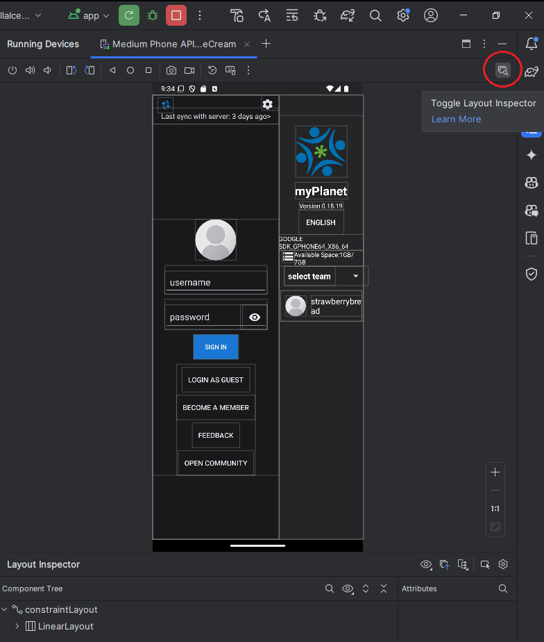
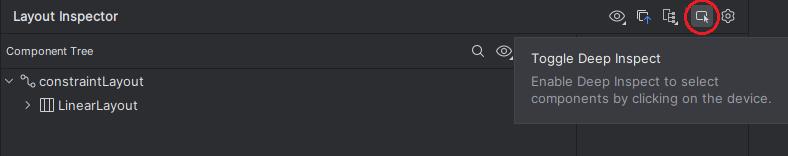
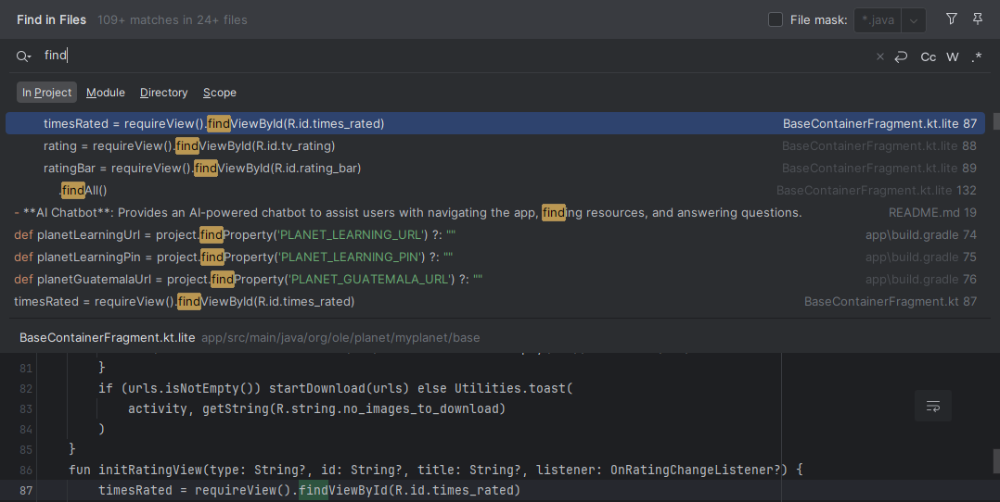

# Navigating the Codebase for Issue Resolution
August 20, 2024 • [strawberrybread](https://github.com/strawberrybread)

As you embark on your journey with OLE, one of the first challenges you'll face is getting familiar with the codebase. Don’t worry—this is a process that can take months, so you won’t be expected to know where everything is right away. However, this does present some difficulties, especially when tackling your first few issues. In this guide, I hope to share some tips that were immensely helpful to me when I was in your shoes.

## Layout Inspector

### Navigating the Codebase with Layout Inspector

The Layout Inspector in Android Studio is more than just a debugging tool—it's a powerful ally in understanding and navigating your app's codebase. By providing a visual representation of your UI's hierarchy, it helps bridge the gap between the code and what you see on the screen, making it easier to find and modify the relevant parts of your codebase.

### Benefits of the Layout Inspector for Codebase Navigation

-   **Visual to Code Mapping**: The Layout Inspector allows you to click on any UI element and see its associated XML or Kotlin/Java code. This makes it easy to locate the exact lines of code that define a particular view, which is especially helpful when dealing with complex layouts or unfamiliar code.
    
-   **Hierarchy Exploration**: By visually inspecting the hierarchy of your UI, you can quickly identify which parts of the codebase are responsible for certain sections of the layout. This helps you navigate through nested ViewGroups and fragments more efficiently, reducing the time spent searching for the right files or classes.
    
-   **Attribute Identification**: When you select an element in the Layout Inspector, you can instantly see its attributes, such as layout width, height, padding, and margin. Knowing which attributes are applied to a view can guide you to the relevant styles, themes, or XML files in your codebase.
    

### Deep Inspect

#### Navigating Code with Deep Inspect

Deep Inspect takes the capabilities of the Layout Inspector to the next level by allowing you to dig deeper into how each view is constructed and rendered. This is particularly useful when you need to understand the underlying code that affects the appearance and behavior of your UI.

#### Benefits of Deep Inspect for Codebase Navigation

-   **Detailed View Analysis**: With Deep Inspect, you can see the inner workings of complex views and custom components. This detailed analysis helps you trace back to the exact parts of the codebase where these components are defined or customized, saving you from sifting through numerous files.
    
-   **Component Relationships**: Deep Inspect shows you how different UI components relate to each other within the hierarchy. Understanding these relationships can help you navigate to the specific fragments, activities, or layout files where these components interact, providing a clearer path through the codebase.
    
-   **Efficient Debugging and Code Understanding**: When a view isn't displaying as expected, Deep Inspect can help you pinpoint the exact lines of code or resources that need adjustment. This targeted approach reduces the time spent exploring the codebase and helps you focus on the most relevant parts.
    

### How to Use Layout Inspector and Deep Inspect for Code Navigation

-   **Toggle Layout Inspector**: Activate the Layout Inspector from Android Studio while your app is running to see a real-time, interactive view of your UI. Clicking on any element in the Layout Inspector will highlight the corresponding code, allowing you to jump directly to the file and line of code responsible for that element. You can find more documentation on this tool [here](https://developer.android.com/develop/ui/compose/tooling/layout-inspector).
    
-   **Toggle Deep Inspect**: Use the Deep Inspect feature within the Layout Inspector to gain deeper insights into complex views. This can guide you through the codebase, from high-level layout files down to the specific implementations of custom views or interactions.

### Why These Tools Are Essential for Navigating the Codebase

The Layout Inspector and Deep Inspect tools are invaluable for developers who need to quickly and effectively navigate a large or complex codebase. They provide a clear visual connection between the app’s UI and the underlying code, allowing you to identify and locate the exact parts of the codebase responsible for each UI element. Whether you’re fixing bugs, optimizing layouts, or simply trying to understand how everything fits together, these tools streamline the process and help you navigate the codebase with confidence.

## Keyword Searches

### Efficient Codebase Navigation with "Find in Files..."

While the Layout Inspector and Deep Inspect tools are incredibly useful for understanding the UI and its associated code, there are times when you need to search for specific code elements or strings across the entire codebase. This is where Android Studio’s **"Find in Files…"** feature becomes indispensable.

#### Benefits of Using "Find in Files..."

-   **Quickly Locate Definitions and References**: If you’re working on a specific issue or feature, you can use keyword searches to find where certain variables, methods, or classes are defined and where they are used. This saves you from manually combing through files, allowing you to jump directly to the relevant code.
    
-   **Search Across All Files**: Unlike a regular search that might be limited to the current file, "Find in Files…" searches through all files in your project, including XML, Kotlin, Java, and even resource files like strings and colors. This is especially useful when you’re not sure where a particular piece of code or resource is located.
    
-   **Filtering Search Results**: The search results can be filtered by file type, scope (e.g., only in the current module, directory, or entire project), and even by case sensitivity or whole words. This flexibility allows you to narrow down your search to find exactly what you need with minimal effort.
    
-   **Navigating Multiple Matches**: When there are multiple matches for your keyword, "Find in Files…" displays them in a list, allowing you to browse through them quickly. This is useful when you're trying to understand how a piece of code is used throughout the project or when you're tracking down a bug that could be affecting multiple parts of the app.
    

### How to Use "Find in Files..."

1.  **Open "Find in Files…"**:
    
    -   You can open the "Find in Files…" dialog by pressing `Ctrl + Shift + F` (Windows/Linux) or `Cmd + Shift + F` (macOS). Alternatively, you can access it from the "Edit" menu under "Find."

2.  **Enter Your Search Keyword**:
    
    -   In the dialog box, enter the keyword you’re searching for. This could be anything from a method name (`updateUI()`), a specific string (`"Login successful"`), or even an XML attribute (`android:textColor`).

3.  **Set Search Options**:
    
    -   Use the options in the dialog to refine your search:
        -   **Scope**: Choose where to search—current file, directory, module, or the entire project.
        -   **File Mask**: Restrict the search to certain file types, like `.xml` or `.kt`.
        -   **Match Case**: Enable if you need the search to be case-sensitive.
        -   **Whole Words**: Use this option to search for whole words only, which is helpful for avoiding partial matches.
        
4.  **Review and Navigate Results**:
    
    -   The search results will appear in a panel at the bottom of the screen, showing you all the instances where the keyword was found. You can click on any result to jump directly to that part of the code.

### Why Use Keyword Searches?

Keyword searches are a fundamental technique for efficiently navigating the codebase. Whether you’re investigating how a feature is implemented, trying to understand how different parts of the code are connected, or looking for a specific string in resource files, "Find in Files…" enables you to quickly and effectively locate the information you need. This tool is particularly valuable when you're working on a codebase you're not fully familiar with, as it allows you to zero in on relevant parts of the code without needing to know the exact file or line in advance.

## Conclusion

Navigating a new codebase can feel daunting, especially when you're just starting out. However, with the right tools and strategies, you'll quickly find your footing and become more confident in your ability to tackle any issue that comes your way.

Remember, it’s normal to feel a bit lost in the codebase at first. Take your time to familiarize yourself with the project structure and use tools like the Layout Inspector, Deep Inspect, and "Find in Files…" to help you locate the code you need. These tools are designed to bridge the gap between what you see in the app and the underlying code, making it easier to understand how everything fits together.

As you dive deeper, keep in mind the importance of looking beyond the immediate file or class you're working on. Overlooking dependencies and imports can lead to misunderstandings and missed context, so always consider how different parts of the code interact with each other. Use Android Studio’s navigation features to explore related files and understand the full scope of the issue you're addressing.

Lastly, don't hesitate to ask for help when you need it. The learning curve can be steep, but with persistence and a willingness to explore, you'll soon find yourself navigating the codebase with ease. Welcome to the team, and happy coding!
