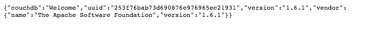
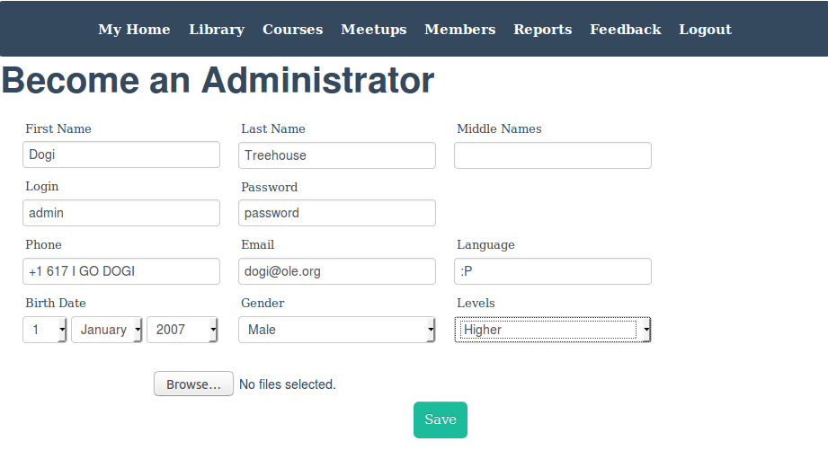
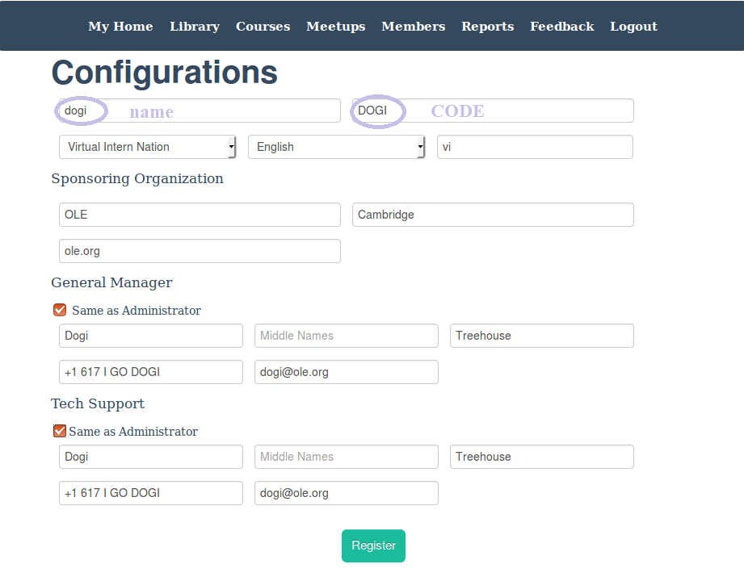
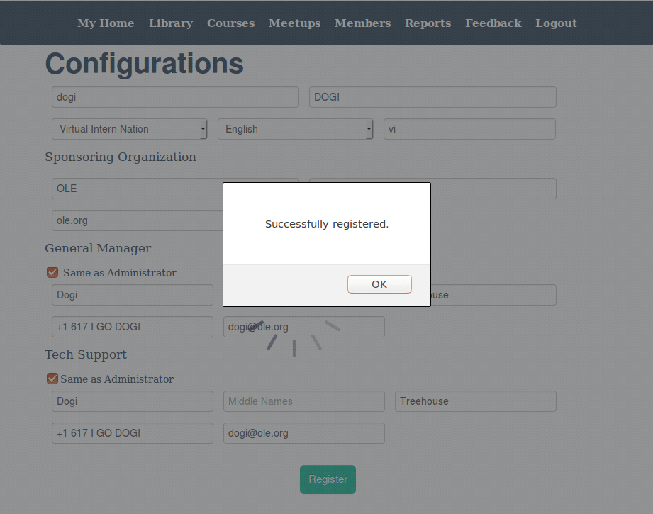
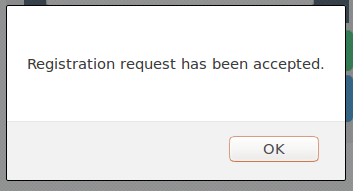

# Configurations

## Objectives
* Learn about BeLL-Apps and the difference between Nations and Communities
* Use Vagrant to create a local BeLL Community
* Register your Community and sync it with the Nation

## Introduction
The BeLL (Basic e-Learning Library) is not only a library, but also an individualized learning system, where students can select their own books and courses to target their individual goals. The two kinds of BeLL apps are described below.

#### BeLL Communities (Local)

* Communities are how the BeLL functions on a local network, with users connecting to a community using either a laptop or a RPi and a router.
* Periodically communities sync with Nations on the internet, which includes sending and receiving educational materials.
* In step 1 you created a BeLL community on your computer. As you follow the steps on this page, you will access and configure your community.

#### BeLL Nations (Internet)

* Nations are BeLL apps for the Internet, allowing communities to interact with each other.
* Nations are over a group of communities, and can run reports on any communities it owns.
* As you complete these instructions, an OLE administrator will complete the registration of your community with the Virtual Intern Nation.

## MacOS(X) and Ubuntu
Check that your vagrant is up and running with `vagrant global-status`. Assuming that it's running or you launch it using `vagrant up`, open Firefox (download if you don't already have it - it is VERY important that you always use the BeLL in Firefox to limit errors). Go to http://127.0.0.1:5985. You could also use http://localhost:5985, meaning that 127.0.0.1 refers to your machine. Both localhost:5985 and 127.0.0.1:5985 are interchangeable. Make sure to have the correct port number (5985), otherwise it will not work correctly.

Your first page will look like this:

## Windows
Double click on the MyBeLL icon on your desktop. It will open up a Firefox browser and show you the user interface (see below).  If you get an `Unable to connect` page, check it out at [FAQ](faq.md#Technical_Issues_and_Questions).

## Database
[CouchDB](https://en.wikipedia.org/wiki/CouchDB) (also known as Apache CouchDB) is a database software that we use for the BeLL. You can see the backend interface of our CouchDB at http://127.0.0.1:5985/_utils. In _utils, you have the opportunity to see all of the software dev of your vagrant BeLL.

## User Interface
To see the actual user interface, go to http://127.0.0.1:5985/apps/_design/bell/MyApp/index.html.
You will be shown the page below. Make sure you fill it out completely.

Next, fill out the configurations. Your name and code must be the same and should match your Github name. Write your `name` in lowercase and `code` in uppercase, and pick **Virtual Intern Nation (vi)** for nation as in the example below:

After filling out your configurations, remember to save a screenshot of the configuration page so that you can post it on the Gitter chat after submitting your registration request.

**Note:** *Adding images to Gitter is quite simple. Just drag and drop your screenshot from it's location on your computer to the chat and it will automatically upload.*

Then, click on the **"Register"** button and you will receive a confirmation that your community has been successfully registered (see below).

Then, post to the Gitter chat the screenshot you took earlier, so an admin can accept your registration request.
Your registration request will be accepted from the nation side (this may take a day or two depending on when dogi sees it). After this happens, once you are logged in and online, you will see the following message.

## Different Kinds of Updates to Your Community
There are three other important kinds of updates that you receive on the community side: updates, publications, and surveys. 

As you can see from the image below, there is an update ready to be downloaded. Usually, next to the update, you should also see  publication(s) ready to be downloaded.

First, click the "Update Available" button and it will reload your homepage with a successful update message. An update refers to a new software update which improves the software. Next, click on "Publications", under the Manager page, and sync the publications. Publications add new resources or courses to your library. Last, repeat the process of sending an activities sync to the nation.

**NOTE**: If there is an "internet connection" error when you click the "Update Available" button, change your browser to Firefox or Chrome.

## Take the Course
We developed a course for aspiring virtual interns so that we could test the software used to build courses and find bugs/things to improve. It is your job to take the course and find out what needs to be fixed/improved from the student standpoint.

To get to Publications, click on "Manager" from the dashboard, then the publications button. Take the course and note things that don't work or could be improved upon in this [google doc](https://docs.google.com/document/d/1HgITKOW2uMKy1Ec_gKc6Zl6tsv-RkD2j7vzRgheLR7g/edit?usp=sharing).