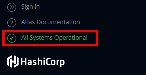
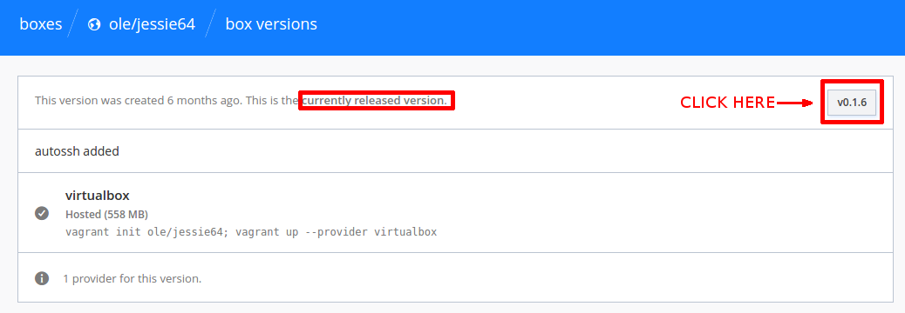

# FAQ

## General Internship Information
- **Q1: [What will I be working on during this internship?](faq.md#Q:_What_will_I_be_working_on_during_this_internship?)**
- **Q2: [What kind of software will we be using for this internship?](faq.md#Q:_What_kind_of_software_will_we_be_using_for_this_internship?)**
- **Q3: [Where can I find more information about this internship?](faq.md#Q:_Where_can_I_find_more_information_about_this_internship?)**
- **Q4: [What are the hours of the internship?](faq.md#Q:_What_are_the_hours_of_the_internship?)**
- **Q5: [Is this a paid internship?](faq.md#Q:_Is_this_a_paid_internship?)**
- **Q6: [What happens after the initial steps?](faq.md#Q:_What_happens_after_the_initial_steps?)**
- **Q7: [If I'm an international student, how soon can I get my paperwork required by my visa?](faq.md#Q:_If_I'm_an_international_student,_how_soon_can_I_get_my_paperwork_required_by_my_visa?)**
- **Q8: [How many pull requests and issues in total do I need to make to finish the steps?](faq.md#Q:_How_many_pull_requests_and_issues_in_total_do_I_need_to_make_to_finish_the_steps?)**
- **Q9: [How long do I have to complete these steps?](faq.md#Q:_How_long_do_I_have_to_complete_these_steps?)**

## Technical Issues and Questions
- **Q1: [What is the purpose of nations and communities, and how do they work together?](faq.md#Q:_What_is_the_purpose_of_nations_and_communities,_and_how_do_they_work_together?)**
- **Q2: [How can I enable the Virtualization in order to turn vagrant on?](faq.md#Q:_How_can_I_enable_the_Virtualization_in_order_to_turn_vagrant_on?)**
- **Q3: [Why is the "Submit" button not showing up when I try to submit my survey?](faq.md#Q:_Why_is_the_"Submit"_button_not_showing_up_when_I_try_to_submit_my_survey?)**
- **Q4: [Why does Firefox say “Unable to connect” when I try to load my community?](faq.md#Q:_Why_does_Firefox_say_“Unable_to_connect”_when_I_try_to_load_my_community?)**
- **Q5: [When I first run BeLL with the "vagrant up" command the download fails, why?](faq.md#Q:_When_I_first_run_BeLL_with_the_"vagrant_up"_command_the_download_fails,_why?)**
- **Q6: [I named my repo incorrectly by not naming it &lt;username&gt;.github.io, can I rename it or I need to delete it?](faq.md#Q:_I_named_my_repo_incorrectly_by_not_naming_it_&lt;username&gt;.github.io,_can_I_rename_it_or_I_need_to_delete_it?)**
- **Q7: [What do I do if I already have a github.io with my username?](faq.md#Q:_What_do_I_do_if_I_already_have_a_github.io_with_my_username?)**
- **Q8: [What do I do if I am on Unix/Mac/Linux and accidentally give root permissions, corrupting the installation of the vagrant vm?](faq.md#Q:_What_do_I_do_if_I_am_on_Unix/Mac/Linux_and_accidentally_give_root_permissions,_corrupting_the_installation_of_the_vagrant_vm?)**

#### Q: What will I be working on during this internship? 
OLE virtual interns will be helping develop OLE’s BeLL (Basic e-Learning Library) software. The BeLL is a virtual library that is deployed internationally to children in countries that typically do not have access to educational resources. 

#### Q: What kind of software will we be using for this internship?
As a part of this internship you will be working with software and languages including Git, GitHub, Gitter, Markdown, Vagrant, VirtualBox, Command Line/Terminal, Command Line/Terminal Scripts, Vim, CouchDB, Docker, HTML5, Javascript, and Node.js. 

#### Q: Where can I find more information about this internship?
More information about the internship can be found here: http://www.indeed.com/jobs?q=%22virtual+software+engineer+intern%22&l=Cambridge%2C+MA

#### Q: What are the hours of the internship?
This is an intensive internship that requires 16 hours of work each week. Work with your fellow interns and keep us updated in the [Gitter chat](https://gitter.im/open-learning-exchange/chat). 

#### Q: Is this a paid internship?
Unfortunately no. This position is unpaid, but it will provide a diverse range of experiences in the workplace. It can provide a certificate of completion, upon request. Also, academic credit can be provided through your institution (if applicable). 

#### Q: What happens after the initial steps?
The initial steps are meant to introduce potential interns to the OLE BeLL software and the process that we use to develop features and improve upon the BeLL. To be more clear: the initial 10 steps are a vetting process to determine whether or not people are fit for the internship, so consider it an interview for the internship. Once you have completed the 10 steps and are approved, you have officially joined the OLE interns team! We’ll add you to the interns Gitter chatroom and assign you to a team. You and your team will be working on an assignment, and we’ll switch up the assignments each week.

#### Q: If I'm an international student, how soon can I get my paperwork required by my visa?
After you finish the first 10 steps, let us know if you need us to sign some paperwork or provide you with an offer letter for your visa. Since the first 10 steps are a vetting process, your internship technically doesn't start until you finish them. Think of the first 10 steps as a continued application process as you are not working or adding to our organizational software, but rather showing that you have enough technical background to work with us. We are more than happy to speak to you about providing you with an offer letter or assisting with organizational information once you complete the 10 steps, but as you are not working with us until you are officially an intern, we cannot provide proof of working with us until you compete the first steps. 

#### Q: How many pull requests and issues in total do I need to make to finish the steps?
To finish the initial steps, you need to make a **minimum** of four issues and five pull requests so you can get familiar with GitHub and to show us that you can write proper issues/PRs. 

#### Q: How long do I have to complete these steps?
There is no official deadline, work on your own time. However, please note that most people who continued into the internship program completed the steps within 7-8 days.

#### Q: What is the purpose of nations and communities, and how do they work together? 
We use the nation/community infrastructure because we often deploy our software in places without internet. Nations are the service sitting in the cloud (which are connected to the internet). Communities, which run locally on Raspberry Pi’s and/or laptops, are run on an *intranet* but are most of the time not connected to the *internet*. Because nations are connected to the internet, they allow a connection process between us (with internet) and users on communities (without internet). To sync with a nation, however, a community needs to be connected to the internet so that information can be sent in both directions.

#### Q: How can I enable the Virtualization in order to turn vagrant on?
First of all, you have to access the BIOS. To do that, you need to reboot your computer and press the appropriate key while it’s booting. It is usually the "F2", "Esc" or "Delete" key. Once you have entered the BIOS setup menu, you have to search for an option called "Intel VT-x", "Intel Virtualization Technology" or something similar. Enable this option, save and reset. Now the "vagrant up" command should be working fine.

#### Q: Why is the "Submit" button not showing up when I try to submit my survey?
Please make sure you’re using Firefox, as our BeLL software is only guaranteed to work in Firefox. To get the “Submit” button to show up, try logging out of the BeLL and logging back in, then go back to the survey. If that doesn’t work, log out of the BeLL, shut down the vagrant machine (`vagrant halt` in the directory where the Vagrantfile is located), `vagrant up` again, log in, and check the survey again. If you’ve tried these steps and it still doesn’t work, let us know in the [Gitter chat](http://gitter.im/open-learning-exchange/chat). 

#### Q: Why does Firefox say “Unable to connect” when I try to load my community?
Because a community is run locally on your machine, you need to `vagrant up` in the directory where the Vagrantfile is located. You can then see if your community is running by going to `127.0.0.1:5985` in Firefox. Go to `127.0.0.1:5985/_utils` to see the CouchDB behind the BeLL, and `127.0.0.1:5985/apps/_design/bell/MyApp/index.html` to navigate the actual BeLL user interface. 

#### Q: When I first run BeLL with the "vagrant up" command the download fails, why?
You should first check if [Hashicorp's atlas](https://atlas.hashicorp.com/boxes/search) is up and running by looking at the left sidebar :



If Atlas is operational, then maybe your download is being interrupted, you can try to download and set up the big vagrant box file manually:

1. Go to this [atlas box page](https://atlas.hashicorp.com/ole/boxes/jessie64/)

2. Click on the last version's (the uppermost) version number

   

3. Add `/providers/virtualbox.box` to the page's link you have been redirected to, and click enter to start the download via your browser, or copy the link and paste it in your preferred Downloader, preferrably one that has pause/resume functionality.

4. After you download the box run the following commands while in your `ole--vagrant-vi` directory, also put the correct path to the box you downloaded: 

``` bash
vagrant box add ole/jessie64 /path/to/vagrant-box.box
vagrant init ole/jessie64
vagrant up
```
You now have a working communityBeLL on your OS. 

#### Q: I named my repo incorrectly by not naming it &lt;username&gt;.github.io, can I rename it or I need to delete it?
You need to delete it and start over. Navigate to the misnamed repo and click the settings tab or enter `https://github.com/YOUR-USERNAME/YOUR-MISNAMED-REPOSITORY/settings` in your browsers URL bar. Next, scroll down to the Danger Zone section of the settings and click '*Delete this repository*'. Read the warnings and then type in the name of the repo to confirm. 

#### Q: What do I do if I already have a github.io with my username? 
You have a couple of options.

1. If you are not using the repo anymore you can delete it and then follow the [First Steps.](firststeps.md)

2. If you are still using it and you don't want to remember another login, you can [create an organization]( https://help.github.com/articles/creating-a-new-organization-from-scratch/) and name the forked repro &lt;orgname&gt;.github.io

3. Or you can just create another github account, and use that for OLE work

#### Q: What do I do if I am on Unix/Mac/Linux and accidentally give root permissions, corrupting the installation of the vagrant vm?
In ```git bash``` type: 
```
cd ole--vagrant-vi
vagrant destroy -f
cd ..
rm -rf ole--vagrant-vi
git clone https://github.com/dogi/ole--vagrant-vi.git
cd ole--vagrant-vi
vagrant up
```

## Helpful Links

#### *GitHub and Markdown*

- [GitHub and Markdown Short Tutorials](https://guides.github.com/)
- [GitHub Help](https://help.github.com/categories/search/)
- [Git Pro (Book)](https://git-scm.com/book/en/v2)
- [Git Cheat Sheet (PDF)](https://education.github.com/git-cheat-sheet-education.pdf)
- [GitHub Tips](https://github.com/git-tips/tips/blob/master/README.md)
- [Markdown Syntax](https://daringfireball.net/projects/markdown/syntax)
- [Markdown Cheat Sheet (PDF)](https://enterprise.github.com/downloads/en/markdown-cheatsheet.pdf)
- [Markdown Editor](https://jbt.github.io/markdown-editor/)
- [Vi Cheat Sheet (JPG)](https://www.shell-tips.com/sheets/vi_help_sheet.jpg)

#### *VirtualBox*

- [VirtualBox First Steps (Manual)](https://www.virtualbox.org/manual/ch01.html)

#### *Vagrant*

- [Vagrant Documentation](https://www.vagrantup.com/docs/getting-started/)
- [Vagrant Tutorial](https://scotch.io/tutorials/get-vagrant-up-and-running-in-no-time)

## Helpful Videos

- [GitHub & Git Foundations (Playlist)](https://www.youtube.com/watch?list=PLg7s6cbtAD15G8lNyoaYDuKZSKyJrgwB-&v=FyfwLX4HAxM)
- [Shorter Git/GitHub Tutorial (Playlist)](https://www.youtube.com/watch?v=vR-y_2zWrIE&list=PLWKjhJtqVAbkFiqHnNaxpOPhh9tSWMXIF)
- [Mastering Markdown (Playlist)](https://www.youtube.com/watch?v=Je5w18nn-e8&list=PLu8EoSxDXHP7v7K5nZSMo9XWidbJ_Bns3)
- [How to Manually Fix Git Merge Conflicts](https://www.youtube.com/watch?v=g8BRcB9NLp4) - Please, note that this video will explain how to fix a merge conflict from the point of view of the repo owner who is trying to merge a pull request. However, it is helpful also when you have to fix a merge conflict on your own local and forked repos.
- [How to Use VirtualBox](https://www.youtube.com/watch?v=Dbblu_HVROk)
- [Vagrant Tutorial](https://www.youtube.com/watch?v=PmOMc4zfCSw)
