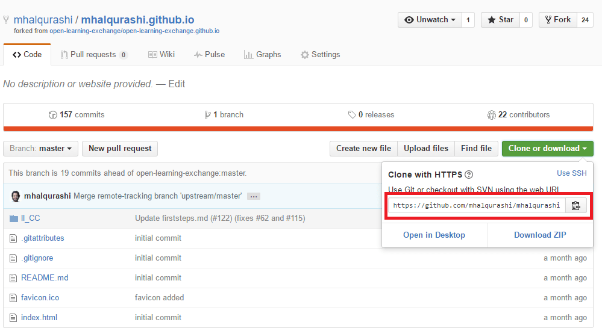

##Git Repositories 

On GitHub, our software code is organized by repositories which are different sections of our software development. For example, you have been working on one of the repositories: open-learning-exchange.github.io. I would strongly suggest looking (look, don't touch) through our different repositories on GitHub [here](https://github.com/open-learning-exchange). These repositories act as a categorizing system for us to organize our code. 

As previously mentioned, you fork a repository to work on your own user and then send it back to the master repository in the form of a pull request to update it. You went through this process to fork open-learning-exchange.github.io and rename it to your own repository. Normally, we do not rename repositories, but Markdown wikis are slightly different. In the future, plan on forking different repositories, working on them, then sending your work to the master/origin via pull request. The general GitHub structure is diagrammed below.


Now, we will be using GitHub repositories on a command line, which means that there is a separate step to get your GitHub repository on your OS. To be clear, you will be using both the command line and the GitHub user interface, meaning that you need to constantly be checking to make sure that your version is not behind to avoid merge conflicts. Therefore, open a command line and open your username.github.io repository on the  GitHub user interface. You then need to copy the link provided of the repository (seen in the picture below).



Then, turn to your command prompt and type your repository URL in the form of `git clone https://github.com/EmilyLarkin/EmilyLarkin.io.git` into the command line. Be sure to use the correct URL to clone your repository (you will obviously not type my username).

The previous step created a clone of your repository on your OS. Now, there are three different Github repository levels: [open-learning-exchange.github.io](https://github.com/open-learning-exchange/open-learning-exchange.github.io), username.github.io, and your username.github.io on your OS. These three levels need to be constantly synced and up to date with one another as we will all be contributing to the origin/master. It's important to try to keep these separate and not mix changes between them as you will be unable to fork and git push/pull if they are very different versions. An explanation on how to keep these repositories up to date is below. 

As you create a fork from the original repository and then clone your forked repository onto your OS, you will need to frequently update the fork so that your fork and clone are not behind. Further, you need to sync your repository on your OS and on GitHub (username. github.io) with the master repository (open-learning-exchange.github.io). There are various ways to do this which I will detail below. 

First, the GitHub help section and https://git-scm.com are incredibly helpful in answering your basic questions, including [this link](https://help.github.com/articles/syncing-a-fork/), which details how to sync a fork with the correct origin/master, because as you renamed your repository, it does not automatically assume that open-learning-exchange.github.io is the source. Instead, it assumes that username.github.io is the master which fails to allow a proper syncing process. Therefore, when you do `git diff` and `git status`, it only looks at your username.github.io. Therefore, you need to use `git fetch upstream`, `git checkout master`, and `git merge upstream/master` to correctly sync to open-learning-exchange.github.io. 

I would begin by opening your command prompt/terminal and finding the correct directory: `cd username.github.io`.

Before you are able to fetch updates from the upstream repository, you need to first configure the upstream repository by following [this link](https://help.github.com/articles/configuring-a-remote-for-a-fork/). Then, use the command `git fetch upstream` to fetch branches and repositories from the upstream repository (in this case, it is open-learning-exchange.github.io). Then check your fork's master branch with `git checkout master`. You should see some variation on this response: 

```
EmilyLarkin.github.io $ git fetch upstream
remote: Counting objects: 1, done.
remote: Total 1 (delta 0), reused 1 (delta 0), pack-reused 0
Unpacking objects: 100% (1/1), done.
From https://github.com/open-learning-exchange/open-learning-exchange.github.io
   6940637..5934ec2  master     -> upstream/master
EmilyLarkin.github.io $ git checkout master
Already on 'master'
Your branch is up-to-date with 'origin/master'.
```
  
Then, use `git merge upstream/master` to merge the open-learning-exchange upstream/master with your local repository. It should look something like this:

```
EmilyLarkin.github.io $ git merge upstream/master
Updating 1388180..5934ec2
Fast-forward
```

If you get something like this

```
# Please enter a commit message to explain why this merge is necessary,
# especially if it merges an updated upstream into a topic branch.
#
# Lines starting with '#' will be ignored, and an empty message aborts
# the commit.
~                                                                               
~ 
```
it means that you are in the text editor Vim. Simply type ```:wq``` which stands for **w**rite and **q**uit. However, if you want to insert something you can type "i" and Vim goes into edit mode. To exit edit mode just hit "escape".

Now, your repository has been synced to the upstream/master. However, a discrepancy may still exist between your local (and now your origin/master) versus your username.github.io. You will now use `git diff` and `git status` to check how your local repository compares to your username.github.io repository. Depending on whether you have more or less commits than your username.github.io, you will either use `git pull` to receive any changes or `git push` to push updates to your repository. Most likely, as you just synced with the master, you will use `git push` to push updates to your username.github.io repo. If you have uncommitted changes (from mixing interface and terminal use of GitHub repositories), then these commands will be aborted until you fix the discrepancy.

Remember, you should repeatedly use the commands `git diff` and `git status` to respectively see the difference between your username.github.io and your local repository and then see the status of your repository and the changes you have made. Once again, you need to sync your repository with the correct master first, otherwise you will not see the correct `git diff` and `git status`. `git diff` and `git status` only look between your local and username.github.io repos, not your origin/master repo. 

This process needs to be repeated whenever you begin work to make sure that you are always up to date. If there are discrepancies, it will mess up the code and you could potentially lose your saved changes because it was not updated properly. We will provide more information on editing and saving changes in the next tutorial. 

If you find yourself needing to rebase your forked repository, the following two links should help
[Rebase](https://git-scm.com/docs/git-rebase)
[Branching Rebasing](https://git-scm.com/book/en/v2/Git-Branching-Rebasing)

 If you would like to understand synching with the fork, here is a useful [video](https://www.youtube.com/watch?v=-zvHQXnBO6c)
