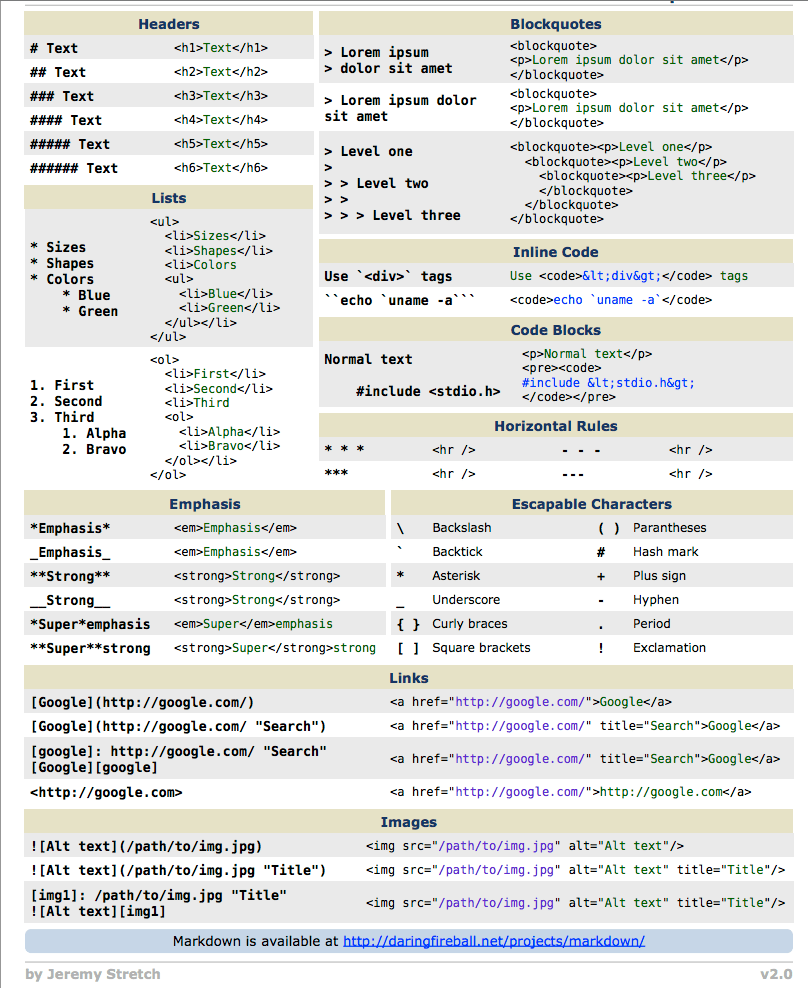
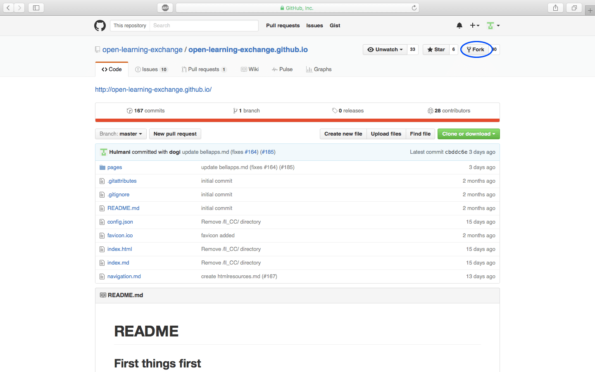
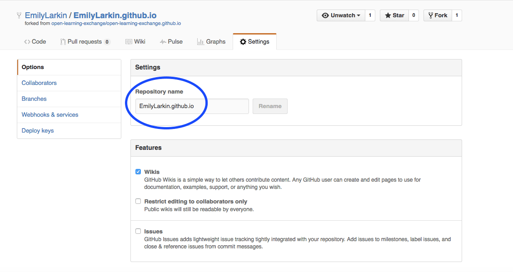

#GitHub and Markdown
###Objective:
* Learning about Github and the Markdown wiki.
* Writing your own individual Markdown wiki page.
* Understanding the Github workflow (including forks, repositories, commits, and pull requests).

###Prerequisites :
You must already have a GitHub account with verified email address.

[GitHub](https://help.github.com/categories/writing-on-github/) acts as a source code management system for Open Learning Exchange. Please, read some of the basic instructions below to learn how we use GitHub at OLE.

[Markdown Wiki](http://dynalon.github.io/mdwiki/#!quickstart.md) is the software we use for our Virtual Intern website. Markdown (MD) Wiki allows us to use Markdown on GitHub so that it is easily compatible with our current development environment. To put it simply, Markdown is a markup language that is very easy to learn and allows you to quickly format your text.
In the screenshot below, you can see an example of Markdown syntax on the left side and the way it is rendered on the right side:

    

#### Markdown != HTML

Below is a cheat sheet of Markdown to help you create your own individual MD Wiki page (please, notice that the code on the left represents Markdown syntax, while the code on the right is the corresponding HTML syntax):

The main GitHub page used to store this MD Wiki can be found at [open-learning-exchange/open-learning-exchange.github.io](https://github.com/open-learning-exchange/open-learning-exchange.github.io) and our virtual interns will essentially create their own Markdown Wiki repository as a copy of open-learning-exchange.github.io.

###Start here
This is just a summary of the steps that you will need to perform. Please, keep on reading for a detailed explanation of each step.  

* [Login to Github with your username and password](githubandmarkdown.md#Login_to_Github_with_your_username_and_password)
* [Find and fork the correct repository](githubandmarkdown.md#Find_and_fork_the_correct_repository)
* [Go to Settings and rename your repository](githubandmarkdown.md#Go_to_Settings_and_rename_your_repository)
* [Post a link to your repository in chat](githubandmarkdown.md#Post_a_link_to_your_repository_in_chat)
* [Create a new file as your personal MD Wiki page and commit your changes](githubandmarkdown.md#Create_a_new_file_as_your_personal_MD_Wiki_page_and_commit_your_changes)
* [Open a pull request](githubandmarkdown.md#Open_a_pull_request)  

####Login to Github with your username and password
Since you have already created a username on GitHub, we can assume that you understand the basic layout and functionality. If you don't, please, explore and do some basic googling. When you're editing on GitHub, it is important to always make sure you are working on your own GitHub repository. To that end, make sure there is your own username before the slash and the correct repository after the slash. For example, EmilyLarkin/BeLL-Apps). All of Open Learning Exchange's work can be [found here](https://github.com/open-learning-exchange). All the different repositories represent different types of software used by OLE, and the repositories act as categorizing system.

There is a lot to learn about GitHub, but to acclimatize you to it, we will provide a basic example of how to change something on GitHub. This example will specifically create your own &lt;username&gt;.github.io and allow you to edit and commit your changes.

####Find and fork the correct repository
First, you will need to find the correct GitHub repository to fork. Forking is essentially creating a copy of a repository on your own GitHub account, to avoid editing and, possibly, messing up with the main repository. To make it easier on you, we will provide you with a link to the correct repository [here](https://github.com/open-learning-exchange/open-learning-exchange.github.io).
Now, you will fork the repository to your own account. Look at the picture below to find the fork button.

####Go to Settings and rename your repository
After your fork the repository, you will be on your page: &lt;username&gt;/open-learning-exchange.github.io. Then, you should go to Settings at the top middle of the page and rename your repository to your GitHub username. See example below.

####Post a link to your repository in chat
After you rename it, make sure to post a link to the github.io website you've just created (&lt;username&gt;.github.io) in the [gitter.im chat](https://gitter.im/open-learning-exchange/chat).

**Important Note: Always pay attention when you are working on GitHub, to make sure you work on your own personal account and not on Open Learning Exchange GitHub account.**
Once again, it is very important to distinguish between your personal GitHub account and the Open Learning Exchange account. As we want to keep a 'clean' version of our code, everyone forks the repositories, commit their changes to their own personal version of the repository, and then send the changes back to the Open Learning Exchange repository for approval (called a pull request), before the Open Learning Exchange code is updated. 
Please, make sure to ALWAYS work on your own personal account via forking and pull requests.

####Create a new file as your personal MD Wiki page and commit your changes
Now, you can edit the files in your repo and the changes you make will be reflected on your &lt;username&gt;.github.io website. To edit, click on the `pages` folder. Then, click `New File` and name the file exactly the same as your GitHub username. We created pages for you using your GitHub username, so it is important that you stick with that name. For reference, an example of a link to a personal page is EmilyLarkin.github.io/pages/EmilyLarkin.md, so yours should look similar, just using your own username.

From here, click the pencil icon to edit (as shown below) and type your name, your location/time zone, and OS (including version). Please, make sure to add a short description of yourself as well, so your fellow virtual interns know who you are. Then, scroll down to the bottom of the page, select the `Commit directly to the master branch` radio box and click `Commit New File`.

Now, check what this looks like on your own page (&lt;username&lt;.github.io/#!pages/&lt;username&lt;.md) and post a link to it in the [gitter.im chat](https://gitter.im/open-learning-exchange/chat). Check and double check that everything looks good and is working before initiating a pull request.

####Open a pull request
Then, you can create a pull request by clicking the `Pull requests` button and then clicking `New pull request`. Finally, click `Create pull request` and someone from our team will then approve and merge your pull request, once everything looks good. After the pull request is completed, you'll be able to see this on open-learning-exchange.github.io in addition to your personal page. Let us know when you have completed this step in the [gitter.im chat](https://gitter.im/open-learning-exchange/chat).

###Useful links
[GitHub](https://help.github.com/categories/writing-on-github/)  
[Markdown](http://dynalon.github.io/mdwiki/#!quickstart.md)  
[Mastering Markdown](https://guides.github.com/features/mastering-markdown/)  
[How to fork a repo](https://help.github.com/articles/fork-a-repo/)
[Other helpful links and videos](https://open-learning-exchange.github.io/#!pages/faq.md#Helpful_Links)

####Return to [First Steps](firststeps.md)
