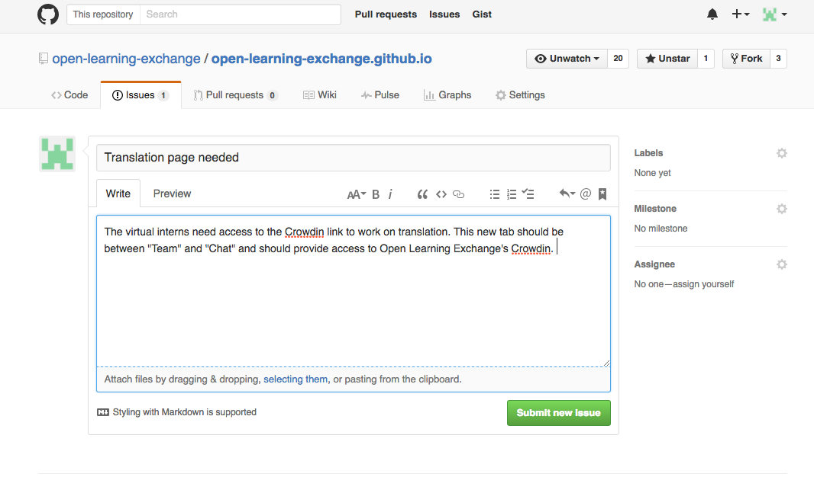
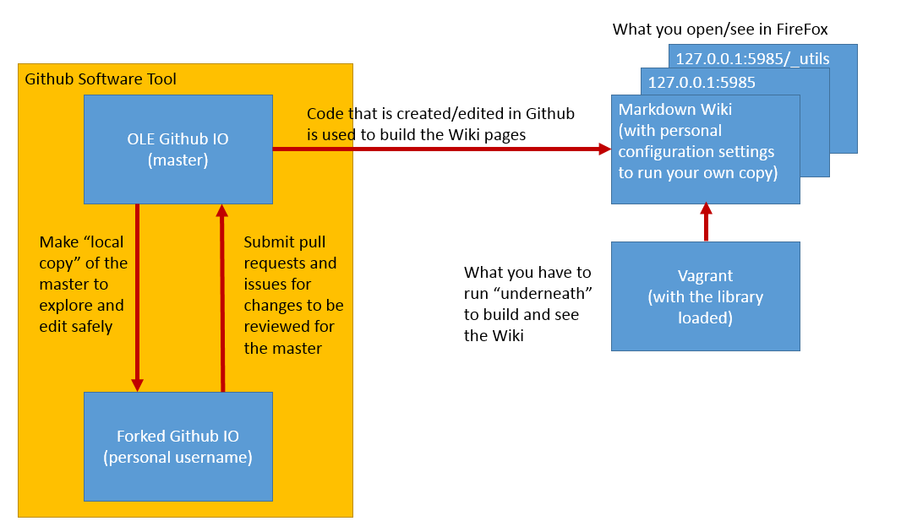

#GitHub Issues

On GitHub, each repository has a section where issues can be added, discussed, and fixed as a means of categorizing and addressing problems we find. Issues are often opened by our team to fix software bugs on the BeLL and in our code. Below, you'll find an example of an issue where I brought up a problem, researched an answer, and then fixed the issue.

First, you will need to open an issue within the right repository ([upstream repository](https://github.com/open-learning-exchange/open-learning-exchange.github.io)) and explain the problem. If you are explaining a bug or how to replicate an issue, please be as explicit as possible and use pictures if possible.

After this, you will then research the possible solutions or ideas on how to address the issue and write a comment with this information, as you can see [here](https://github.com/open-learning-exchange/open-learning-exchange.github.io/issues/15). Someone else will hopefully provide input (as Dogi did here) and then you can move ahead with making the proposed changes.

On your own fork of the correct repository, go and make a proposed change and commit it once you have finished. Then, open a pull request with your changes and please, remember to include the issue it is solving (for example, if your pull request fixes the issue number 320, then add `#320` to your pull request). Next, wait until one of the OLE staff accepts the changes and merges your pull request. You can see this process [here](https://github.com/EmilyLarkin/EmilyLarkin.github.io/commit/b335125e4c9af9e4ea57b5f5fd1629845732a6c4).

Please, be aware that a staff member may either submit a code review asking you to modify some of your changes, or accept the pull request and close the issue. You can see the process [here](https://github.com/open-learning-exchange/open-learning-exchange.github.io/issues/15).

**NOTE**: This is an exercise to help you familiarize with GitHub issues, committing, and creating pull requests. This is a common process in large open source projects as there is always room for improvement. So, we strongly encourage you to follow this process and continue to post issues and resolve them.

##Useful Links
[Helpful links and videos](faq.md#Helpful_Links)  
[Mastering Issues](https://guides.github.com/features/issues/)

####Return to [First Steps](firststeps.md)
