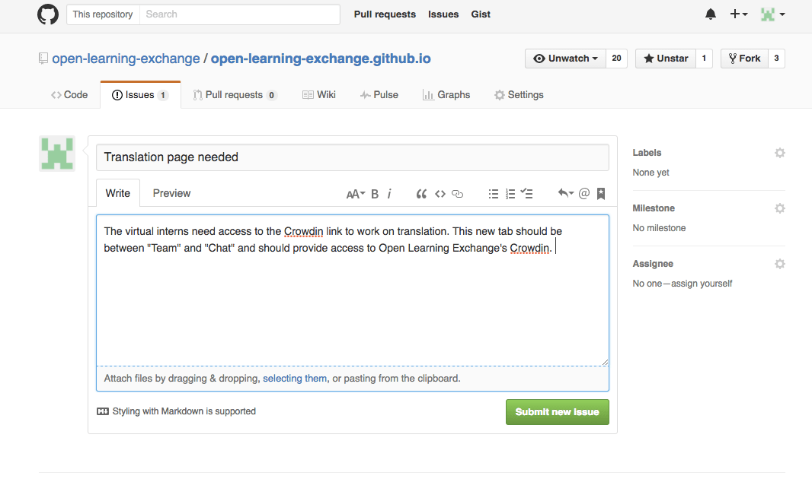
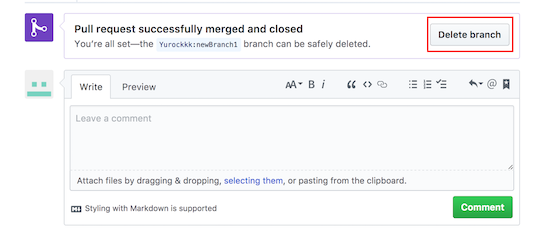

#GitHub Issues
##Introduction

On GitHub, each repository has a section where issues can be added, discussed, and fixed as a means of categorizing and addressing problems we find. Issues are often opened by our team to fix software bugs on the BeLL and in our code. Below, you'll find an example of an issue where I brought up a problem, researched an answer, and then fixed the issue.

##Create an Issue
First, you will need to open an issue within the right repository ([upstream repository](https://github.com/open-learning-exchange/open-learning-exchange.github.io)) and explain the problem. If you are explaining a bug or how to replicate an issue, please be as explicit as possible and use pictures if possible.

After this, you will then research the possible solutions or ideas on how to address the issue and write a comment with this information, as you can see [here](https://github.com/open-learning-exchange/open-learning-exchange.github.io/issues/15). Someone else will hopefully provide input (as Dogi did here) and then you can move ahead with making the proposed changes.

Every time you start to work on an issue you need to create a branch to keep your work on various issues separate from each other. Before you create your branch, sync your repo following the process in the [previous step](gitandrepositories.md). Then use `git checkout -b name_of_your_new_branch` to create and switch to a new branch on your local repository.

**TIP**: The default branch in your repository is called master. Keeping the master branch clean of any changes is a good practice so if you make any changes you dont want, you may revert back.

Now you can go and make the proposed changes to your local files.

**NOTE**: It's important that you are on the new branch, make sure you are on the correct branch with `git checkout branch-name` before committing. Use `git branch` to make sure you are on the correct branch.

##Create a Commit
After you are done making your changes use the command `git status`. If the list of files changed only includes those you wish to modify, use the command `git add .` (The '.' is part of the command.) Otherwise you can also choose only certain changes to include by using `git add <file1> <file2> <file3>...`  Now that you have selected the files you wish to include, use the commands `git commit -m "commit message"` and `git push -u origin name_of_your_new_branch` to save your changes and push them to your Github (for any further commit on the same branch after the first one, you can just use `git push`).

You can view your changes by going to <code>https://<b>rawgit.com</b>/YourUserName/YourUserName.github.io/YourBranchName/#!index.md</code> and viewing the page(s) you have changed. If everything looks correct, you are ready to create a pull request. Please remember to include the issue it is solving (for example, if your pull request fixes the issue number 320, then add `#320` to your pull request).

##Wait for Review
All that remains is posting your pull request in the chat and waiting until one of the OLE staff gets a chance to look at it. Be aware that a staff member may either submit a code review asking you to modify some of your changes, or accept the pull request and close the issue. You can see the process [here](https://github.com/open-learning-exchange/open-learning-exchange.github.io/issues/15).

After your pull request has been aprroved and merged by OLE staff, you might want to delete the branch that is associated with your pull request. It can keep your local and remote (yourUserName.github.io on GitHub) repository away from a mess of defunct branches. To delete the defunct branch in your remote repository, you can click the "Delete branch" button in your pull request (see the picture below). To delete the defunct branch in your local repository, use the command `git branch -d yourLocalBranchName` (make sure you are not on the branch that you want to delete).

**NOTE**: Remember to always sync your fork before starting to work on a new issue. To sync your fork you can follow the process in the [previous step](gitandrepositories.md).

**NOTE**: This is an exercise to help you familiarize with GitHub issues, committing, and creating pull requests. This is a common process in large open source projects as there is always room for improvement. So, we strongly encourage you to follow this process and continue to post issues and resolve them.

##Useful Links
[Helpful links and videos](faq.md#Helpful_Links)  
[Mastering Issues](https://guides.github.com/features/issues/)

####Return to [First Steps](firststeps.md)
