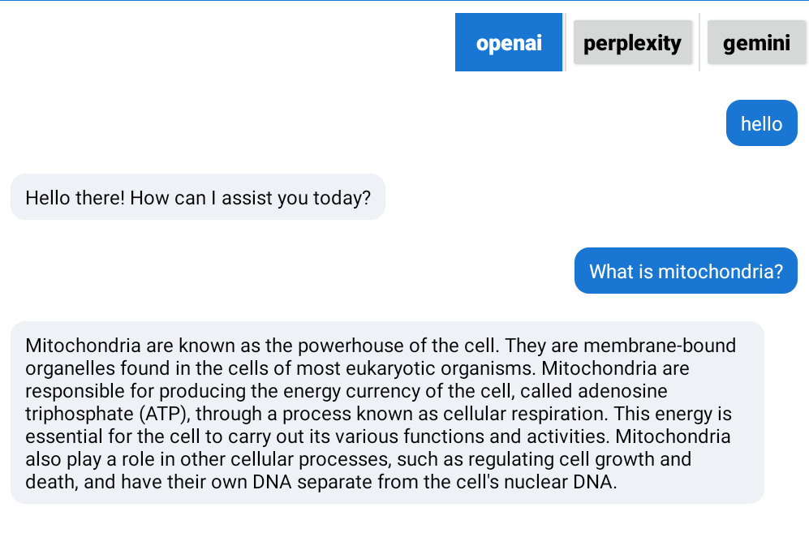

# AI Chat Demonstration

This page showcases how the AI chat feature works within our app. The AI chat enables users to engage in meaningful and context-aware conversations effortlessly.

## Navigating to the AI Chat within the app

## Step 1: Starting a Conversation

## Step 2: AI Generating a Response

You can try different GPT's according to your prefference.

## Step 3: Additional features

The chat includes additional features, such as the ability to save conversations, which are conveniently organized in a sidebar. Additionally, users can easily search for specific chats whenever needed.

