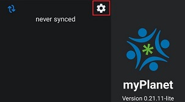
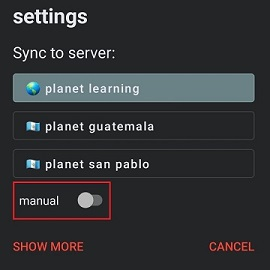
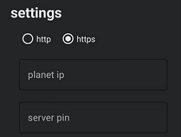
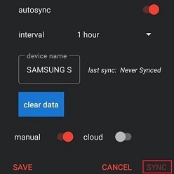
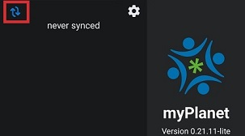

# Connecting myPlanet to a Planet Server  

To access learning resources, you must connect your myPlanet application to a Planet server. This guide explains how to set up the connection.  

## Configuring a Connection  

- Click the settings gear icon located at the top of the screen to open the settings dialog box.  

    

- Choose a Configuration Option  
  - Pre-configured Servers  
    - A few pre-configured servers may be available in the settings. If one of these matches the server you need to connect to, select it and the synchronization process will begin right away.
  - Manual Configuration
    - If the pre-configured servers do not meet your needs, toggle on "Manual" configuration.

      

    - Select "https" as the protocol.
    - Enter the "Planet IP" and "Server PIN" provided by your admin.

      

    - If frequent updates to educational resources are expected, enable Auto-Sync and set the preferred sync frequency.
    - Click the "SYNC" button to begin synchronization. Wait for the process to complete.

      

## Manually Synchronizing myPlanet with the Server  

To manually re-synchronize your connection later, simply press the "Resync" button:  

    
