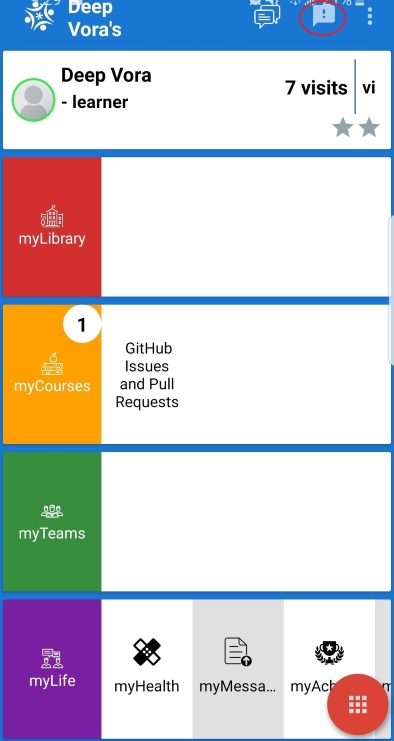
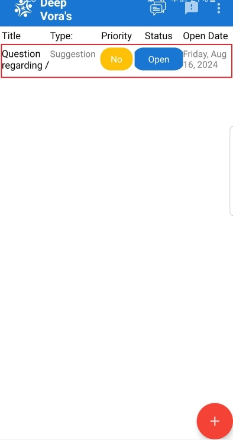

# Feedback

## Feedback on myPlanet

Feedback section is added so that our users can share there thoughts on a course, library or feature. Here at Open Learning we value feedback of the community.

 Users are encouraged to leave feedback or suggestions on any app content as well as feature. To leave a feedback, you may find it on the top right section of the android application. Users may click it to view feedback left by other users.

## Feedback List
Below image showcases the list of feedback left by our users. Feedbacks are displayed by their priority and status.  Additionally users can add their responses to other users feedbacks.

## Creating a new Feedback
In order to create a feedback, click on the new bright red "Plus" button on the bottom right. 

Upon creating a new feedback - 
1. Set Priority:
  Users can set priority by assigning it as urgent.

2. Feedback Type:
  Users can categorize their feedbacks into 3 categories namely; `Question`, `Bug`, `Suggestion`

3. Feedback comment:
  Users can enter their feedback on the textbox displayed in the above image to post their feedback.

Finally, click on submit and your feedback has been submitted.

## Resolving / Replying to a Feedback
Users can interact with existing feedbacks posted by the community to share their knowledge.

You can enter your feedback and click on reply to leave a reply or close the feedback if the content has been addressed.
