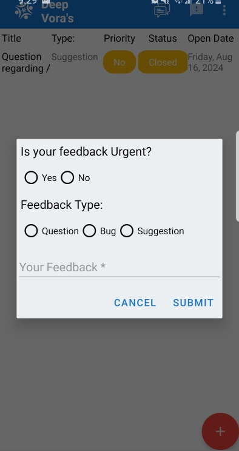
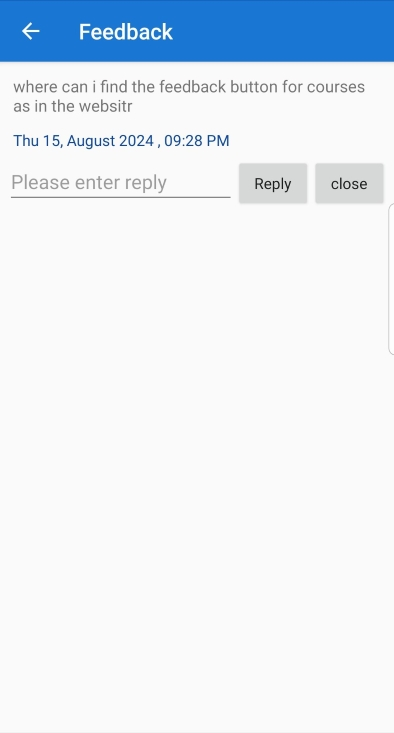

# Feedback

## Feedback on myPlanet

We’ve added a feedback section to allow our users to share their thoughts on courses, the library, or features. At Open Learning Exchange, we highly value community feedback.

Users are encouraged to leave feedback or suggestions on any app content or feature. To provide feedback, locate the option in the top-right section of the Android application. Users can click it to view feedback left by others.

## Feedback List

The image below displays the list of feedback submitted by our users. Feedback is organized by priority and status. Additionally, users can respond to feedback left by others.

## Creating a new Feedback

To create new feedback, click the bright red “Plus” button at the bottom right.

Upon creating a new feedback - 
1. Set Priority:
  Users can mark the feedback as urgent by setting its priority.

2. Feedback Type:
  Users can categorize their feedback into one of three categories: Question, Bug, or Suggestion.

3. Feedback comment:
  Users can enter their feedback in the textbox shown in the image above.

Finally, click “Submit” to post your feedback.

## Resolving / Replying to a Feedback

Users can interact with existing feedback posted by the community to share their knowledge.

To respond, enter your feedback and click “Reply.” You can also close the feedback if the issue has been addressed.
