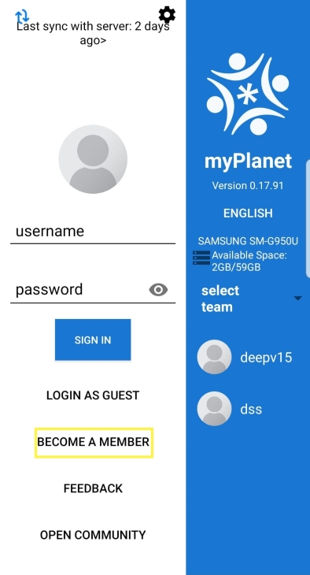
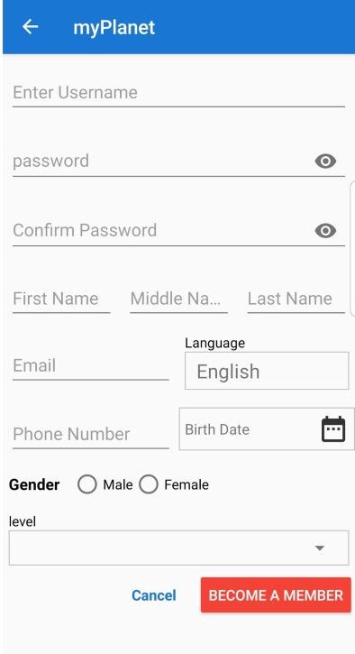
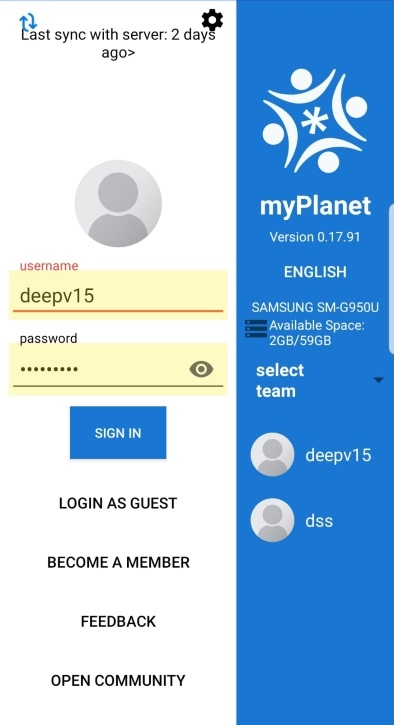
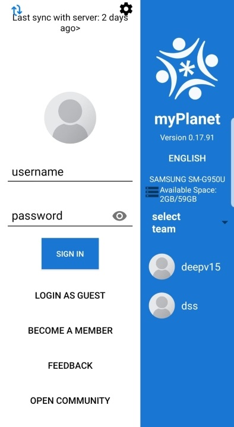

# myPlanet Sign In / Become a Member

## Creating an Account / Becoming a Member

To create an account or become a member, follow these steps:

**1. Click on the "Become a Member" button.**

   
   
**2. A form will pop up for you to enter the following details:**

   

   After entering all the required information, your user account will be created.

   **NOTE**: Make sure to fill in all the fields accurately to complete the registration process.

## Signing Into the App

To sign in using an existing member account, follow these steps:

**1. Sign In:**
   - After entering your credentials, you will be signed in to the app.
   - Ensure you enter the correct username and password to access your account.

   

**2. Tap on your user:**
   - If your user is displayed in the list of recent users, tapping on it will sign you in automatically.

   

   **NOTE**: If no recent users are displayed, sign in with your username and password.
