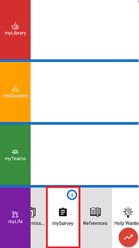

# Surveys
Surveys are created by the community leaders to ask the community as a whole some questions. The following few sections will outline how to fill a survey on the myPlanet app.

## Finding your Survey
1. Click the myPlanet logo in the top left corner.
- Go to the **Surveys** section.

- Find your survey in the list and click **Record Survey**.  

## Completing the Survey
- Survey are a mixture of multiple choice and text questions.
- After answering each question, you click the submit button. **You cannot go back to a question once you submit it**.

- After finishing the survey, you click the finish button.

**Note** : You can also see the surveys you haven't finished by going to the home page, then **mySurvey**.  

