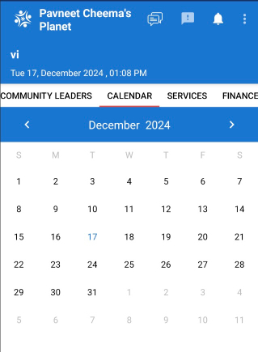
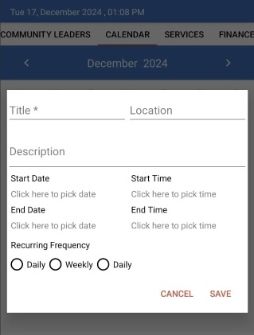

 # Community Events
 
  ## Schedule an Event
  
  - **To create an event**, go to the calendar under the Community tab.
  
  
  - Select the desired date on the calendar, then complete the form that appears. Fill in all relevant details to ensure participants have the information they need.

  

  ## View an Event