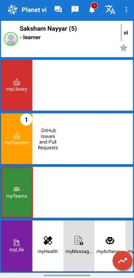
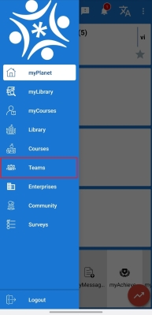
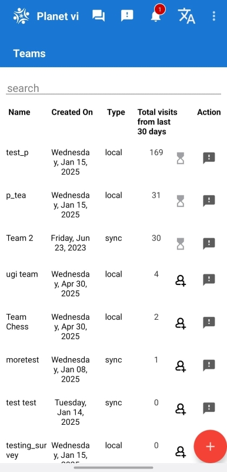
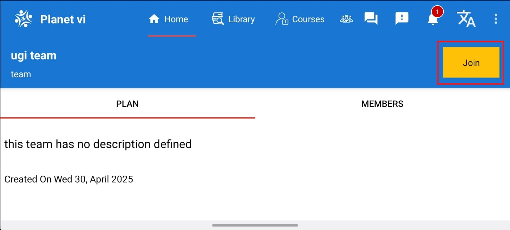
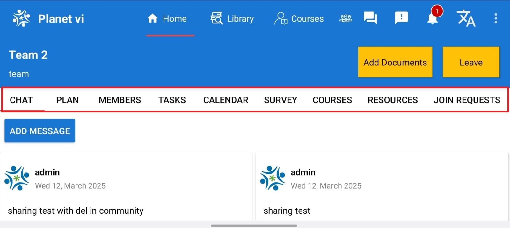

# Teams Feature Overview – myPlanet App

The **Teams** feature in the myPlanet app allows users to collaborate, communicate, and manage tasks with their teams directly from the app. This guide explains how to access, join, and use the Teams feature effectively.

---

## Home Page – Accessing Teams

On the app's **Home Page**, locate the **Teams** tab highlighted in the screenshot below.  
This tab gives you a quick view of the **Teams you have already joined** and allows you to navigate directly to your team spaces.

<!--  -->

---

## Access Teams via Sidebar

You can also access the **Teams** feature through the **Sidebar menu**.  
Open the sidebar by swiping from the left or tapping the menu icon, and select the **Teams** option.

<!--  -->

---

## Viewing and Joining Teams

Tapping on the **Teams** tab or selecting it from the sidebar will take you to the **Teams List** page.  
Here, you can:
- View a list of available teams.
- Tap on any team to view its details.
- Click the **Join** button to send a request to become a member of that team.

  

---

## Inside a Team – Exploring Options

Once you've joined a team, you gain access to a rich set of collaboration tools within that team space, including:
- **Chat**: Communicate with team members in real time.
- **Plan**: Organize activities, events, or projects.
- **Members**: View the list of team members.
- **Tasks**: Manage and assign tasks within the team.
- **Calendar**: Track team events and deadlines.
- **Survey**: Participate in surveys and polls created for the team.
- **Courses**: Access learning materials assigned to the team.
- **Resources**: Share and access files or documents relevant to the team.
- **Join Requests**: Manage pending join requests for the team.

---

## Summary
The **Teams** feature in the myPlanet app provides a centralized hub for communication, planning, and resource sharing within your teams.  
Use the **Teams tab** or **Sidebar** to explore available teams, and enjoy seamless collaboration after joining a team.

---

