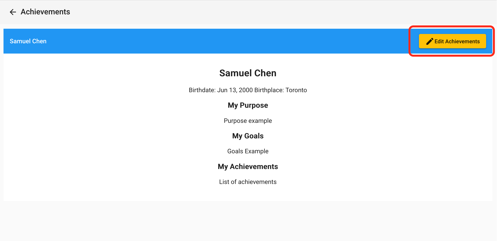
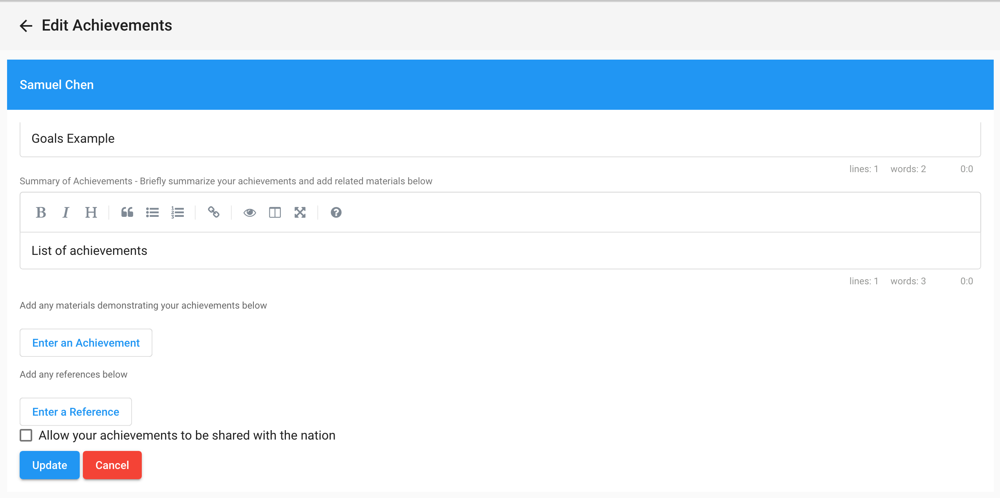
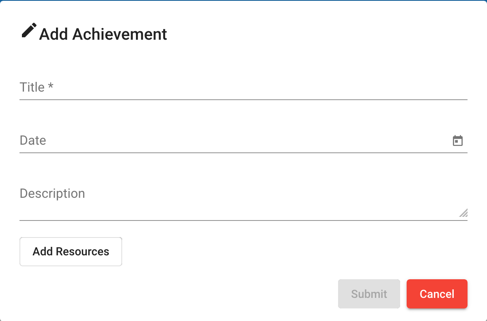
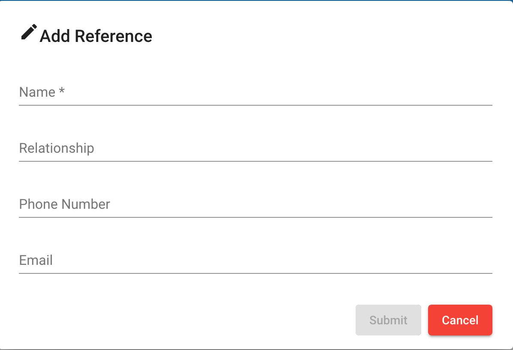

# Achievements
Topics:
1. [Navigating To The Meetup Page](#navigating-to-the-meetup-page)

## Navigating To The Achiement Page
As you can see below, once you are in your planet dashboard you can access the page on the bottom left (Red box):

## Adding or Editing Achievement
On the achievement page, you will be able to either **add** or **edit** your achievements:

Here, you will be prompted to input information for your achievement page.

## Adding Achievements & Reference
On this page you will be able to **Enter an Achievement** or **Enter a Reference**

1. Clicking on **Enter an Achievement** will open the dialog below. You can also click on **Add Resources** to showcase the resources related to your achievement.

2. Clicking on **Enter a Reference** will open the dialog:

