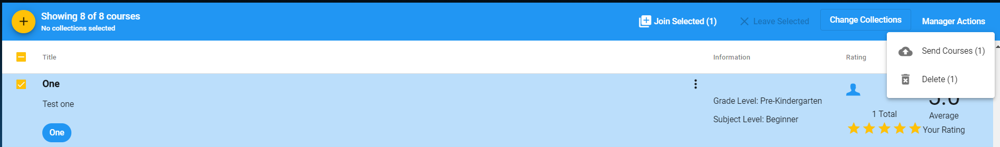
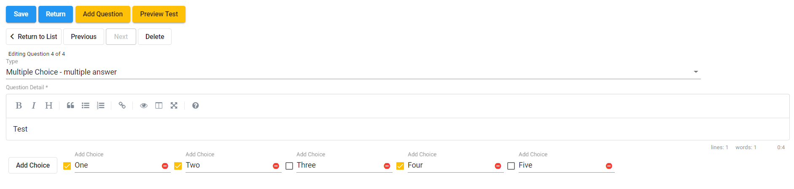
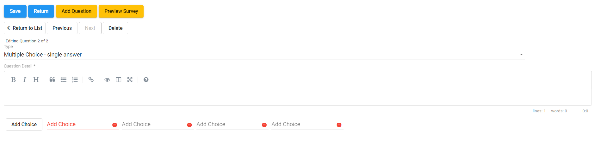
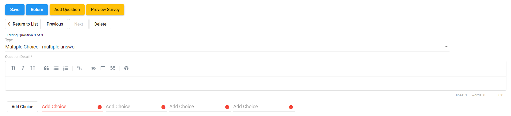
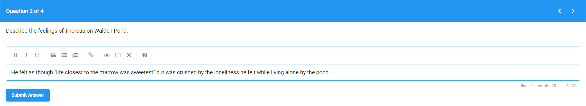
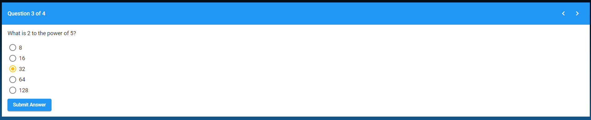
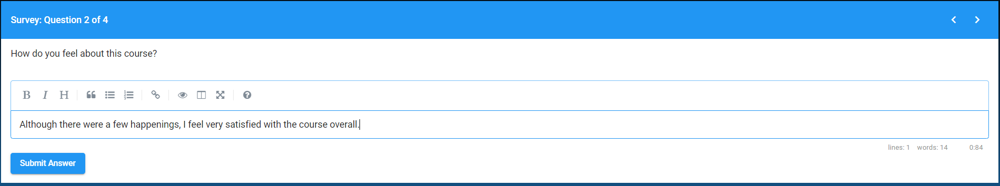

# Courses
Topics:
1. [Getting to the Courses Page](#getting-to-the-courses-page)
2. [List of Courses](#list-of-courses)
3. [Actions on List Page](#actions-on-list-page)
4. [Adding Course](#adding-course)
5. [Course Collections](#course-collections)
6. [Taking a Test](#taking-a-test)
7. [Taking a Survey](#taking-a-survey)

## Getting to the Courses Page
There are two ways to get to the Courses page:

1. From the Navigation Bar, click on the "Courses" Tab at the top.

2. From the dashboard tile, click on the "myCourses" tile right on the front page.

## List of Courses

Upon getting to the courses page, you will be greeted a page similar to the following, with each course being an item in a list.

By clicking on "Title", or "Rating", you are able to sort the course list accordingly.

## Actions on List Page

* Action Menu

The action menu has several different actions available.

1. To add a course, press the "+" button.

2. To join a course, select the checkbox next to a course then click the "Join Selected" button. The selected course is now part of your myCourses, and can be seen on the front page's dashboard. Multiple courses are able to be joined at once.

Alternatively, click on your course on the courses list then click the "Join" button near the top-right of the course page.

3. To leave a course, select the checkbox next to a course that you are already a part of then click the "Leave Selected" button. The selected course is no longer part of your myCourses, and can no longer be seen on the front page's dashboard. Multiple courses are able to be left at once.

Alternatively, click on your course on the courses list then click the "Leave" button near the top-right of the course page.

4. To change a collection, select the checkbox next to a course then click "Change Collections". To learn what a collection is, click [here](#course-collections).

5. To send a newly created course to be updated in the remote database, select the checkbox next to a course, click on "Manager Actions", then click on "Send Courses". You will need to enter your administrator password.

6. To delete a course, select the checkbox next to a course, click on "Manager Actions", then click on the "Delete" button. Multiple courses are able to be deleted at once.

* Rating

By default, the rating on the right side of a course item shows the average rating of all users who have rated the particular course.

In order to add a rating for a course: 

1. Click on one of the stars to the right side of the course item, with 1 being the lowest rating and 5 being the highest.

2. A module will pop up, showing the rating you've added and an optional comment. You can also change your given rating on this page.

3. Your rating will be submitted and the average rating of the course will be updated once you click the "OK" button on the module.

* Search

At the search bar near the top-right of the page, you are able to search by Grade Level, Subject Level, and Title. The search will automatically be performed upon changing any of these three, so there is no need to type the Enter key or press a Submit button. Press the "Clear" Button to return all three fields to their defaults and show all available courses again.

For filtering by collection, please check out [Course Collections](#course-collections)

* Pagination

At the bottom-right of the page, you can see your pagination options. You are able to have 5, 10, 20, 50, 100, or 200 courses per page, and the pages showing the course list will be split accordingly. Use the left and right arrow buttons to navigate in the case there are multiple pages.

## Adding Course

To begin adding a course, press the "+" button on the action menu.

You will be greeted by the following page:

The Course Title and Description fields are mandatory, along with Grade Level and Subject Level. Trying to submit the course without any of these will stop you.

Add a collection or subcollection to the course by clicking on the "Collections" button.

The following module will pop up:

You are able to filter your available collections by their name at the search bar near the top.

To create a new collection or to see the subcollection of a collection listed below, click on their respective dropdown buttons.

By clicking the "Edit" button next to each collection, you are able to change the collection's name and subcollection status.

To see what a collection is, try [Course Collections](#course-collections).

Clicking on the "Add Step" button near the bottom will reveal extra fields to the right of the page, as seen above. These steps are where you can give learning materials, tests, resources, and surveys. Click the "Delete" button near the top to cancel the step creation or click the "Add Step" button on the bottom of the page to add your newly created step.

When finished adding your steps, click the "Submit" button to create your Course.

* Tests

When creating a step, click on the "Add Test" button to create a test for what you have learned in the previous steps.

Upon clicking the "Add Question" button, you will find there are four types of questions: 
* Text - Short answer

Simply fill out the question detail or query for this type of question. The test taker will automatically get a textbox for filling out his or her answer.

* Text - Long answer

Simply fill out the question detail or query for this type of question. The test taker will automatically get a textbox for filling out his or her answer.

* Multiple Choice - single answer

Click the "Add Choice" button to create a choice of answers for the question. The checkboxes denote the correct answer for the question and is required for creation of the question. Only one checkbox can be chosen for this type of question. Click the red circle button to the right of the choice to delete it from the question.

In the image seen above, the correct answer is set by checkbox to be the second choice, "Two".

* Multiple Choice - multiple answer

Click the "Add Choice" button to create a choice of answers for the question. The checkboxes denote the correct answers for the question and are required for creation of the question. Click the red circle button to the right of the choice to delete it from the question.

In the image seen above, the correct answer is set by checkbox to be the first, second, and fourth choices, "One", "Two", and "Four".

While multiple choice questions are automatically graded, text questions must be manually graded.

Fill out the appropriate fields on however many questions you want for this test. When you are finished, press the "Preview Test" button to preview how your test will look, then press the "Save" button to save the entire test.

* Resources

Clicking on the "Add Resources" button will display the list of resources in your current Library. Select one or more resource by checkbox to add the resources to the current step then click "OK" to add the resources to your step, or "Cancel" to return without adding them.

* Surveys

Surveys are nearly identical to tests in function, but are used for the purpose of collecting data from the course's students rather than testing their knowledge.

Upon clicking the "Add Question" button, you will find there are four types of questions: 

* Text - Short answer

Simply fill out the question detail or query for this type of question. The survey taker will automatically get a textbox for filling out his or her answer.

* Text - Long answer

Simply fill out the question detail or query for this type of question. The survey taker will automatically get a textbox for filling out his or her answer.

* Multiple Choice - single answer

Click the "Add Choice" button to create a choice of answers for the question. Click the red circle button to the right of the choice to delete it from the question. Unlike tests, there are no checkboxes denoting the "correct" choice, as this is a survey.

* Multiple Choice - multiple answer

Click the "Add Choice" button to create a choice of answers for the question. Click the red circle button to the right of the choice to delete it from the question.  Unlike tests, there are no checkboxes denoting the "correct" choice, as this is a survey.

While multiple choice questions are automatically graded, text questions must be manually graded.

For multiple choice questions, click the "Add Choice" button to create a choice of answers for the question. Click the red circle button to delete the choice from the question.

Fill out the appropriate fields on however many questions you want for this survey. When you are finished, press the "Preview Survey" button to preview how your survey will look, then press the "Save" button to save the entire survey.

## Course Collections

Course collections are the categories that a course can have, assisting in finding a desired course when you want to search your list of courses by category.

Collections can be standalone without being a subcollection of another collection, or can set another collection as its supercollection, as long as that supercollection is not a supercollection of another collection. In other words, there can only be one layer of collection to subcollection correlation.

There are two ways of filtering the Courses page by collection:

1. By clicking on the "Collections" button next to "Courses" on the top-left of the page. This will bring up a module where you can filter the course list on the Courses page by selecting checkboxes next to collections and subcollections, seeing only the courses that have these collections or subcollections. 

You are also able to edit the course's name or subcollection status from this module.

2. By clicking directly on the collection name listed under the course, you can filter the courses by the clicked collection. Free collections are blue while subcollections are gray.

Note that this filtering is not retroactive, and clicking on a subcollection to click on its supercollection afterwards will not update the filtering to filter by the supercollection.

## Taking a Test

In order to take a test, you must first [join](#actions-on-list-page) the course. If you have not joined the course, you will only see the Preview button and not the Take Test button. The visuals of both are identical, but while previewing, you will not be able to submit your answers.

On the courses list, click on your desired course.

To take a test, click on the step with the associated test then click on "Take Test".

* Text - Short answer

Enter your answer in the textbox then click "Submit Answer" to submit your written answer.

* Text - Long answer

Enter your answer in the textbox then click "Submit Answer" to submit your written answer.

* Multiple Choice - single answer

Only a single answer may be selected by the radio buttons to the left of the answer choices. Click on "Submit Answer" to submit your selected answer. In the case that your answer is incorrect, the submission will fail and you will have to try again.

* Multiple Choice - multiple answer

Multiple answers may be selected by the checkboxes to the left of the answer choices. Click on "Submit Answer" to submit your selected answers. In the case that your answers are incorrect, the submission will fail and you will have to try again.

## Taking a Survey

In order to take a survey, you must first [join](#actions-on-list-page) the course. If you have not joined the course, you will only see the Preview button and not the Take Survey button. The visuals of both are identical, but while previewing, you will not be able to submit your answers.

On the courses list, click on your desired course.

To take a survey, click on the step with the associated survey then click on "Take Survey".

* Text - Short answer

Enter your answer in the textbox then click "Submit Answer" to submit your written answer.

* Text - Long answer

Enter your answer in the textbox then click "Submit Answer" to submit your written answer.

* Multiple Choice - single answer

Only a single answer may be selected by the radio buttons to the left of the answer choices. Click on "Submit Answer" to submit your selected answer.

* Multiple Choice - multiple answer

Multiple answers may be selected by the checkboxes to the left of the answer choices. Click on "Submit Answer" to submit your selected answers.
