# Feedback
Topics:
1. [Giving Feedback](#giving-feedback)
2. [Giving Feedback To Planet](#giving-feedback-to-planet)
3. [Giving Feedback To Different Items](#giving-feedback-to-different-items)
4. [View Feedbacks](#view-feedbacks)
5. [Replying To Feedbacks](#replying-to-feedbacks)
6. [Closing And Reopening Feedbacks](#closing-and-reopening-feedbacks)

## Giving Feedback
As you can see, this is the feedback screen. You will be able to input if the feedback is urgent, the feedback type, and the details.

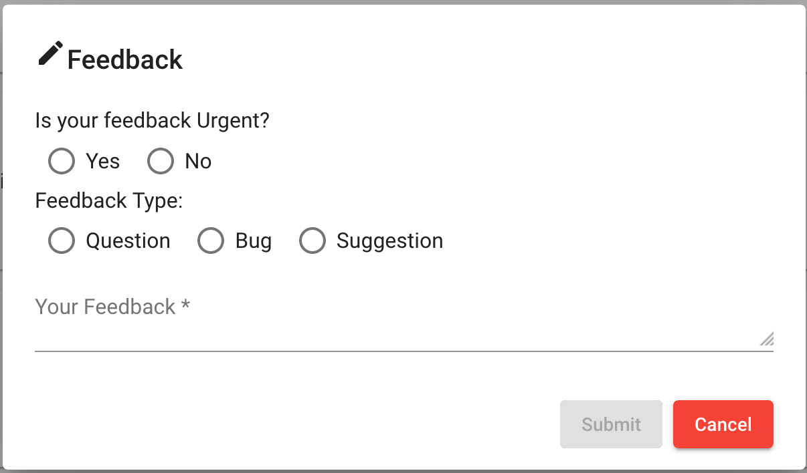

## Giving Feedback To Planet
As you can see below, once you are in your planet dashboard you can add feedback to planet using the icon on the top (Red box)

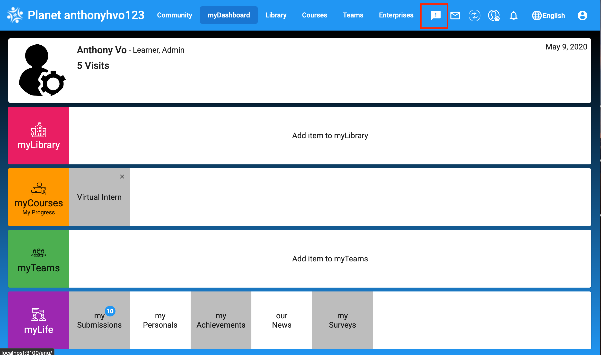

## Giving Feedback To Different Items
1. Resources
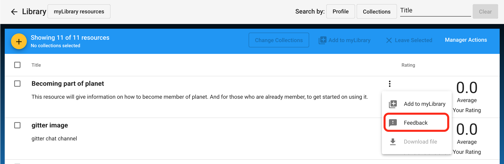

2. Courses
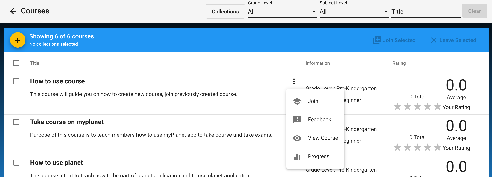

3. Teams
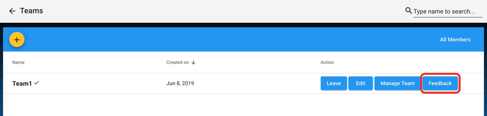

3. Meetups
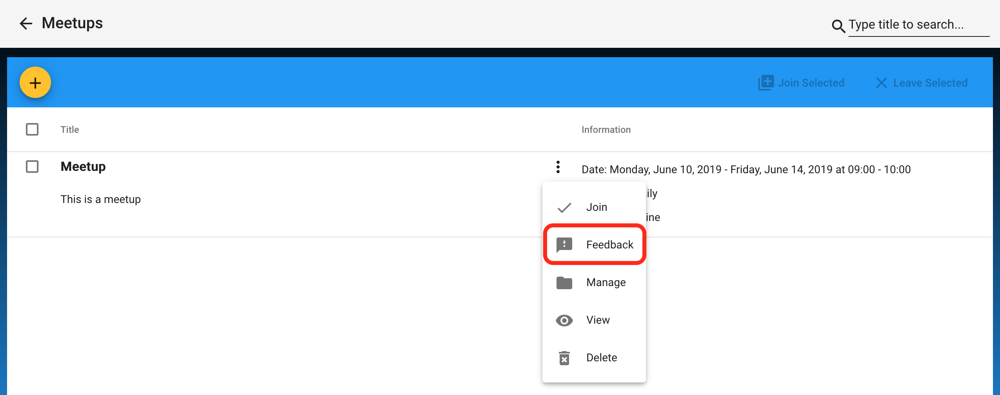

## View Feedbacks
Firstly, you can view your feedbacks by going to the `Manager Page` then `Feedbacks` to view the feedback list.

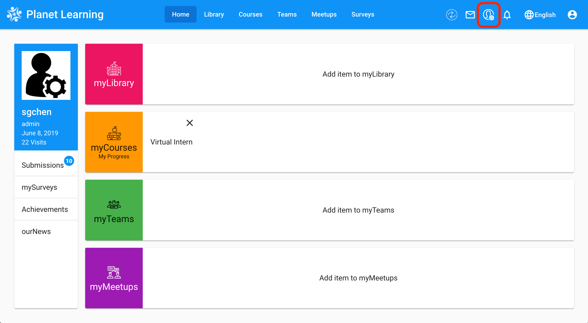
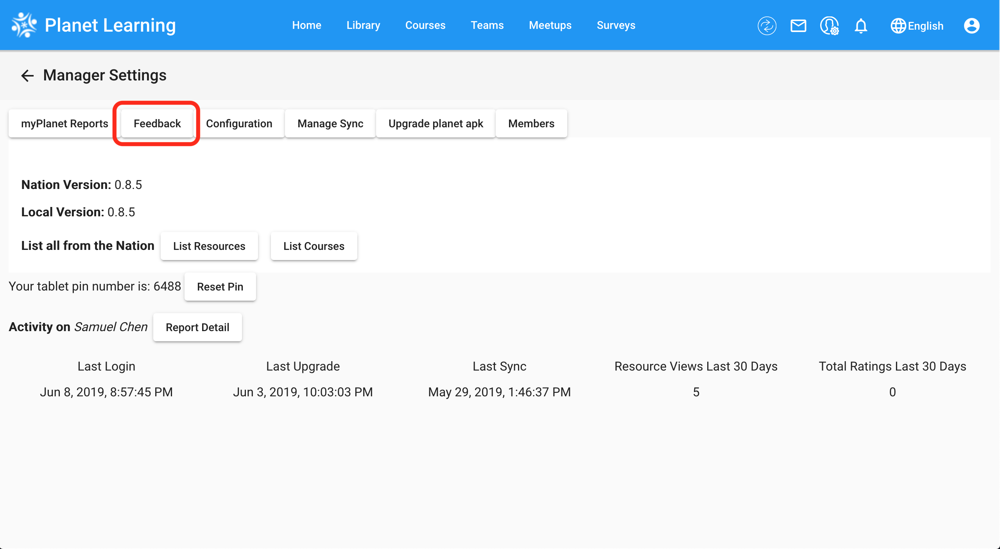

## Replying To Feedbacks
First, click on view as seen below
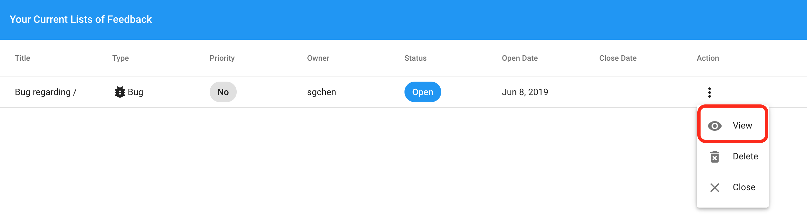

Then you can reply to it
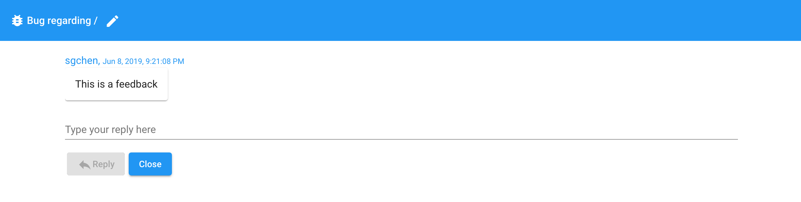

## Closing And Reopening Feedbacks
By clicking the dotted menu under actions, you will be able to close an open feedback (Picture 1) or reopen a closed one (Picture 2)

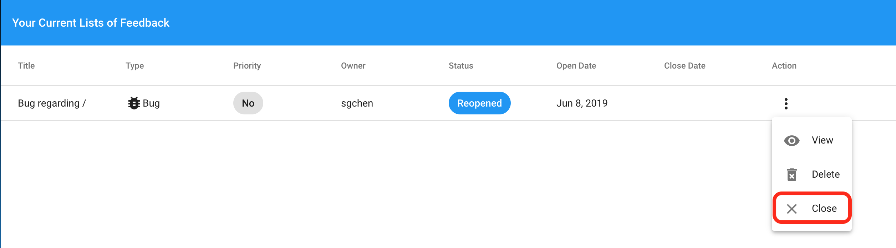
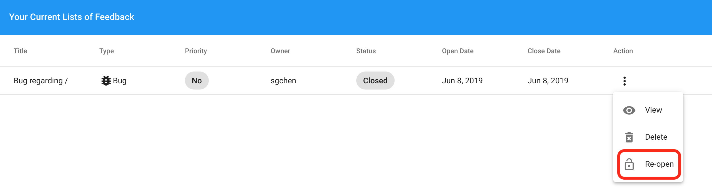

