# Library

## Getting to Library page
The Library page can be accessed through the menu bar at the top, or by clicking "Add item to myLibrary" on your dashboard.

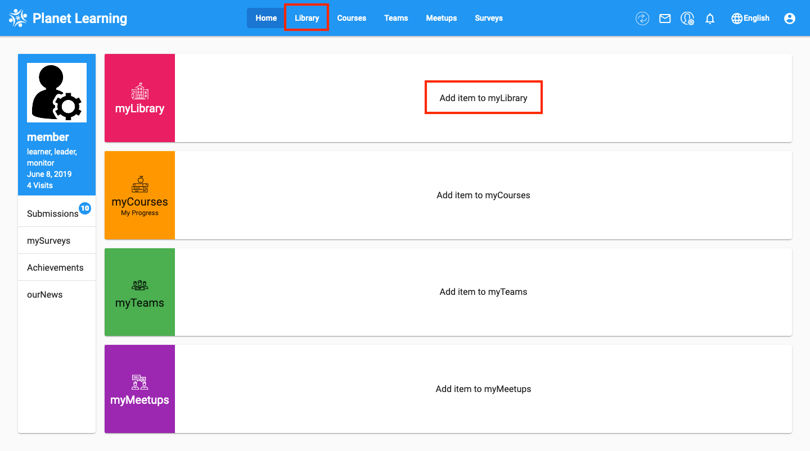

## List of Resources
Here, you can view the list of all the resources available to you in the Library.

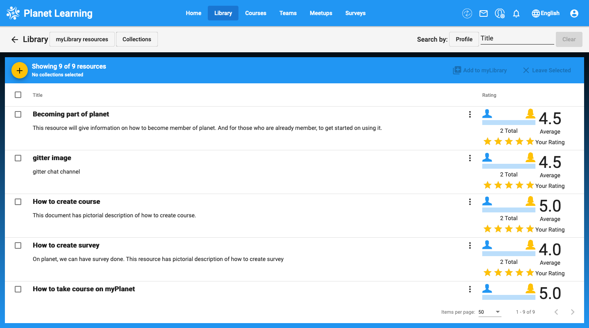

There are several different actions that can be performed in the library:

**Action Menu** - Here, you can add the resource to your library, give feedback, or download the resource.

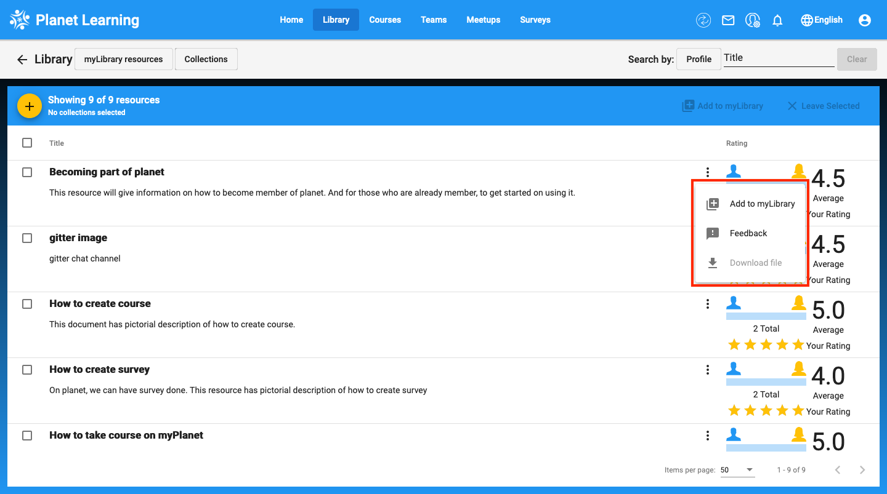

**Rating** - You can rate resources from 1 to 5 stars, and also see the resources' average rating from other members.

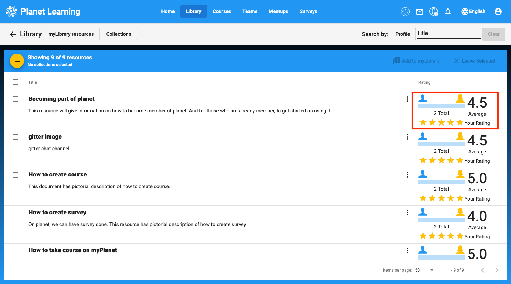

**Selection** - By using these checkbox selectors, you can add or remove multiple resources from your library at the same time.

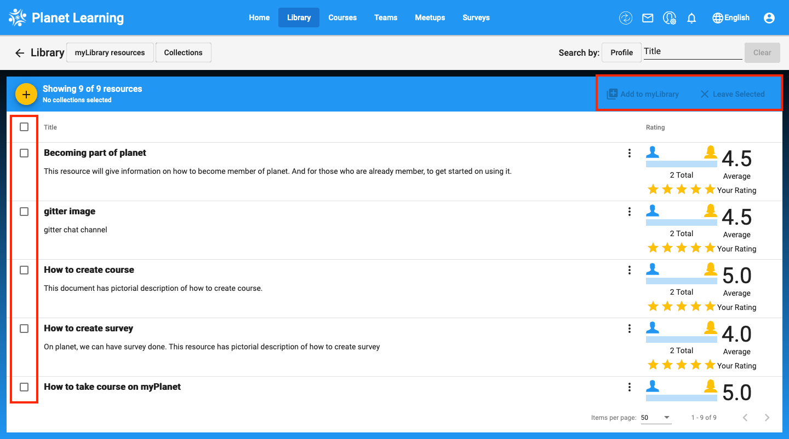

**Filter/Search** - To filter searches, click on the "Profile" button next to the search bar, then select your desired filters for a more advanced search.

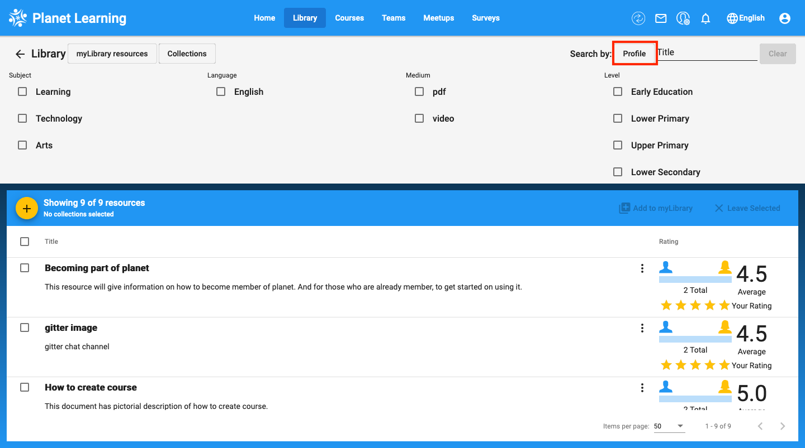

**Pagination** - The paginator shows the number of search results, and allows you to select the number of results per page, and navigate between pages.

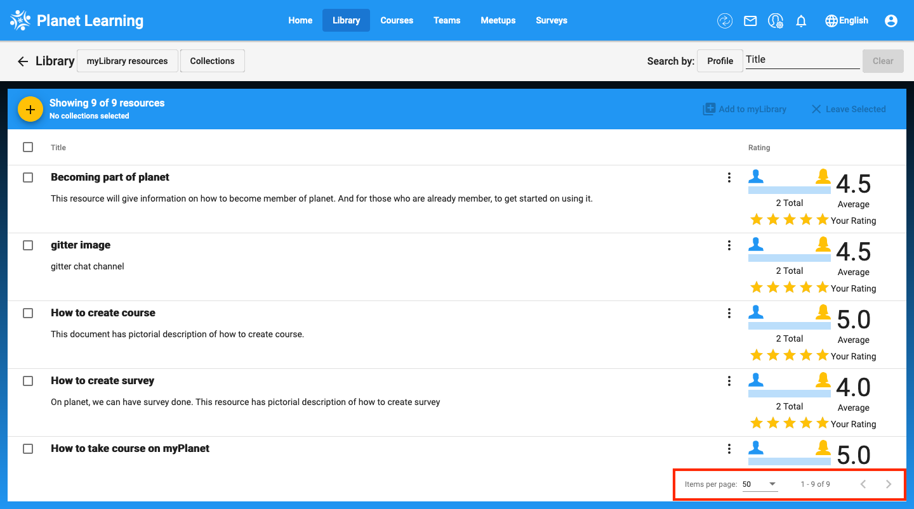

## Adding Resource
You can also add resources to the library. To do this, click on the "+" button, fill out the information about your resource, and upload it by clicking on the "Browse" button to select the file from your computer.

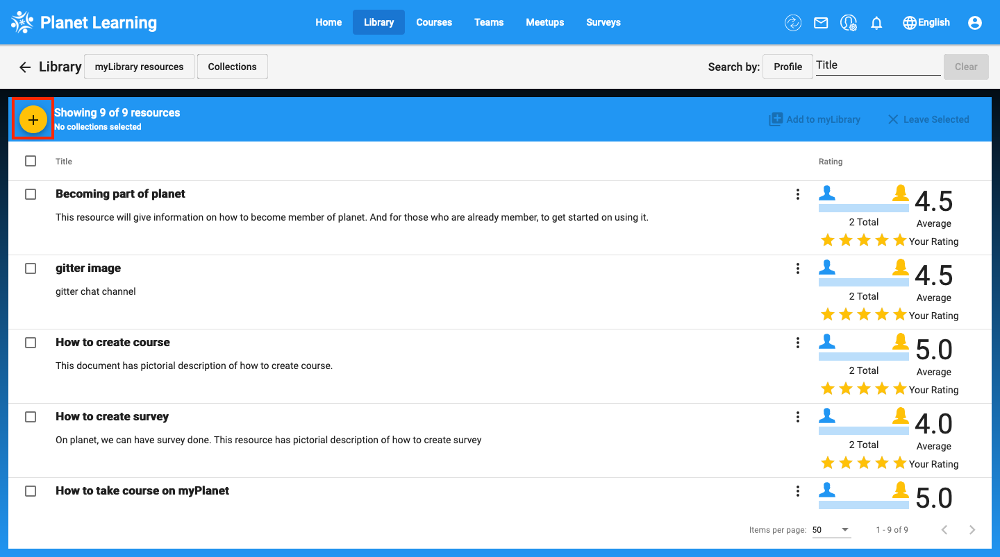
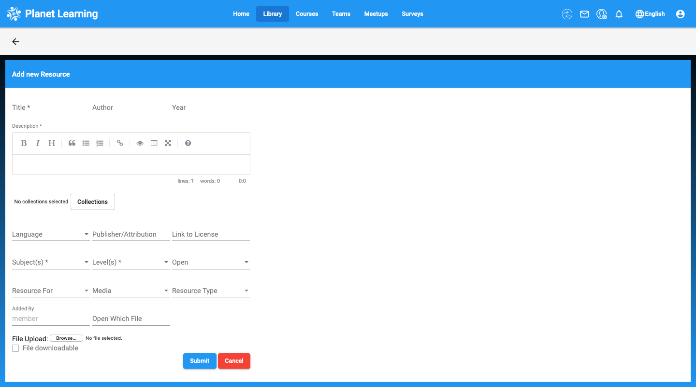

## Using collection of resource
The admin of the community can create "Collections" to categorize the resources. Members can also use these collections to view different groups of resources.

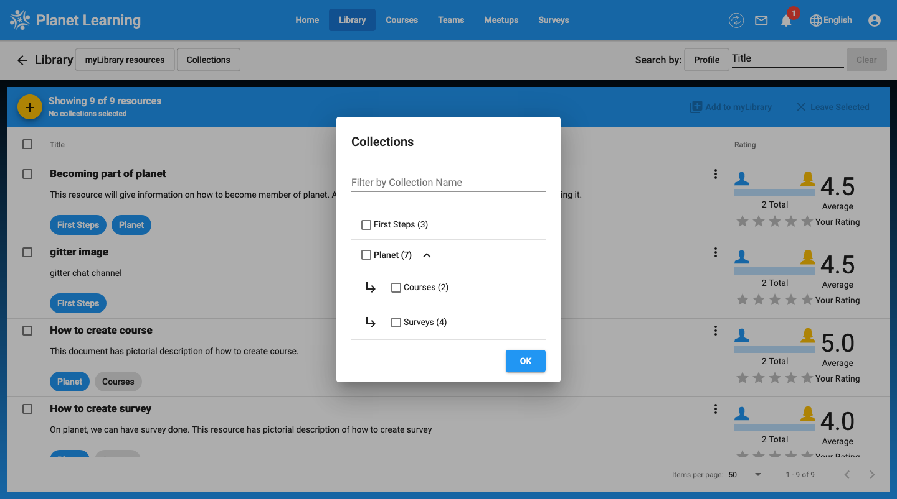

## Resource View
The resource view page looks like this:

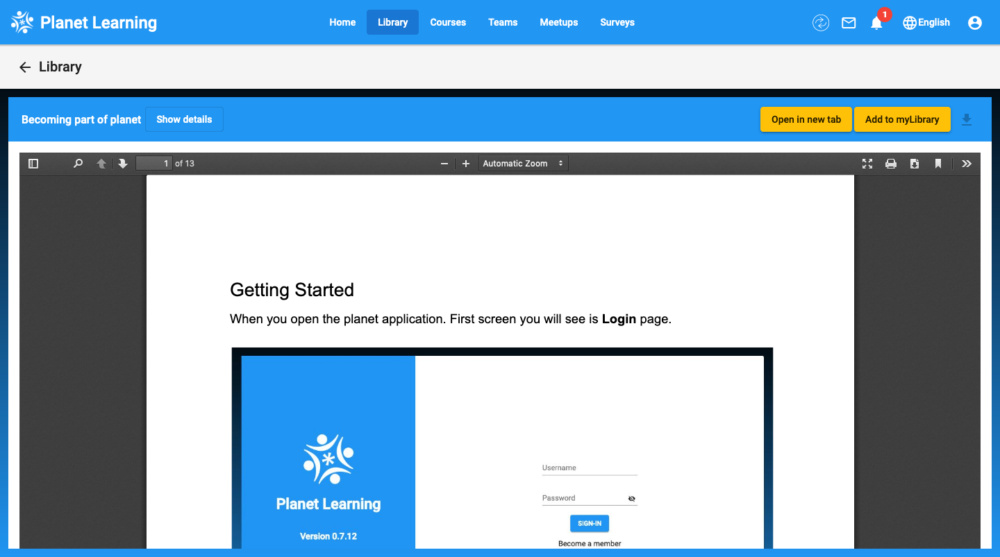

On this page, you can open the resource in a new tab, add it to your library, and download it to your computer. In the resource viewer itself, you can also search for terms, jump to pages, zoom, and more.
