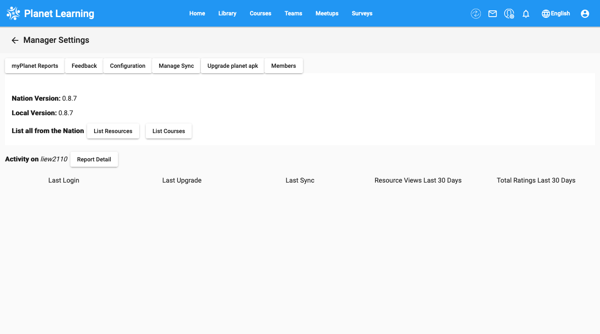
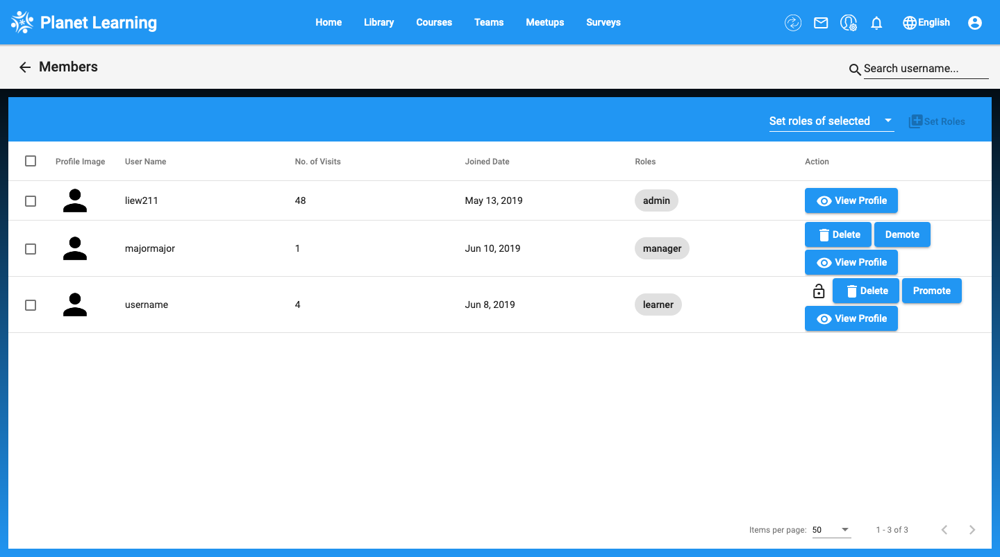
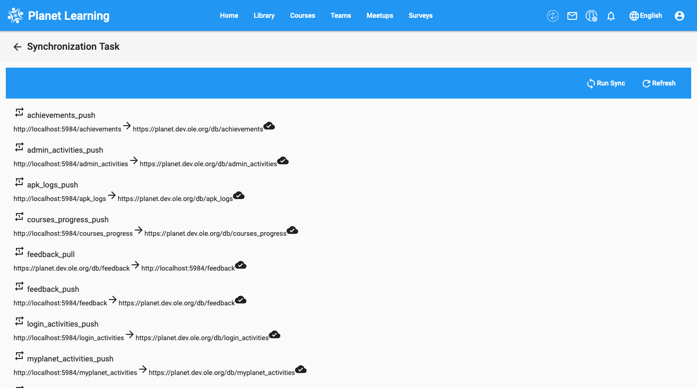

# Manager
	
One of the roles in planet is the Manager. The admin, as well as other managers, will have the ability to promote members to manager, set roles, and perform tasks such as syncing the community with the nation and upgrading the local community.
	
## Manager Dashboard
	
To access the Manager page, click on the manager icon on the home screen.
	

	
Here, you can view the reports, feedback, configuration, members, and reports from the planet, as well as perform Manage Sync and Upgrade.
	

	
You can view the list of members by clicking on the members button. Here, you can promote/demote, set roles, and view profiles of other members.
	

	
To perform Manage Sync, simply click on the Manage Sync button in the Manager page, then click the Run Sync button.
	

