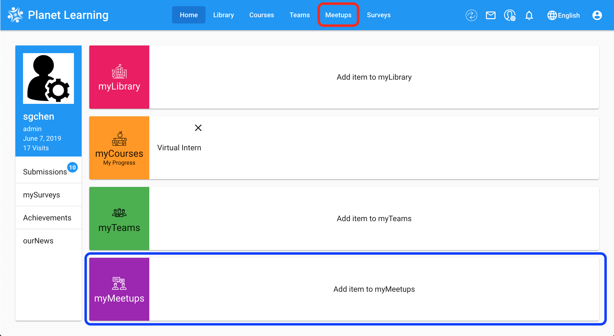
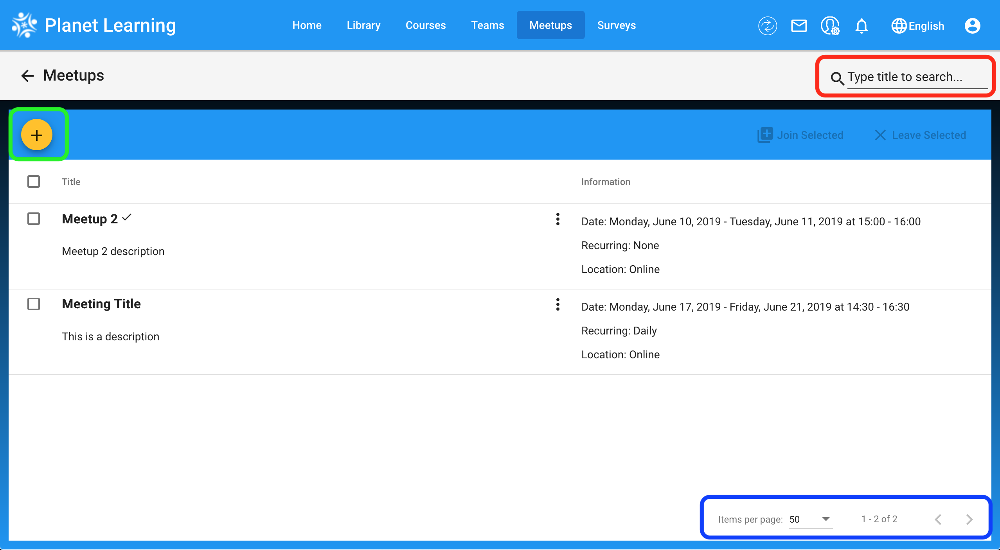
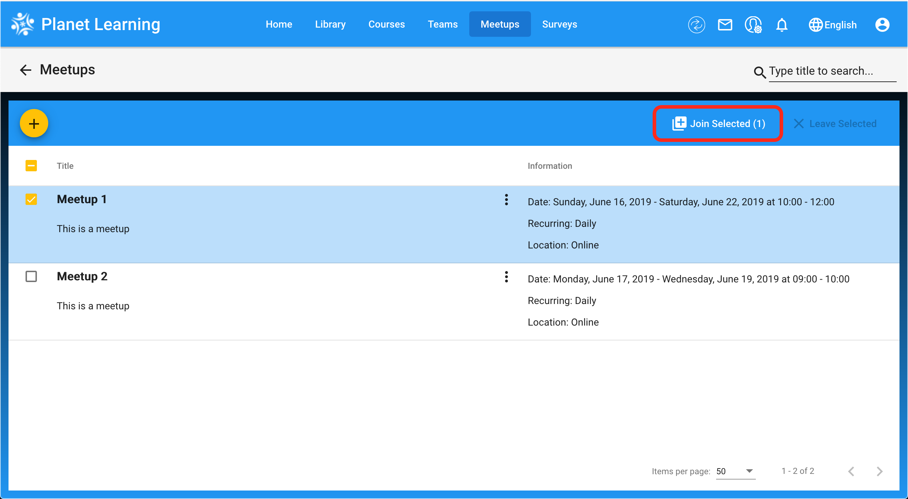
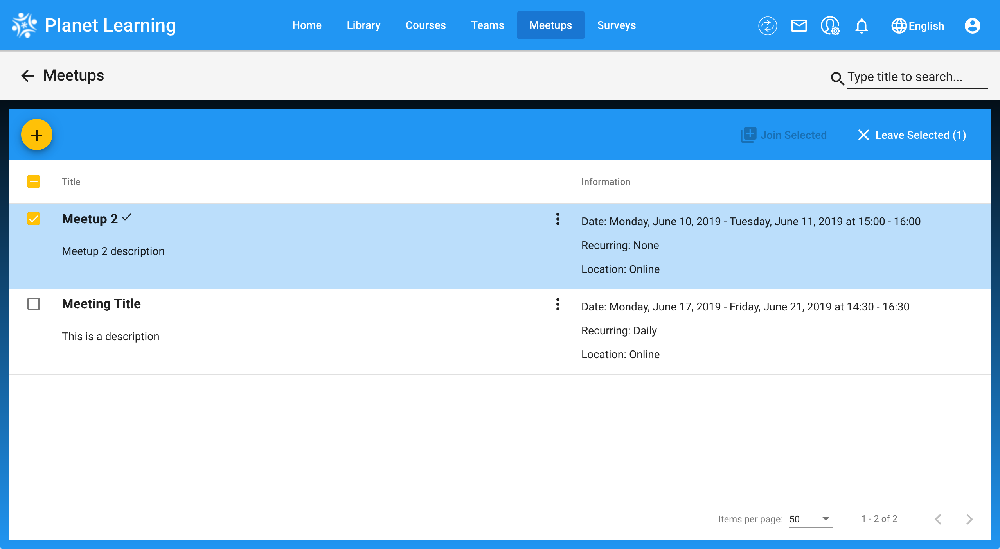
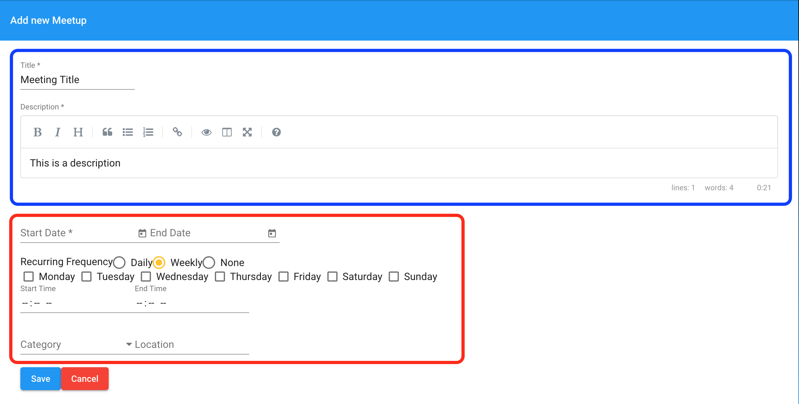
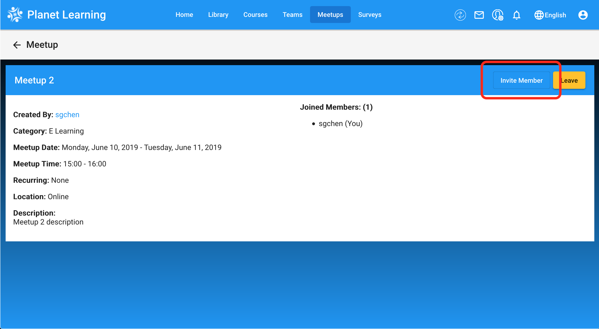

# Meetups

## Navigating To The Meetup Page
As you can see below, once you are in your planet dashboard you can access the page using the **Dashboard Tile** (Red box) and the **Menu** (Blue box):

## Available Actions On Meetup Page
1. Traversing the page. Here you can **filter and search** (Red box) for specific meetups and use the 
**page navigation** (Blue box) to traverse the list of meetings and show the number of them on the page.
You can also click on the plus icon (Green box) to add a new meetup (see "Adding meetups")

2. You can join meetups (Picture 1) and leave meetups you are apart of (Picture 2). First click on the small box on the left of the meetup to select it and pick an action (Red box).

## Adding Meetups
After clicking on the plus icon, you will have come to this page. Here you will need to add a **Title and a Description** (Blue box). Next you will have to pick the **duration of the meetup**, category, and location** (Red box).

**Note:** If you pick the frequency to be weekly, you will be prompted to choose which days of the week the meetup will occur (as shown below).

## Inviting Others
Once you navigate into a meetup, you will be able to invite other members by clicking the `Invite Member` button (Red box).

