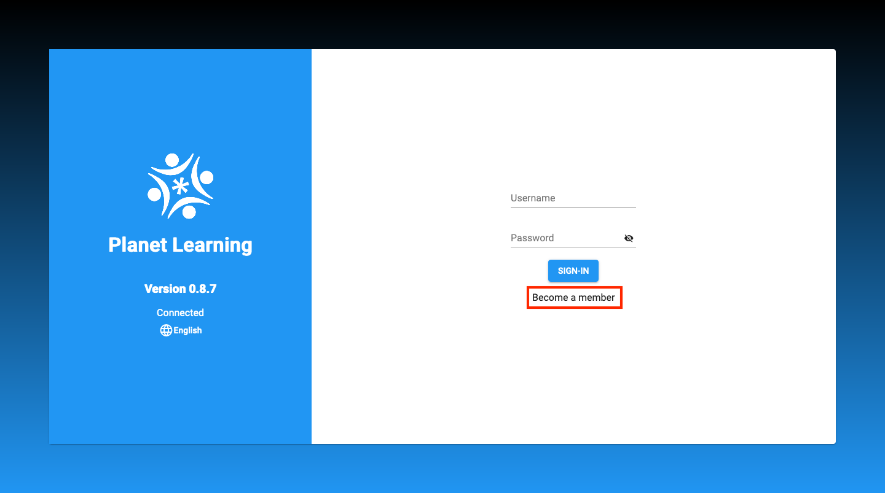
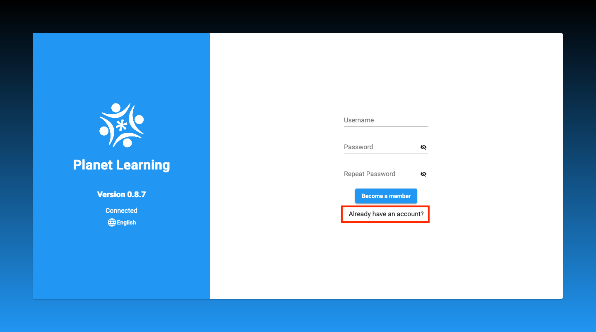
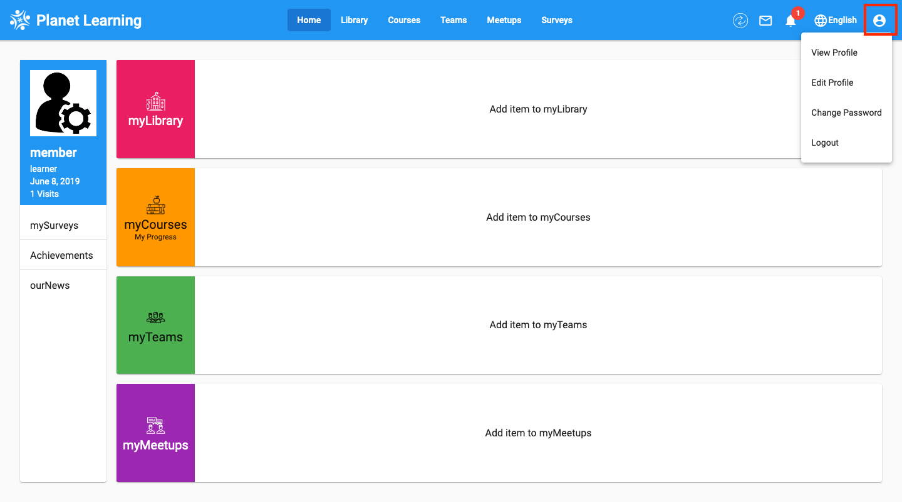

# Member

## How to get to Become Member
When you first open Planet, you will see the login page. Click on the "Become a member" button to create your account.

To return to the login page from the "Become a member" page, click on the "Already have an account?" button.

## Different kind of roles available in system
There are several different roles available in Planet: "admin", "manager", "learner", "leader", and "monitor". Members are "learners" by default, and only the "admin" is allowed to set specific roles of members.

## User profile
Click on the profile button in the top right corner of Planet. Here, you can view or edit your profile, change your password, or logout. Be sure to log out once you are finished with your session.

