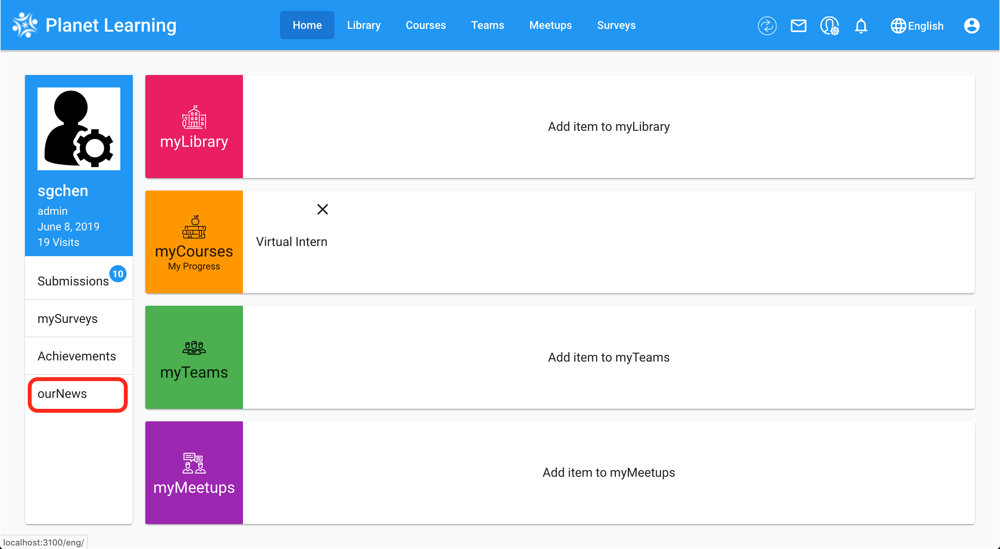
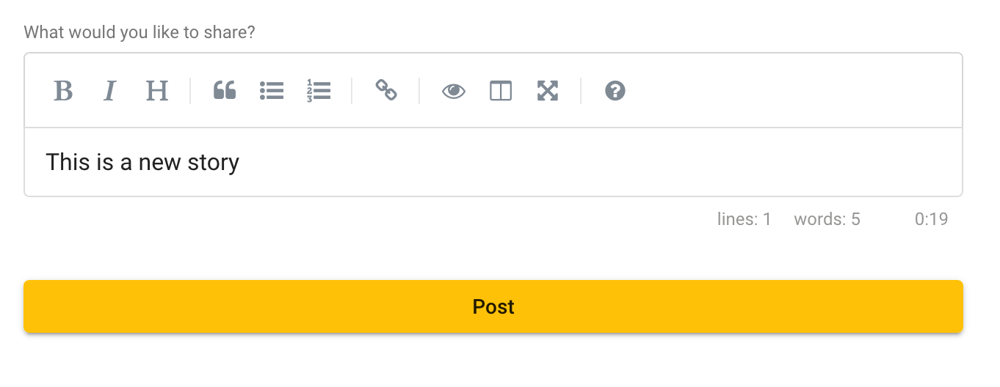
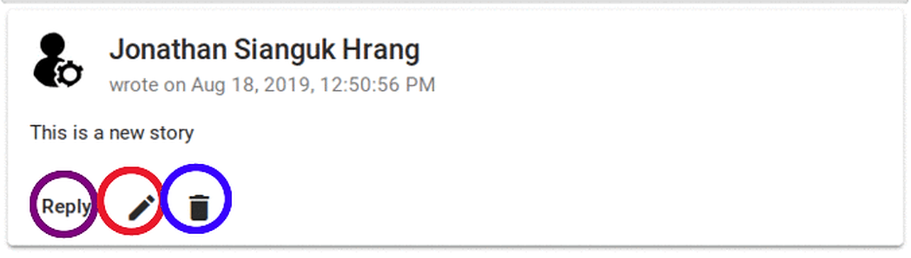

# News
Topics:

* [Navigating to the News Page](#Navigating-to-the-News-Page)
* [Adding a Story](#Adding-a-Story)
* [Editing or Deleting Stories](#Reply-Edit-and-Delete-Stories)

### Navigating to the News Page
As you can see below, once you are in your planet dashboard you can access the page using `ourNews` (Red Box)

### Adding a Story
After navigating to the `News` Page, you will be able to browse previous stories and add one of your own as you can see below.

### Reply, Edit and Delete Stories
You can reply to a story by clicking on the reply icon on the post (Purple circle), edit a story by clicking the pencil icon (Red circle) and delete a story by clicking the garbage can icon (Blue circle)

