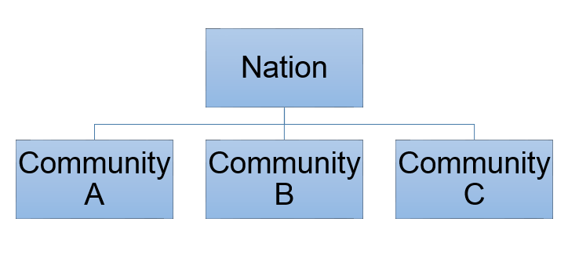
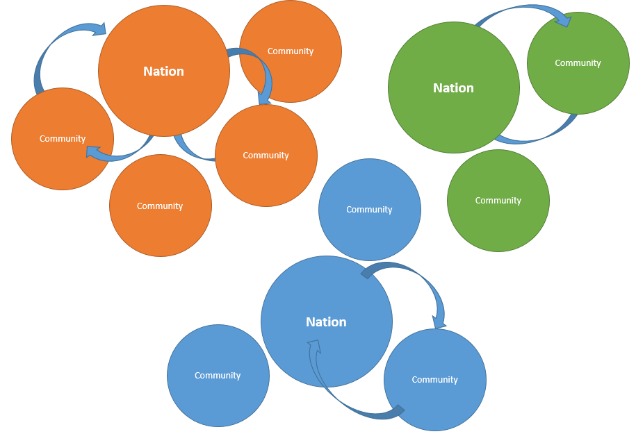
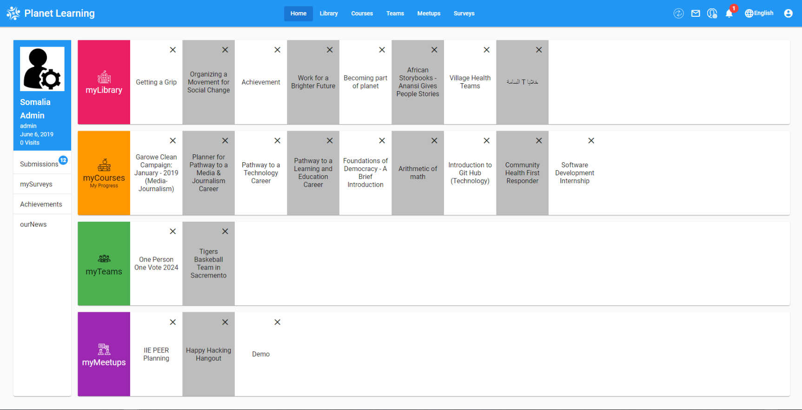

# Planet Learning

## About OLE – Building Open Learning Communities Worldwide

### Our Mission
The [**Open Learning Exchange (OLE)**](http://ole.org) is committed to ensuring that everyone—especially children—has access to **high-quality basic education**.  

We collaborate with **community-based entrepreneurs, educators, and practitioners worldwide** to promote **effective and affordable learning systems for all**.  

We believe this will lead to:
- **More productive lives**
- **Stronger communities**
- **Thriving nations**
- The possibility of a **peaceful world**

### What We Do
OLE’s mission is to ensure **learning for all**, not only through universal literacy and numeracy, but also by equipping learners with vital knowledge and skills in areas such as:
- **Health**
- **Nutrition**
- **Community development**

Since 2007, OLE International has:
- Helped establish **Open Learning Communities** for children, adolescents, and young adults  
- Reached learners whose lives have been disrupted by violent conflicts  
- Supported affiliates in **Asia, Africa, the Middle East, and Latin America**

---

## Introduction

### What is the OLE Planet Learning System (Planet)?
**Planet** (Personalized Learning And Network-Enabled Teams) is a **multilingual learning system and library** with thousands of educational resources, including:
- Books  
- Videos  
- Educational games  

It also provides software tools for:
- Content and student management  
- Student evaluation and monitoring  
- Course creation  

At its core, **Planet is a repository of free, open access, and public domain resources** designed to support learners of all ages and backgrounds.  

Resources include:
- Subjects: **Literature, Health, Science, Math**, and more  
- Languages: **English, Somali, Swahili, Arabic, Spanish**, etc.  
- Formats: **Text, audio, video**  

### Flexible Access
- Operates in the **cloud** (online through the internet)  
- Can also run **locally** on a **Raspberry Pi server** (a small, affordable, low-power computer)  
- Works in **areas with little or no internet connection**  
- Requires **very low power**, so it can run even from a **portable battery (power bank)**  

### Monitoring & Evaluation
Planet makes it easy to track progress by providing:
- Frequent **assessments** for learners, leaders, and administrators  
- Evaluation of whether **learning resources are effective**  
- **Usage feedback metrics** (simple reports that show how often resources are used and how learners are performing)  

---

## Planet Nations and Communities

Under the Planet system, there are two types of structures: **Nations** and **Communities**.

  

### Nations
  * **Nations** always exist in the cloud and require an internet connection to access.
  * Each **Nation** serves as a central repository for the **Community** or a group of communities that it serves.
  * Different **Nations** cannot connect to each other. 

 ### Communities
  * A **Community** is a local installation of the Planet system.
  * A **Community** does not require an internet to access.
  * Users can connect to a **Community** using any device with access to a web browser, such as a tablet, computer, etc. The connection is established via a router through a locally configured _intranet_.
  * Each **Community** connects periodically to a **Nation** via _internet_ in order to receive new materials and to upload user metrics.
  * A **Community** is not able to connect to other **Communities**. 

The **nations** may store thousands of Resources in many formats and languages. Unique collections of Resources can be selected and downloaded into each **Community** from the **Nation**. This gives a Learner a personalized approach to his or her education. 

---

## Become Member
To be able to use **PLANET** you need to be part of the system. The first thing you will see on PLANET is the **Login page**. [Learn more about becoming part of PLANET and using it.](member.md)

---

## Features of Planet

When you are inside PLANET, you will see the following features:  

### Community
The **Community page** allows you to:  
- Connect with like-minded individuals  
- Expand your knowledge and creativity  
- Check for new events, join ongoing ones, or create your own via the calendar feature  

Note: The **Community tab** is only available within a local community Planet, not in the cloud.

---

### myDashboard
**This portion is under development.**  
(The dashboard is where learners can track their courses, progress, and upcoming activities.)  

---

### Library
The **Library** is home to the community's collection of media and other resources.  
You can explore materials in multiple subjects and formats (books, videos, documents).  

[Learn more about Library.](library.md)

---

### Courses
The **Courses page** allows you to:  
- Create courses  
- Join existing courses  
- Explore a wide range of topics (literacy, science, health, community skills, etc.)  

[Learn more about Courses.](course.md)

---

### Exams
**This portion is under development.**  
(The Feature may allow learners to take exams within the system, and educators to create and grade assessments digitally.)  

---

### Surveys
The **Surveys** section allows you to:  
- Create surveys  
- Send them to others  
- Collect feedback from learners and educators  

[Learn more about Surveys.](survey.md)  

---

### Teams
In the **Teams** section, you can:  
- Create and manage teams  
- Communicate with team members  
- Offer courses within your team  
- Organize members for collaborative projects  

[Learn more about Teams.](teams.md)  

---

### Meetups
The **Meetups** feature lets you:  
- Create meetups  
- Join existing meetups  
- Coordinate community gatherings, workshops, or study groups  

[Learn more about Meetups.](meetup.md)  

---

### News
The **News section** is where you can:  
- View posts made by users in your community  
- Stay updated on local events and announcements  

[Learn more about News.](news.md)  

---

### Achievement
The **Achievement section** allows you to:  
- Add and display your achievements  
- Showcase learning milestones within your profile  

[Learn more about Achievements.](achievement.md)  

---

### Feedback
Throughout Planet, you will be able to give **feedback** on:  
- The platform itself  
- Courses  
- Learning resources  
- Other features  

[Learn more about Feedback.](feedback.md)  

---

### Manager
The **Manager role** comes with a set of administrative features, including:  
- Viewing reports about usage and learning progress  
- Syncing the community with the Nation (to update resources and upload data)  
- Performing upgrades on the community system  

[Learn more about Manager.](manager.md)  
