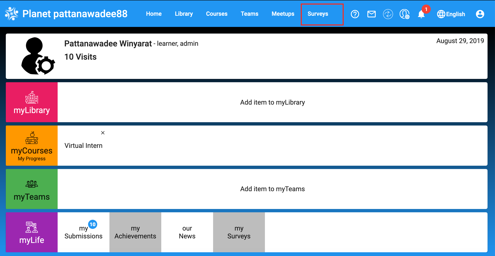
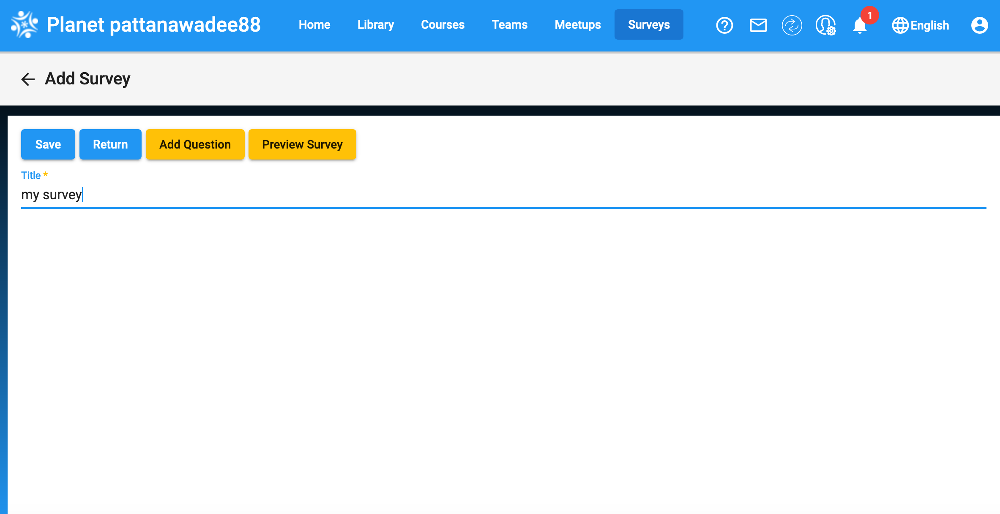
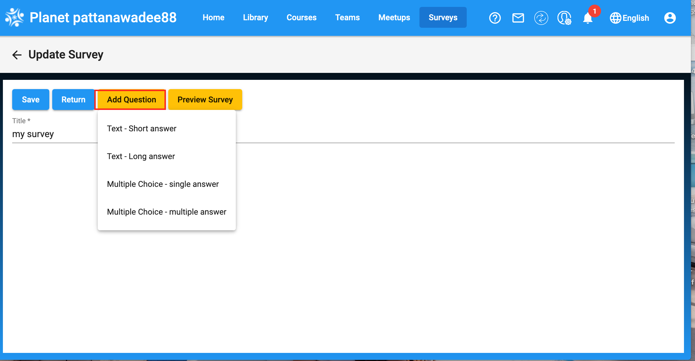
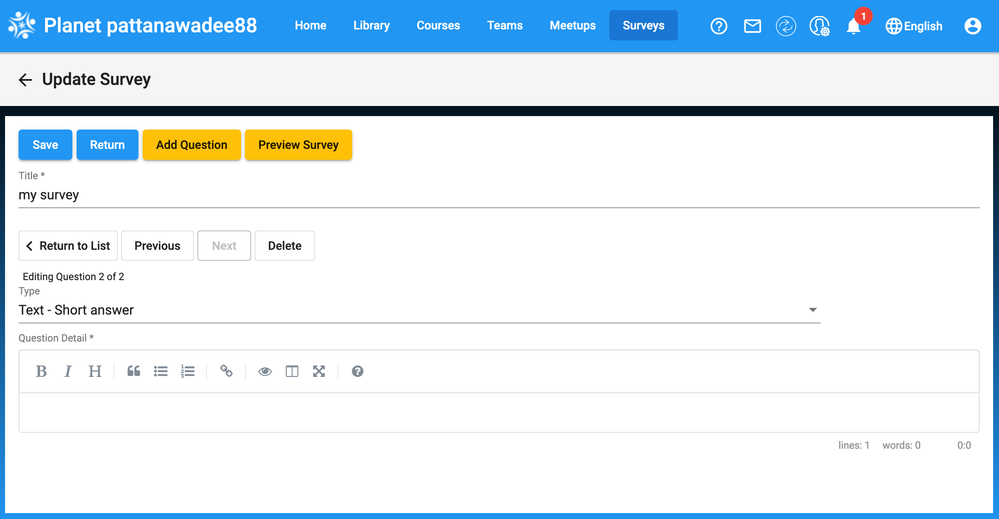
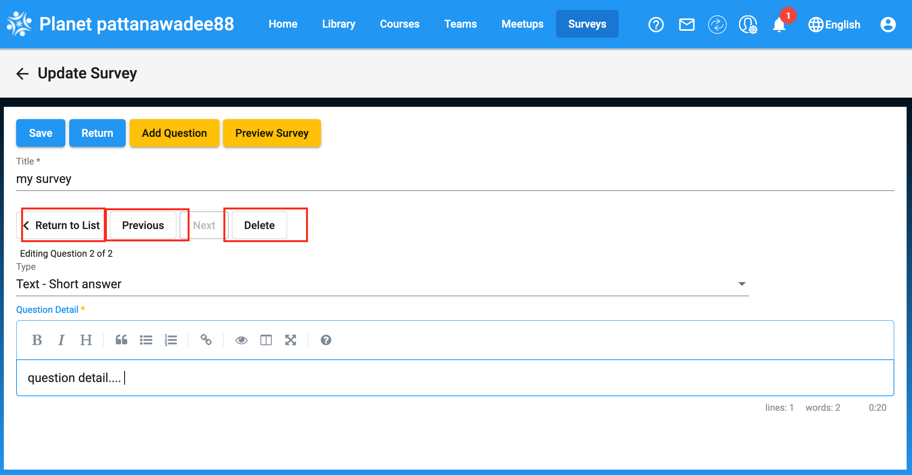
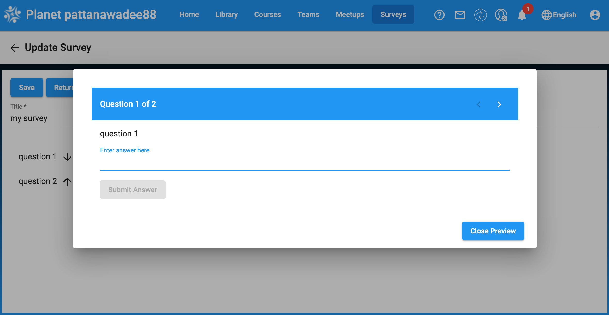
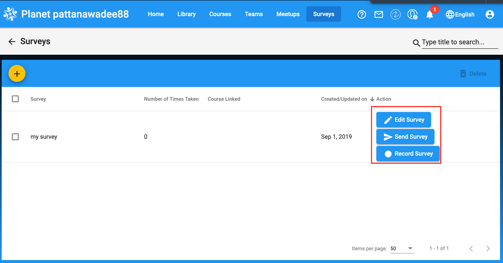
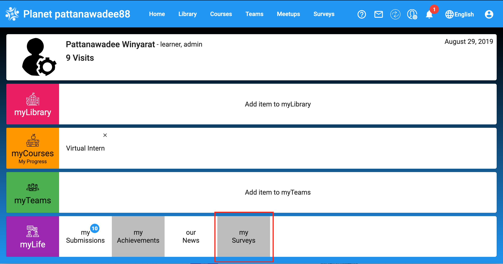

# Survey
## Navigating To The Survey page
As you can see below, once you are in your planet dashboard you can access the page on the top left (Red box):

## Adding a survey
Clicking on the plus icon to add a survey, as shown below: 

You will come to this page. Here you will need to add a **Title of a survey** 

Once you have a title of a survey, you have to choose **Type of your survey questions** to be able to add question(s).

Once you choose the type of your survey question, you can add question details.

**you can have multiple questions in one survey**

As a picture shown below, you can **Return to List of a survey**, **Previous question**, **Next question**, and **Delete question**

After finish adding question(s), you can preview your survey.

And once you finish create your survey, on your survey page , you can **Edit Survey**, **Send Survey**, and **Record Survey**

Also, you can find your survey on **my surveys** on your Home page.

