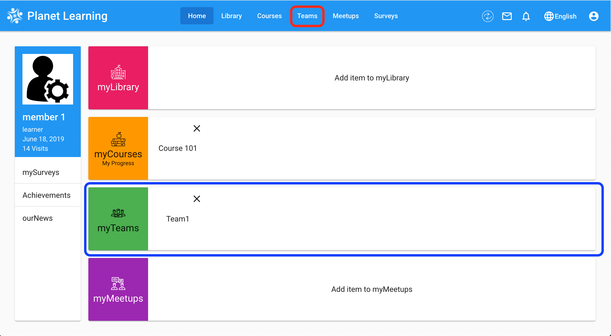
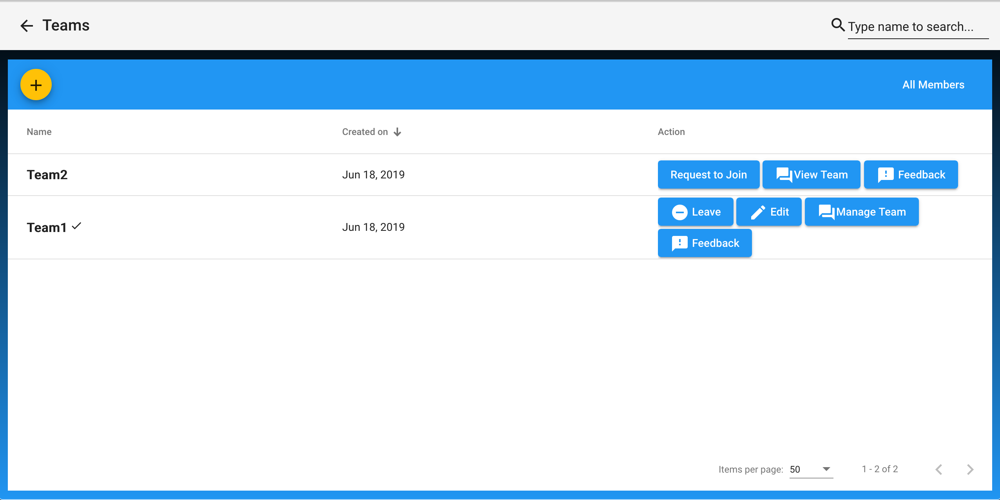
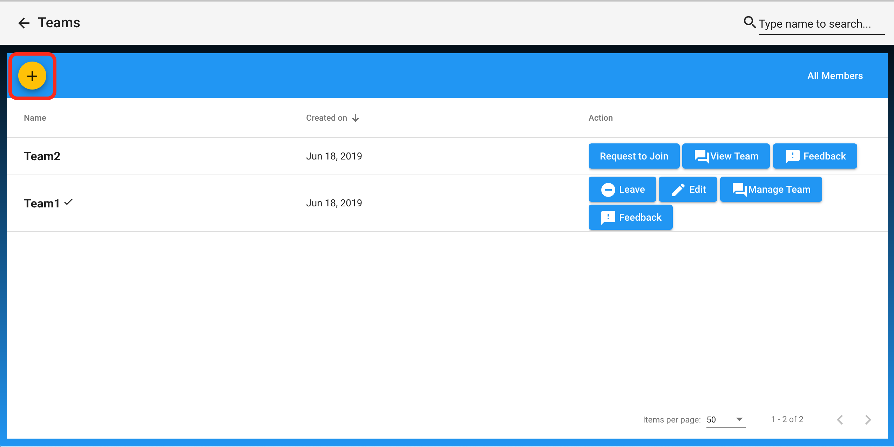
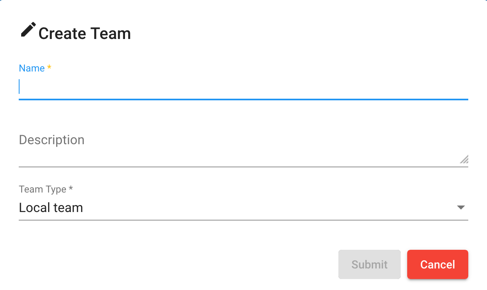
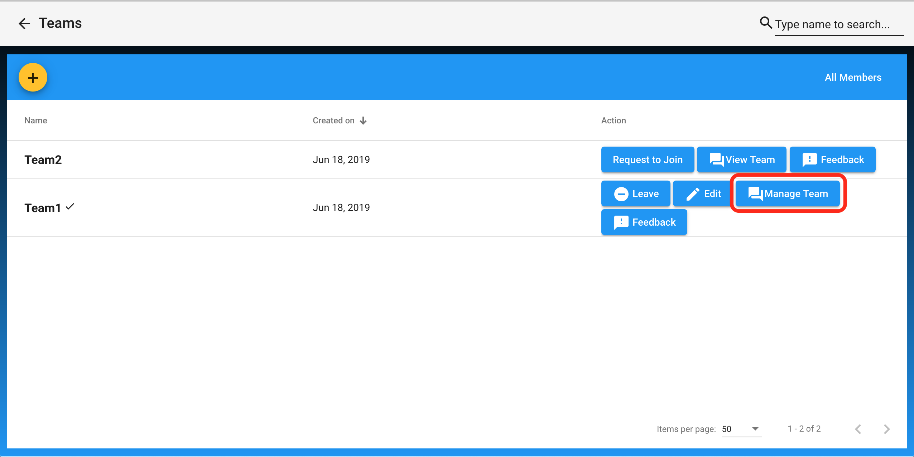
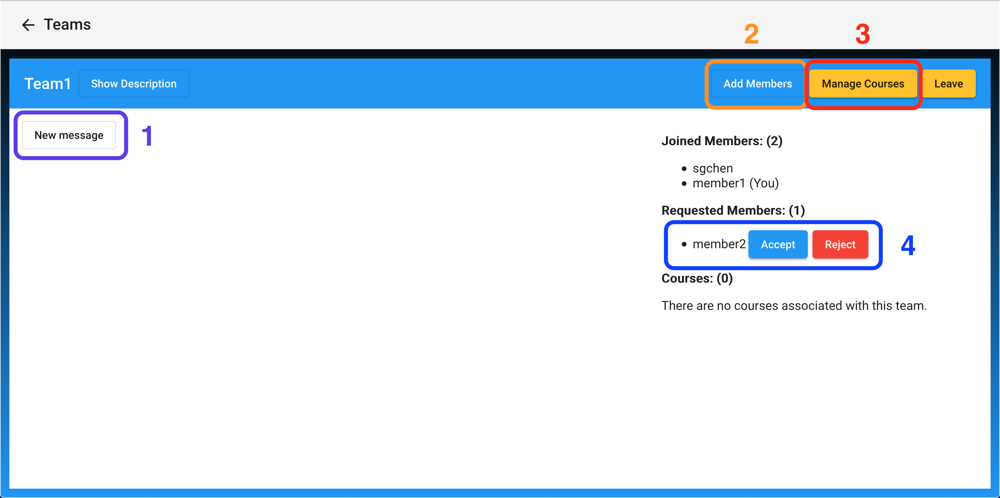
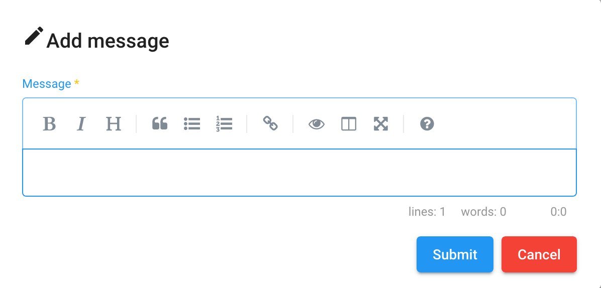
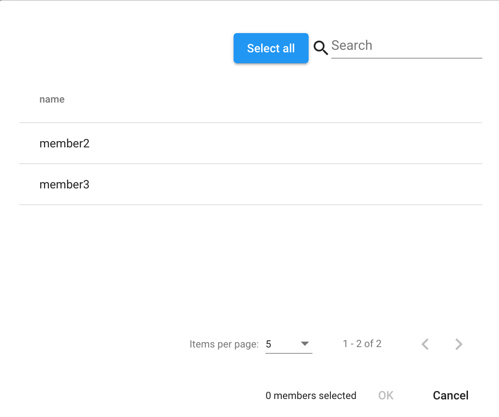
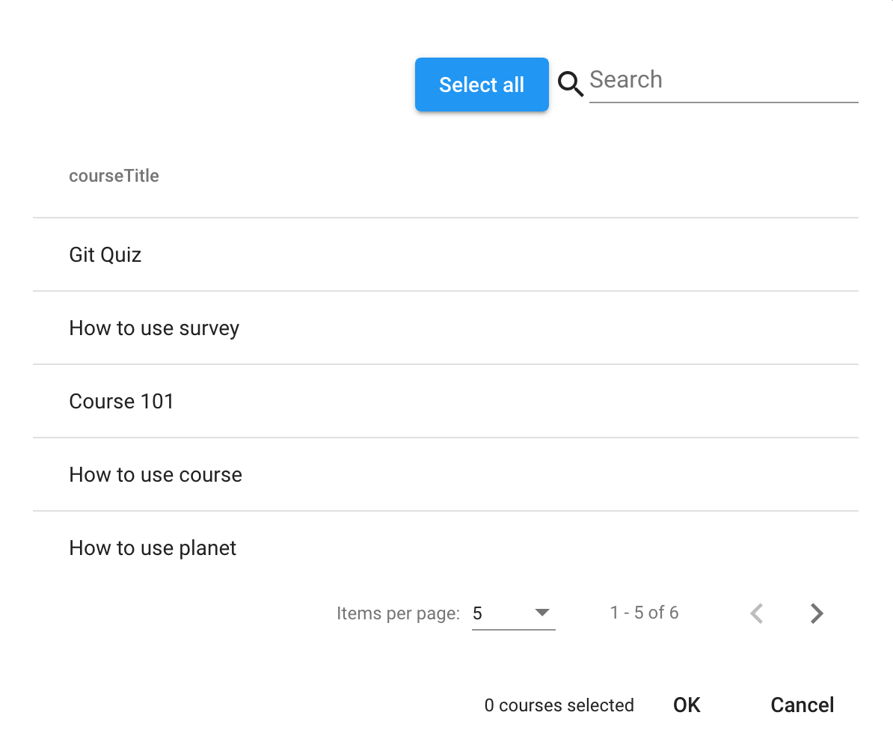

# Teams

Topics:
1. [Accessing Teams](#accessing-teams)
2. [Actions On Teams Page](#actions-on-teams-page)
3. [Adding Teams](#adding-teams)
4. [Manage Teams](#manage-teams)

## Accessing Teams
On dashboard you will be able to access teams from the **dashboard tile** (red box) and the **menu** (blue box).

## Actions On Teams Page
After arriving to the Teams page you will see the screen as you can see below. Here are the actions you can perform:
- Search for specific teams by name
- Leave teams (If you are already apart of a team)
- Request to join (If you not apart of a team)
- Change pages if there is a great amount of teams

## Adding Teams
You are able to add teams by clicking the **plus button** and inputting information as you can see below:

## Manage Teams
To manage teams you would have to click on `Manage` as seen below

You will then arrive at this page where you will have many potential actions:

These actions will be explained in depth below:
1. `New Message`
2. `Add Members`
3. `Manage Courses` 
4. `Accept` or `Reject`

You are also able to leave the meeting with the `Leave` button

### 1. New Message
After clicking the `New Message` button, you will be able to make a post to the team

### 2. Add members
After clicking the `Add Members` button, you will be able to add members

### 3. Manage Courses
After clicking the `Add Members` button, you will be able to add and remove courses

### 4. Accept / Reject
Here, you will be able to accept or reject any members who requested to join the team
