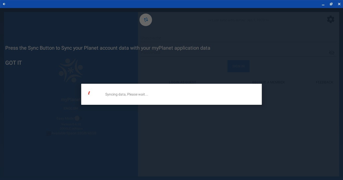

# First Steps

# The Big Picture

Welcome to the first steps for becoming an OLE Virtual Mobile Intern! We treat these first steps as a vetting process to prove that you can follow simple instructions before you can progress to working on harder projects in bigger teams. Consider them to be the interview for the internship.

If you are selected for the internship after completing the steps, you will be officially invited to join the OLE interns team! We’ll add you to the Virtual Interns Discord chatroom and assign you to a specific team to work on developing and improving OLE’s software. Our current projects can be found [here](#!./pages/robots/rbts-intern-orientation.md#Familiarize_Yourself_with_Current_Projects_and_Issues).

Once accepted, you and your team will work on an assignment, and we’ll switch up the assignments each week. As part of this internship, you will have the opportunity to work with software and languages including **[Git](https://git-scm.com/)**, **[GitHub](https://github.com/)**, **[Markdown](https://daringfireball.net/projects/markdown/)**, **[Vagrant](https://www.vagrantup.com/)**, **[VirtualBox](https://www.virtualbox.org/)**, **[Command Line/Terminal](https://www.w3schools.com/whatis/whatis_cli.asp)**, **[Command Line/Terminal Scripts](https://www.codecademy.com/articles/command-line-commands)**, **[Vim](https://www.vim.org/)**, **[CouchDB](http://couchdb.apache.org/)**, **[Docker](https://www.docker.com/)**, **[HTML5](https://developer.mozilla.org/en-US/docs/Web/Guide/HTML/HTML5)**, **[JavaScript](https://developer.mozilla.org/en-US/docs/Learn/JavaScript/First_steps/What_is_JavaScript)**, **[Node.js](https://nodejs.org/en/)**, **[Angular](https://angular.io/)**, **[Java](https://www.tutorialspoint.com/java/index.htm)**, and **[Kotlin](https://kotlinlang.org/)**.

**NOTE**: This is an unpaid but intensive internship that requires 16 hours of work each week. More information about the internship can be found in our [FAQ](https://open-learning-exchange.github.io/#!pages/vi/vi-faq.md#General_Internship_Questions). If you have further questions, don’t hesitate to ask other members in the Discord Server!

# The Steps

Social coding is a huge part of any open source and collaborative project, and the Open Learning Exchange (OLE) is no different. In the following series of steps, you will learn about Markdown, Vagrant, Docker, Git, GitHub, GitHub issues, GitHub pull requests, etc. You will also be introduced to OLE’s digital library that hosts the learning materials – [Planet](https://github.com/open-learning-exchange/planet), and it's companion android app [myPlanet](https://github.com/open-learning-exchange/myplanet).

Because these steps are simple, we expect high-quality work, which may take a longer time. We want to see that you are capable of using or learning how to use these tools (writing good GitHub issues, creating pull requests, navigating the Planet, using Vagrant and Docker, etc.). These steps may seem easy, but we want you to impress us with good GitHub etiquette and quality Markdown. The bare minimum would be to just passively follow the steps; you should do further reading about the tools/languages we use so you can further your understanding and relieve confusion if you're unclear about how something works. **Treat these steps as learning opportunities!** The GitHub and Markdown skills you practice here are very important for both this internship and a future software development career.

The MDwiki has plenty of resources to help you complete the steps. There is a list of useful links at the end of each step. We also created a [FAQ page](https://open-learning-exchange.github.io/#!pages/vi/vi-faq.md) where you can find the answers to some commonly asked questions. This page has even more [useful links and video tutorials](https://open-learning-exchange.github.io/#!pages/vi/vi-faq.md#Helpful_Links) that will help you become familiar with the tools/languages we use. For anything that is not on the FAQ page, Google and Stack Exchange are your friends :)

**We also want you to keep us updated a relatively good amount in the Discord chat as you complete these steps. We will ask you to send us messages, links, and screenshots along the First Steps, and we will use this to track your progress, so please do not forget to do so.**

A very large part of these steps is finding problems with these steps and this MDwiki, so take note of any issues that you run into or suggestions for improvement while doing these steps. Think of it as improving these steps and this MDwiki for future interns.

There is no official deadline to complete these steps, but most candidates who are approved for the internship program finished the steps within 7-8 days. Good luck!

## Step 0 - Prerequisites

The following hardware is required for the internship:

1. Laptop or computer with minimum 8GB of RAM
2. Android device (phone or tablet) with minimum 2GB RAM and at least Android 6 "Marshmallow"
3. Internet connection

## Step 1 - GitHub & Markdown Setup

- Follow the instructions on the [GitHub and Markdown page](../../pages/vi/vi-github-and-markdown.md) page. Make sure that you've linked to your github.io and pull request on the Discord channel (https://YourUserName.github.io and LinkToYourPullRequest).
- Include Raw.githack link in your pull request (https://raw.githack.com/YourUserName/YourUserName.github.io/YourBranchName/#!pages/vi/profiles/YourUserName.md).

NOTE: Raw.githack link above is case sensitive to your username.

## Step 2 - Getting myPlanet App

- myPlanet application is only available for Android devices. You can find myPlanet application in the play store.
- If you follow this link for myPlanet on Play Store you will be able to reach myPlanet in playstore. You can then install myPlanet from there on your phone.

## Step 3 - Build myPlanet in Android Studio
Download, install and Set up Android Studio
- Go to [Android official website](https://developer.android.com/studio/install) and follow the steps to install and setup android studio which is the recommended android IDE depending on your laptop Operating System.
- Follow the steps on [myPlanet Github Repository](https://github.com/open-learning-exchange/myplanet#getting-started-for-users) to get myplanet code cloned on your laptop.

**Open Android Studio:**
 Launch Android Studio on your computer. If this is your first time using Android Studio, it may take a moment to set up the initial configuration.

**Import the Project:**
 In Android Studio, click on "Open an existing Android Studio project" or navigate to "File" > "Open" and select the cloned repository folder that contains the Android app project. Click "OK" to import the project.

**Gradle Build:**
 After importing the project, Android Studio will perform a Gradle build, which may take a few moments. Gradle is the build system for Android projects, and it will download any necessary dependencies for the project.

**Configure Emulator or Connect Device:**
 To run the app, you need to set up either an Android emulator or connect a physical Android device to your computer:
    - Emulator: In Android Studio, you can create a virtual device emulator by navigating to "Tools" > "AVD Manager." Follow the prompts to create a new virtual device based on your preferred device configuration.
    - Physical Device: If you want to run the app on a physical Android device, connect it to your computer using a USB cable and ensure that USB debugging is enabled in the device's developer options.

**Select Run Configuration:**
 In Android Studio's toolbar, select the desired run configuration from the drop-down menu. It should be the name of your app module.

**Run the App:**
 Click on the "Run" button (typically a green play button) or use the keyboard shortcut "Shift + F10" (Windows) or "Control + R" (Mac) to run the app. Android Studio will deploy the app to the emulator or connected device.

**App Launch:**
 Once the app is installed on the emulator or device, it will automatically launch. You can interact with the app and test its functionality.

## Step 4 - Connect myPlanet to planet vi

In this step you will be connecting your application, myPlanet, to an angular-based web app, Planet. This connection will allow you to share data and resources between the two applications. To establish the connection, follow the instructions below:

- To start using myPlanet, the app requires certain permissions from the user. These  permissions include access to storage (to save and retrieve data), location (for location-based features or services), audio (possibly for recording or playing audio content), and camera (for capturing images or utilizing augmented reality features, if applicable).
  
    
    
- After granting the necessary permissions, the next step in the process involves configuring the IP address and pin in order to establish a connection with the Planet server. The IP address is likely the network address or hostname of the server where the Planet application's data is stored. The provided pin is a security measure to ensure authorized access to the server.
- Begin by locating the settings icon within the myPlanet application. This icon is typically represented by a gear or cogwheel symbol. Click on the settings icon to initiate a pop-up dialog box.

  
- Once the dialog box appears, you will see a form where you need to enter the IP address and password. These details will be provided to you by the administrator. Enter the IP address and password accurately into the respective fields.

  
- After entering the IP address and password, click on the "Sync" button. This action will initiate the synchronization process between myPlanet and planet vi. It will establish a connection between the two applications, enabling data exchange and collaboration.

  
- Once the synchronization process is completed successfully, you can proceed to create a user account within the planet vi application.
- Locate the option to "Become a member" to create a new user account. Fill in the necessary details requested
- Make note of these credentials or store them securely, as you will need them to log in to the planet vi application.

  
- By following these steps, you will successfully connect myPlanet to planet vi and create a user account within the planet vi application, allowing you to utilize the interconnected features and resources between the two applications.

## Step 5 - Vysor Course
- After successfully logging into the myPlanet app, users are directed to the myPlanet dashboard, which serves as the home screen of the application. The dashboard provides a centralized and convenient hub where users can access various features, information, and tools available within the app.
- On the myPlanet dashboard, users may find a range of options and widgets tailored to their preferences and needs. These can include shortcuts to frequently used features, personalized recommendations, notifications, progress updates, and more. The dashboard is designed to provide users with a quick overview and easy navigation to different sections of the app.
- To proceed further and access the courses offered within the myPlanet app, users are instructed to click on the "courses" section. This action will take them to a dedicated page or view that presents a list of existing courses available within the app's catalog.
    
     
- To enhance your understanding of Vysor, a screen mirroring and remote control application, you should consider enrolling in the "How to Use Vysor" course. This course can be found within the courses tab of myplanet.
- Once you locate the course, click on it to join and access the valuable content it offers. The course is designed to provide you with a comprehensive understanding of Vysor's features and functionalities. It will guide you through various steps and procedures involved in effectively utilizing Vysor.

  
- In addition to accessing the list of existing courses through the main "courses" section, the myPlanet app also provides a convenient sidebar feature that allows users to easily view and access the courses they have already joined or enrolled in.
- To view the courses a user has joined, they are instructed to select the "myCourses" option within the sidebar. By clicking on or tapping this option, the user is directed to a dedicated page or view that specifically displays the courses they are currently enrolled in.  
    
  
- Throughout the course, you will learn how to connect your device to Vysor, mirror your device's screen onto your computer, and navigate the different control options available. By following the instructions and completing the course steps, you will gain practical knowledge and confidence in using Vysor.
- After you finish all the course steps, it is encouraged to provide feedback on your learning experience by rating the course. To do this, locate the star rating system, which should be displayed in an image or visual representation on the course page.
- Simply click on the stars to indicate your level of satisfaction with the course content, presentation, and overall usefulness.

  
  
- Your rating will serve as valuable feedback for the course creators, helping them improve the course and cater to the needs of future learners. Additionally, your rating will also assist other users in assessing the quality and relevance of the "How to Use Vysor" course

**NOTE**: Capture screenshots of your myPlanet dashboard and myCourses page(with the rated course) and send the screenshots to the discord channel. Be sure to tag @.giddie and @dogi in your message.

## Step 6 - Github Issues tutorial

* Follow the tutorial under the [GitHub Issues](../vi/vi-github-issues.md) to create at least one issue. Post a link in the discord channel whenever you create an issue or when you comment on someone else's issue. You are encouraged to post as many issues as you can for improving the page as well as for personal practice.
* No issue is too big or too small to be filed and it is OK if you are not sure how to fix it yourself. If you know how to solve an issue, be sure to provide a detailed account of your research and show how to fix it. It is ok to file an issue about minor typos and very small changes, but do not make this the case for all of the issues that you file.
* You can also work on issues that you didn't create. Make sure you have created at least one issue, resolved it, commented on an issue you didn't create and have a pull request with the fix merged.

**NOTE**: You can track your progress with the number of pull requests and issues [here](vi-track-progress.md).

## Step 7 - Course About

* Explore Available Courses:navigate to the "courses" tab or directory. This directory should contain a list of available courses.
* Choose a Course: Browse through the courses and select the one you are interested in. Each course may have its own subdirectory containing course materials and resources.
* Join the Course: Access the chosen course's subdirectory and explore the course materials, including any text files, presentations, code samples, or exercises provided. Take note of the structure and organization of the course.
* Go Through the Course: Begin by reading the course introduction or overview, which may provide information on the course objectives, prerequisites, and recommended study plan. Follow the course materials in the order specified, taking your time to understand and absorb the content.
* Engage with Course Materials: Engage with the course materials actively. This may involve reading text files, viewing presentations, playing audios and videos.
* Take Notes and Rate the course: As you progress through the course, take notes of any issue you encounter and open an issue in the github repository and rate the course you have just completed
* Collaborate and Seek Help: Seek help if you encounter difficulties or have questions related to the course content.
* Be sure to capture screenshots of your exploration and send them to the discord channel. Be sure to tag @.giddie and @dogi in your message.

## Step 8 - Create Issues and Pull Requests

Create 3 more issues, add comments to 3 other issues, and resolve 3 issues by making the necessary changes in your repo with 3 separate pull requests. You should resolve 3 issues created by yourself, and make sure to mention in the issue that you are working on it. Be sure to seek confirmation from the OLE team before starting work on your issues. You will follow the same steps as in [GitHub Issues tab](../vi/vi-github-issues.md), continuing to improve this Markdown Wiki so that it is educational, yet easy to understand for future interns.

Just as your learning with this Wiki was made possible by the efforts of previous interns, now we turn to you to continue that tradition and help future interns take their First Steps. Through this step, you should try to further improve our Markdown Wiki, with better explanations, formatting fixes, and more! You must have made your pull requests and have them each approved by at least two other OLE team members/interns in order for it to be merged to the upstream repository. Just as before, announce your Pull Request on the Discord chat so other members can review it. You may need to make some additional corrections. Learn by teaching - or editing our teaching tool, in this case!

 Remember, no issue is too small to address! Make sure that your issue is concise, and focuses on addressing a single theme at a time .The approval process for this step may take time, but it is OK to continue working.

 **An example area you can make a meaningful is in improving the [myPlanet manual](../manual/myplanet/overview.md)**

**NOTE**: When you are fixing an issue, mention the issue number you are fixing in the title of your pull request and make a new branch for every new issue from the master branch.
  
Once you complete Step 8 you will have:

> 5 pull requests made (one at step 3 and one at step 6)
> 4 comments added (on an issue you didn't create)
> 4 issues created

**NOTE**: You can track your progress with the number of pull requests and issues [here](vi-track-progress.md).

## Step 9 - Be part of the team

* Once you have finished step 8, sync your community with the nation (as you did in Step 7 - [Nation Planet tab](../vi/vi-nation.md)).

  Next thing is to add yourself to the virtual intern list found in [vi-team.md](../vi/vi-team.md) and create a pull request. Message us ("@.giddie", "@dogi" and "@everyone") in the Discord channel so that we can set up a meeting and add you to the team as soon as possible.
  Make sure to read through the [intern orientation document](../robots/rbts-intern-orientation.md) before the meeting.
