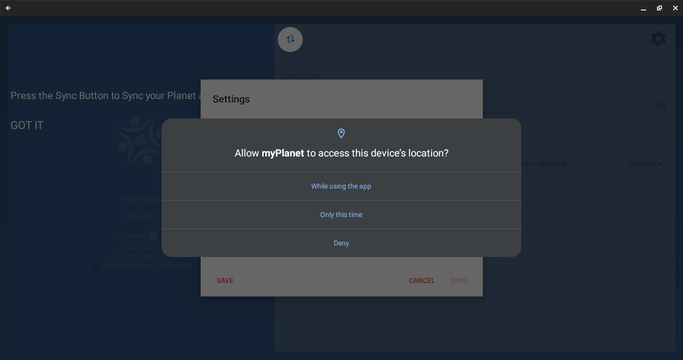
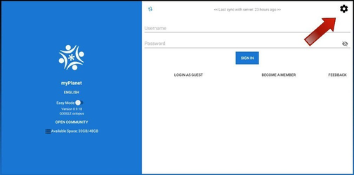

## Step 0 - Prerequisites

The following hardware is required for the internship:

1. Laptop or computer with minimum 8GB of RAM
2. Android device (phone or tablet) with minimum 2GB RAM and at least Android 6 "Marshmallow"
3. Internet connection

## Step 1 - Git markdown

- Follow the instructions on the [GitHub and Markdown page](../../pages/vi/vi-github-and-markdown.md) page. Make sure that you've linked to your github.io and pull request link on the Discord channel (https://YourUserName.github.io and LinkToYourPullRequest).
- Also include Raw.githack link in your pull request (https://raw.githack.com/YourUserName/YourUserName.github.io/YourBranchName/#!pages/vi/profiles/YourUserName.md).

NOTE: Raw.githack link above is case sensitive to your username.

## Step 2 - Playstore

- myPlanet application is only available for Android devices. You can find myPlanet application in the play store.
- If you follow this link for myPlanet on Play Store you will be able to reach myPlanet in playstore. You can then install myPlanet from there on your phone.

## Step 3 - Android Studio compile
- Download, install and Setting up Android Studio
- Go to [Android official website](https://developer.android.com/studio/install) and follow the steps to install and setup android studio which is the recommended android IDE depending on your laptop Operating System.
- Follow the steps on [myPlanet Github Repository](https://github.com/open-learning-exchange/myplanet#getting-started-for-users) to get myplanet code cloned on your laptop.

**Open Android Studio:**
 Launch Android Studio on your computer. If this is your first time using Android Studio, it may take a moment to set up the initial configuration.

**Import the Project:**
 In Android Studio, click on "Open an existing Android Studio project" or navigate to "File" > "Open" and select the cloned repository folder that contains the Android app project. Click "OK" to import the project.

**Gradle Build:**
 After importing the project, Android Studio will perform a Gradle build, which may take a few moments. Gradle is the build system for Android projects, and it will download any necessary dependencies for the project.

**Configure Emulator or Connect Device:**
 To run the app, you need to set up either an Android emulator or connect a physical Android device to your computer:
    - Emulator: In Android Studio, you can create a virtual device emulator by navigating to "Tools" > "AVD Manager." Follow the prompts to create a new virtual device based on your preferred device configuration.
    - Physical Device: If you want to run the app on a physical Android device, connect it to your computer using a USB cable and ensure that USB debugging is enabled in the device's developer options.

**Select Run Configuration:**
 In Android Studio's toolbar, select the desired run configuration from the drop-down menu. It should be the name of your app module.

**Run the App:**
 Click on the "Run" button (typically a green play button) or use the keyboard shortcut "Shift + F10" (Windows) or "Control + R" (Mac) to run the app. Android Studio will deploy the app to the emulator or connected device.

**App Launch:**
 Once the app is installed on the emulator or device, it will automatically launch. You can interact with the app and test its functionality.

## Step 4 - Connect myPlanet to planet vi

- In this step you will be connecting your application, myPlanet, to another application called planet vi. This connection will allow you to share data and resources between the two applications. To establish the connection, follow the instructions below:
- To start using myPlanet, the app requires certain permissions from the user. These  permissions include access to storage (to save and retrieve data), location (for location-based features or services), audio (possibly for recording or playing audio content), and camera (for capturing images or utilizing augmented reality features, if applicable).
  
    
    
- After granting the necessary permissions, the next step in the process involves configuring the IP address and pin in order to establish a connection with the Planet server. The IP address is likely the network address or hostname of the server where the Planet application's data is stored. The provided pin is a security measure to ensure authorized access to the server.
- Begin by locating the settings icon within the myPlanet application. This icon is typically represented by a gear or cogwheel symbol. Click on the settings icon to initiate a pop-up dialog box.

  
- Once the dialog box appears, you will see a form where you need to enter the IP address and password. These details will be provided to you by the administrator. Enter the IP address and password accurately into the respective fields.

  
- After entering the IP address and password, click on the "Sync" button. This action will initiate the synchronization process between myPlanet and planet vi. It will establish a connection between the two applications, enabling data exchange and collaboration.

  
- Once the synchronization process is completed successfully, you can proceed to create a user account within the planet vi application.
- Locate the option to "Become a member" to create a new user account. Fill in the necessary details requested
- Make note of these credentials or store them securely, as you will need them to log in to the planet vi application.

  
- By following these steps, you will successfully connect myPlanet to planet vi and create a user account within the planet vi application, allowing you to utilize the interconnected features and resources between the two applications.

## Step 5 - Vysor Course
- After successfully logging into the myPlanet app, users are directed to the myPlanet dashboard, which serves as the home screen of the application. The dashboard provides a centralized and convenient hub where users can access various features, information, and tools available within the app.
- On the myPlanet dashboard, users may find a range of options and widgets tailored to their preferences and needs. These can include shortcuts to frequently used features, personalized recommendations, notifications, progress updates, and more. The dashboard is designed to provide users with a quick overview and easy navigation to different sections of the app.
- To proceed further and access the courses offered within the myPlanet app, users are instructed to click on the "courses" section. This action will take them to a dedicated page or view that presents a list of existing courses available within the app's catalog.
    
     
- To enhance your understanding of Vysor, a screen mirroring and remote control application, you should consider enrolling in the "How to Use Vysor" course. This course can be found within the courses tab of myplanet.
- Once you locate the course, click on it to join and access the valuable content it offers. The course is designed to provide you with a comprehensive understanding of Vysor's features and functionalities. It will guide you through various steps and procedures involved in effectively utilizing Vysor.

  
- In addition to accessing the list of existing courses through the main "courses" section, the myPlanet app also provides a convenient sidebar feature that allows users to easily view and access the courses they have already joined or enrolled in.
- To view the courses a user has joined, they are instructed to select the "myCourses" option within the sidebar. By clicking on or tapping this option, the user is directed to a dedicated page or view that specifically displays the courses they are currently enrolled in.  
    
  
- Throughout the course, you will learn how to connect your device to Vysor, mirror your device's screen onto your computer, and navigate the different control options available. By following the instructions and completing the course steps, you will gain practical knowledge and confidence in using Vysor.
- After you finish all the course steps, it is encouraged to provide feedback on your learning experience by rating the course. To do this, locate the star rating system, which should be displayed in an image or visual representation on the course page.
- Simply click on the stars to indicate your level of satisfaction with the course content, presentation, and overall usefulness.

  
  
- Your rating will serve as valuable feedback for the course creators, helping them improve the course and cater to the needs of future learners. Additionally, your rating will also assist other users in assessing the quality and relevance of the "How to Use Vysor" course

## Step 6 - 1 issue and pull request

* Follow the tutorial under the [GitHub Issues tab](../vi/vi-github-issues.md) to create at least one issue. Post a link in the discord channel whenever you create an issue or when you comment on someone else's issue. You are encouraged to post as many issues as you can for improving the page as well as for personal practice.
* No issue is too big or too small to be filed and it is OK if you are not sure how to fix it yourself. If you know how to solve an issue, be sure to provide a detailed account of your research and show how to fix it. It is ok to file an issue about minor typos and very small changes, but do not make this the case for all of the issues that you file.
* You can also work on issues that you didn't create. Make sure you have created at least one issue, resolved it, commented on an issue you didn't create and have a pull request with the fix merged.

## Step 7 - course about

* Explore Available Courses:navigate to the "courses" tab or directory. This directory should contain a list of available courses.
* Choose a Course: Browse through the courses and select the one you are interested in. Each course may have its own subdirectory containing course materials and resources.
* Join the Course: Access the chosen course's subdirectory and explore the course materials, including any text files, presentations, code samples, or exercises provided. Take note of the structure and organization of the course.
* Go Through the Course: Begin by reading the course introduction or overview, which may provide information on the course objectives, prerequisites, and recommended study plan. Follow the course materials in the order specified, taking your time to understand and absorb the content.
* Engage with Course Materials: Engage with the course materials actively. This may involve reading text files, viewing presentations, playing audios and videos.
* Take Notes and Rate the course: As you progress through the course, take notes of any issue you encounter and open an issue in the github repository and rate the course you have just completed
* Collaborate and Seek Help: Seek help if you encounter difficulties or have questions related to the course content.

## Step 8 - 3 issue and pull request

* You may continue making Issues, Pull requests and Comments, or move on to the next step, while you are waiting for your pull request to be merged. The approval process for your Step 6 fix may take time, but it is OK to continue working.
  Once you complete Step 6 you will have:

> 2 pull requests made (one at step 3 and one at step 6)
> 1 comment added (on an issue you didn't create)
> 1 issue created

## Step 9 - Pull request for adding yourself to team and read pre interview document

* Once you have finished step 8, sync your community with the nation (as you did in Step 7 - [Nation Planet tab](../vi/vi-nation.md)).

  Next thing is to add yourself to the virtual intern list found in [vi-team.md](../vi/vi-team.md) and create a pull request. Message us ("@/all" and "@dogi") in the Discord channel so that we can set up a meeting and add you to the team as soon as possible.
  Make sure to read through the [intern orientation document](../robots/rbts-intern-orientation.md) before the meeting.
