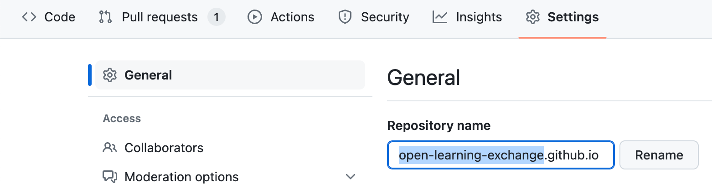
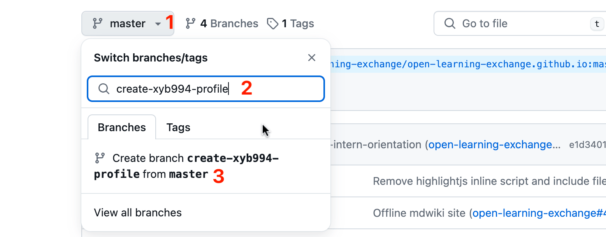
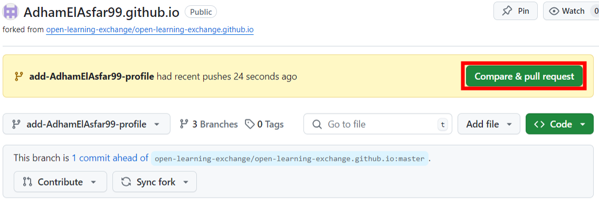
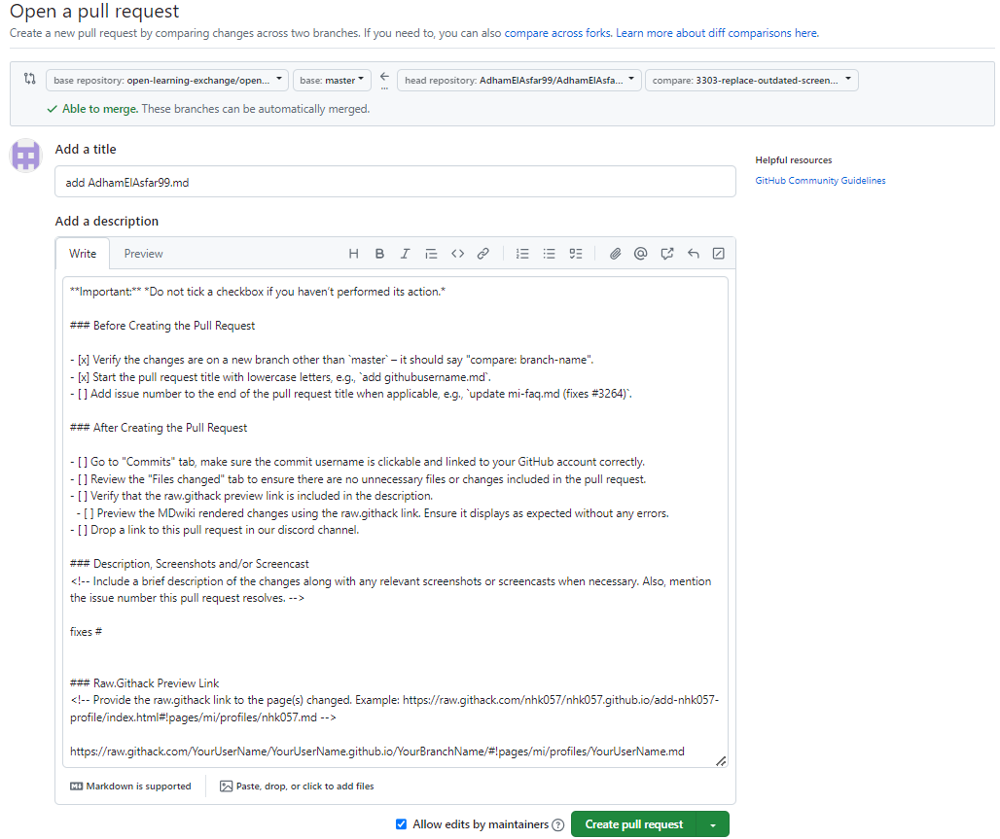
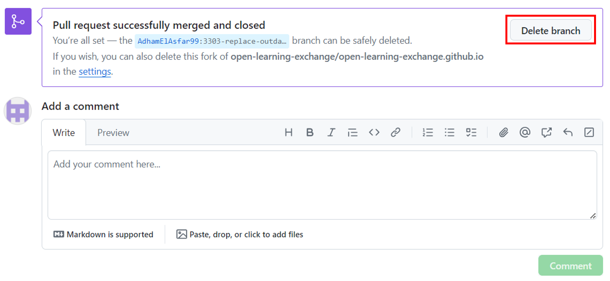

# GitHub and Markdown

## 1. Objectives

- Learn about GitHub and Markdown
- Create your own Markdown profile page
- Understand the GitHub workflow (including forks, repositories, commits, and pull requests)

## 2. Preparation

Before diving into GitHub and Markdown, it's crucial to understand the essential tools and resources involved for this tutorial:

- [GitHub](https://docs.github.com/en) –  a platform for hosting code, version control, and collaboration.
- [Markdown](https://en.wikipedia.org/wiki/Markdown) – a lightweight markup language with plain text formatting syntax.
- [MDwiki](http://dynalon.github.io/mdwiki/#!quickstart.md) – a content management system that leverages Markdown. The site you are reading is built with MDwiki.

While it's not mandatory to click on the links above, you can explore them to deepen your understanding.

### 2.1 Introduction to Markdown

1. Review [Getting Started | Markdown Guide](https://www.markdownguide.org/getting-started/) for an overview of Markdown, how it works, and what you can do with it.
2. Go through [Basic Syntax | Markdown Guide](https://www.markdownguide.org/basic-syntax/) to learn the fundamental syntax.
3. Complete [this interactive Markdown tutorial](https://tylingsoft.github.io/tutorial.md/#whats-markdown) to gain some practical experience.

## 3. GitHub workflow and your own Markdown profile page

Below is a summary of the steps that we will walk you through:

1. [Login to GitHub with your username and password](#Login_to_GitHub_with_your_username_and_password)
2. [Find and fork the correct repository](#Find_and_fork_the_correct_repository)
3. [Go to Settings and rename your repository](#Go_to_Settings_and_rename_your_repository)
4. [Check if your github.io site works](#Check_if_you_github.io_site_works)
5. [Create a new file as your personal MDwiki page and commit your changes](#Create_a_new_file_as_your_personal_MDwiki_page_and_commit_your_changes)
6. [Open a pull request](#Open_a_pull_request)

### 3.1 Login to GitHub with your username and password

To continue, ensure you are logged in to GitHub with your account credentials. If you're unfamiliar with GitHub's layout and functionalities, visit [our repository](https://github.com/open-learning-exchange/open-learning-exchange.github.io) to explore.

**NOTE**: Existing GitHub users should confirm that their commit email address is set correctly. You can set it for each repository or globally. For detailed steps, refer [Setting your commit email address on GitHub](https://docs.github.com/en/account-and-profile/setting-up-and-managing-your-personal-account-on-github/managing-email-preferences/setting-your-commit-email-address#setting-your-commit-email-address-on-github).

### 3.2 Find and fork the correct repository

Forking creates a personal copy of a repository in your GitHub account, allowing you to make changes without affecting the original repository.

To fork the correct repository, follow these steps:

1. Visit the [OLE github.io repository](https://github.com/open-learning-exchange/open-learning-exchange.github.io).
2. Click the "Fork" button at the top-right corner. If you're unable to locate it, refer to [Forking a repository - GitHub Docs](https://docs.github.com/en/pull-requests/collaborating-with-pull-requests/working-with-forks/fork-a-repo#forking-a-repository).

**NOTE**: Until you become an official virtual intern, always fork the repository before making changes. Commit your changes to your forked version, and submit pull requests to contribute back to OLE's repository. The main repository will be updated once your pull requests are approved.

### 3.3 Go to Settings and rename your repository

After forking the repository, you'll be redirected to your personal copy of the repository: **&lt;YourUserName&gt;/open-learning-exchange.github.io**. To rename this repository to create your GitHub Pages site:

1. Click at the repository Settings at the top of the page.
2. In the repository name field, change it to `YourUserName.github.io`.
3. Click **Rename** to confirm the change.

**Note:** If you already have a GitHub Pages site at https://YourUserName.github.io in use, refer to [this FAQ question](https://open-learning-exchange.github.io/pages/vi/#Q17:_What_do_I_do_if_I_already_have_a_github.io_with_my_username?) for guidance.

### 3.4 Check to see if your github.io site works

After renaming your repository, visit `https://<YourUserName>.github.io` to check if your site is live.

If you see a "404 Page Not Found" error, don't panic. It may take a while for your GitHub Pages site to build and become accessible. To ensure it's set up correctly, go to the repository **Settings > Pages** and confirm that the **Source** is set to "Deploy from a branch" and `master` `/(root)` are selected under **Branch**.

### 3.5 Create a new file as your personal MDwiki page and commit your changes

Before editing, ensure you're working in your own GitHub repository. Verify that the repository name includes your GitHub username. For example, it should look like `<YourGitHubUserName>/<YourGitHubUserName>.github.io`.

#### 3.5.1 Create a new branch

1. **Switch to the Master Branch**: Click the branch selector at the top-left corner of your repository. If it doesn't say "**master**", switch to the master branch.
2. **Name the New Branch**: Click the branch selector again, then type a descriptive name like `add-<YourGitHubUserName>-profile`. For best practices on branch naming, check out this [guide](https://github.com/agis/git-style-guide#branches).
3. **Confirm Creating the New Branch**: Click "Create branch **add-\<YourGitHubUserName\>-profile** from **master**." You should now see "**add-\<YourGitHubUserName\>-profile**" as your current branch.

  

#### 3.5.2 Create your profile file in Markdown

To create your profile file, follow these steps:

1. Navigate to `pages/mi/profiles/` folder from the main page of your forked repository.
2. Ensure you are still on the branch you just created, look for "**add-\<YourGitHubUserName\>-profile**" on the branch selector menu
3. Above the list of files, select the "Add file" dropdown menu, then click "Create new file".
4. Name the file using your GitHub username with the .md extension (e.g., `JohnDoe.md`). This ensures your profile is easy to find.

In this new Markdown file, include the following information:

- Yur name, location/time zone, and OS (with version)
- A brief description of yourself to help others get to know you.

Use the "Preview" tab to see how your Markdown will look. Aim to use at least five different types of Markdown elements for variety. Avoid HTML, as the purpose of Markdown is to keep things simple. Consider creative examples, like:

- [Profile 1](profiles/Okuro3499.md) (using table and lists)

When you're ready, click the green "Commit changes..." button. If you need to edit your file again, click the pencil icon.

Afterward, preview your changes on this link: https://raw.githack.com/YourUserName/YourUserName.github.io/YourBranchName/#!pages/mi/profiles/YourUserName.md. This allows reviewers to preview your changes. Please double check that everything looks good and is working as you hoped before moving on to next section.

**NOTE**:

- If changes don't appear, clear your browser's cache or open your page in "incognito" or "private" mode. You can also refresh the page using `Ctrl+Shift+R` or `Ctrl+F5` (on Mac: `Cmd+Shift+R`).
- Since the MDwiki site is used for "production," always check if your content renders correctly on the raw.githack link. Remember that there are [different Markdown flavors](https://github.com/commonmark/CommonMark/wiki/Markdown-Flavors). Use GitHub's preview tab for guidance, but rely on raw.githack for accuracy.

### 3.6 Open a pull request

Once you have your profile ready, it's time to create a pull request. Click on one of the "Pull request" buttons as highlighted in the screenshot below.

**There are a few things to watch out before clicking on the green "Create pull request" button**. Make sure you:

* give the pull request a short and descriptive title (e.g. create YourUserName.md)
* Follow the pull request template, include the raw.githack link to your Markdown profile page in the pull request description
* scroll down the page and verify you used at least 5 **different** Markdown elements in your profile

Finally, click "Create pull request" button and post the link to your github.io and profile pull request in the [discord server mobile intern channel](https://discord.com/channels/1079980988421132369/1131244649902772235):

> I'm on step 1 - GitHub and Markdown, please look at `https://YourUserName.github.io` and review my profile pull request `LinkToYourPullRequest`

Remember, it can take a while for `https://YourUserName.github.io` to be up and running, so don't worry if you see a **404** when you access the link!

Someone from our team will review the changes and notify you on discord. Often there will be some feedback from the reviewer for you to address. If that is the case, make changes to your branch and comment on the pull request when done. Any changes you make to your branch will be automatically updated in the pull request. Once you get 3 approving reviews, we will merge your Markdown profile with the main repository.

After the pull request is merged, you'll be able to see your personal page at `open-learning-exchange.github.io/#!pages/mi/profiles/<YourUserName>.md`. Let us know in the [discord server mobile intern channel](https://discord.com/channels/1079980988421132369/1131244649902772235) after you complete this step.

### 3.7 Delete the Branch from your remote repository

After your pull request has been **approved** and **merged** by OLE staff, you might want to delete the branch that is associated with your pull request. It can keep your remote (yourUserName.github.io on GitHub) repository away from a mess of defunct branches. To delete the defunct branch in your remote repository, you can click the "Delete branch" button in your pull request (see the picture below).

## 4. Useful Links

- [Basic writing and formatting syntax - GitHub Docs](https://guides.github.com/features/mastering-markdown/)
- [MDWiki – Quick Start](http://dynalon.github.io/mdwiki/#!quickstart.md) - The official MDwiki quick start guide on Markdown syntax.
- [Fork a repository - GitHub Docs](https://docs.github.com/en/pull-requests/collaborating-with-pull-requests/working-with-forks/fork-a-repo) - A more in-depth explanation about how and why we fork repositories.
- [Managing files - GitHub Docs](https://docs.github.com/en/repositories/working-with-files/managing-files)

[Other helpful links and videos](../vi/vi-faq.md#Helpful_Links)

#### Return to [First Steps](mi-10-steps.md#Step_1_-_GitHub_&_Markdown_Setup)
