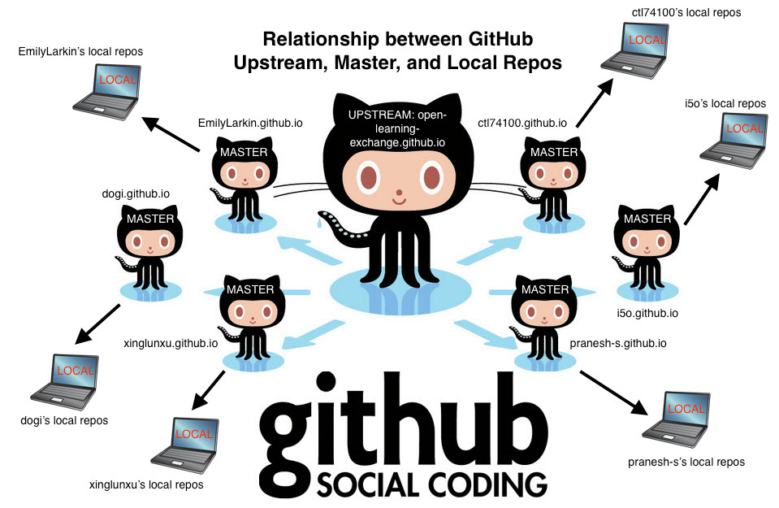
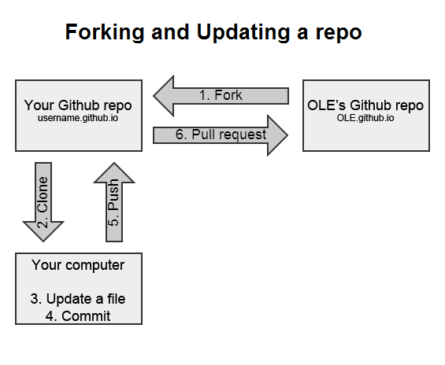

# Git Repositories: A Guide to Cloning, Configuring, and Syncing Forks

## Objectives

- Learn how to **use Git from the command line**
- Understand how to configure and sync a repository with the forking workflow

## Introduction

On GitHub, software code is organized into repositories, each representing a different project. For example, you've been working on one of our repositories, **open-learning-exchange.github.io**. We encourage you to explore our other repositories on GitHub [here](https://github.com/open-learning-exchange), but remember: **look, don't touch**. If you are new to Git or GitHub, take a look at [this introduction](https://www.freecodecamp.org/news/introduction-to-git-and-github/).

As previously mentioned, in the [forking workflow](mi-github-and-markdown.md#2.3_Introduction_to_Forking_Workflow), you fork a repository to work on it independently from the upstream repository, then send your changes back to the original repository via a pull request. You completed this process on github.com in Step 1. In this step, we'll dive deeper and use the command line to sync your forked repository with OLE's upstream repository.

The diagram below shows the structure of the forking workflow for open-learning-exchange.github.io, with a central upstream repository, individual forks, and local copies on your machine.



## Important Terms

In this step, you'll encounter some common terms, such as

- `master`/`main`: a repository's default branch name
- `upstream`: the repository you forked from
- `origin`: your own fork of the upstream repository
Both `upstream` and `origin` are considered **[remote](https://git-scm.com/docs/git-remote)**. Also, remember that a repository can contain multiple branches.

## Start here

This is a summary of the key steps to follow. For a detailed explanation, continue reading.

- [Clone Your GitHub Repository username.github.io](#1._Clone_Your_GitHub_Repository_username.github.io)
  - [Clone with HTTPS or Clone with SSH?](#1.1_Clone_with_HTTPS_or_Clone_with_SSH?)
- [Explanation About Repositories and Syncing Process](#2._Explanation_About_Repositories_and_Syncing_Process)
- [Configure a Remote Repository for Your Fork](#3._Configure_a_Remote_Repository_for_Your_Fork)
- [Sync Your Fork](#4._Sync_Your_Fork)

### 1. Clone Your GitHub Repository username.github.io

1. Open a command prompt/terminal window and visit your `username.github.io` repository on GitHub.
2. Click the green "&lt;&gt; Code" button to get the repository's HTTPS link and click the "Copy url to clipboard" icon next to the URL
3. In your command line interface (CLI), type `git clone ` and paste the copied link. It should look similar to `git clone https://github.com/YourUsername/YourUsername.github.io.git`.
4. Hit Enter. If the repository is cloned successfully, you can now `cd` into your `username.github.io` directory to see its contents.

#### 1.1 Clone with HTTPS or Clone with SSH?

Both HTTPS and SSH URLs let you access the same remote repositories, but they use different protocols. While we've discussed cloning with HTTPS, you can also use SSH. For more details, check [Cloning a repository | GitHub Docs](https://docs.github.com/en/repositories/creating-and-managing-repositories/cloning-a-repository) for all the ways to clone a repository onto your local machine. To clone with SSH, [verify you have existing SSH keys on your machine](https://docs.github.com/en/authentication/connecting-to-github-with-ssh/checking-for-existing-ssh-keys), and make sure the key is [added to your GitHub account](https://docs.github.com/en/authentication/connecting-to-github-with-ssh/adding-a-new-ssh-key-to-your-github-account) already.

### 2. Explanation About Repositories and Syncing Process



The previous step created a clone of your repository on your OS.

Now, there are three levels of repositories to keep in mind:

1. **Upstream Repository on GitHub:** `open-learning-exchange.github.io`
2. **Your Fork on GitHub:** `your-username.github.io`
3. **Your Local System Clone:** `your-username.github.io`

These repositories must be consistently synced and up-to-date with each other since we all contribute to the upstream repository (open-learning-exchange.github.io). It's crucial to keep changes separate and avoid mixing them between repositories. Significant differences can cause conflicts and prevent you from performing `git push/pull` operations smoothly.

#### 2.1 Steps to Sync Repositories

1. **Fork and Clone:**
   - Fork `open-learning-exchange.github.io` to create `your-username.github.io` on GitHub. (This was done in Step 1).
   - Clone `your-username.github.io` to your local system. (This was done in this step's 1.1)

2. **Sync with Upstream:**
   - Add the upstream repository:
     ```
     git remote add upstream https://github.com/open-learning-exchange/open-learning-exchange.github.io.git
     ```
   - Fetch changes from upstream:
     ```sh
     git fetch upstream
     ```
   - Checkout your local master branch:
     ```sh
     git checkout master
     ```
   - Merge upstream changes into your local branch:
     ```sh
     git merge upstream/master
     ```

3. **Push Updates to Your Fork on GitHub:**
   - Push local changes to your fork on GitHub:
     ```sh
     git push origin master
     ```

#### 2.2 Resources

- [GitHub Help: Syncing a Fork](https://help.github.com/articles/syncing-a-fork/)
- [Git Documentation](https://git-scm.com/doc)

By following these steps, you ensure your repositories are consistently up to date and avoid conflicts (Refer the diagram below).


### 3. Configure a Remote Repository for Your Fork

To be able to fetch updates from the upstream repository, you need to first configure the upstream repository by following these steps:

1. Open your command prompt/terminal and find the correct directory, `cd username.github.io.`

2. List the current configured remote repository for your fork with `git remote -v`. This is what it should look like:

```
$ git remote -v
origin  https://github.com/username/username.github.io.git (fetch)
origin  https://github.com/username/username.github.io.git (push)
```

3. Specify a new remote upstream repository that will be synced with the fork by using `git remote add upstream <repository>`. Our remote upstream repository will be `https://github.com/open-learning-exchange/open-learning-exchange.github.io.git`. Do not forget the `.git` at the end.

```
$ git remote add upstream https://github.com/open-learning-exchange/open-learning-exchange.github.io.git
```

4. Verify if upstream is configured correctly with `git remote -v`.

```
$ git remote -v
origin  https://github.com/username/username.github.io.git (fetch)
origin  https://github.com/username/username.github.io.git (push)
upstream  https://github.com/open-learning-exchange/open-learning-exchange.github.io.git (fetch)
upstream  https://github.com/open-learning-exchange/open-learning-exchange.github.io.git (push)
```

### 4. Sync Your Fork

Then, use the command `git fetch upstream` to fetch branches from the upstream repository (in this case, it is open-learning-exchange.github.io). Next, check your fork's master branch with `git checkout master`. You should see some variation of this response:

```
EmilyLarkin.github.io $ git fetch upstream
remote: Counting objects: 1, done.
remote: Total 1 (delta 0), reused 1 (delta 0), pack-reused 0
Unpacking objects: 100% (1/1), done.
From https://github.com/open-learning-exchange/open-learning-exchange.github.io
   6940637..5934ec2  master     -> upstream/master
EmilyLarkin.github.io $ git checkout master
Already on 'master'
Your branch is up-to-date with 'origin/master'.
```

**NOTE**: If there are any errors after `git fetch upstream`, please check for typos from previous step. If so, use `git remote rm upstream` and add the repo in upstream again

Then, use `git merge upstream/master` to merge the open-learning-exchange upstream/master with your local repository. It should look something like this:

```
EmilyLarkin.github.io $ git merge upstream/master
Updating 1388180..5934ec2
Fast-forward
```

If you get something like this,

```
Please enter a commit message to explain
why this merge is necessary, especially
if it merges an updated upstream into a
topic branch. Lines starting with '#'
will be ignored, and an empty message
aborts the commit.
~
~
```

it means that you are in the Vim text editor. Simply type ```:wq``` which stands for **w**rite and **q**uit. However, if you want to insert something you can type "i" and Vim goes into edit mode. To exit edit mode just hit "escape".

Now, your repository has been synced to the upstream/master. However, a discrepancy may still exist between your local (and now your origin/master) versus your username.github.io on GitHub. You will now use `git diff` and `git status` to check how your local repository compares to your username.github.io repository. Depending on whether you have more or less commits than your username.github.io, you will either use `git pull` to receive any changes or `git push` to push updates to your repository. Most likely, as you just synced with the master, you will use `git push` to push updates to your username.github.io repo.

``` bash
$ git push origin master
```

If you have uncommitted changes (from mixing interface and terminal use of GitHub repositories), then these commands will be aborted until you fix the discrepancy.

Remember, you should repeatedly use the commands `git diff` and `git status` to respectively see the difference between your username.github.io and your local repository and then see the status of your repository and the changes you have made. Once again, you need to sync your repository with the correct master first, otherwise you will not see the correct `git diff` and `git status`. `git diff` and `git status` only look between your local and username.github.io repos, not your upstream repo.

Below is an example of the **git diff** command showing the difference in the file of local and remote repository.

``` bash
$ git diff
diff --git a/<file name>.md b/<file name>.md
index bf400c0..fc7380b 100644
--- a/<file name>.md
+++ b/<file name>.md
@@ -1,5 +1 @@
 What is this?
```

**What does `diff --git a/<file name>.md b/<file name>.md` mean?**

**Answer:** Our diff compares two items with each other: item A and item B. In most cases, A and B will be the same file, but in different versions. To make clear what is actually compared, a diff output always starts by declaring which files are represented by "A" and "B".

**What does `--- a/<file name>.md` and `+++ b/<file name>.md` mean?**

**Answer:** Further down in the output, the actual changes will be marked as coming from A or B. In order to tell them apart, A and B are each assigned a symbol: for version A, this is a minus ("-") sign and for version B, a plus ("+") sign is used.

This process needs to be repeated whenever you begin to work, to make sure that you are always up to date. If there are discrepancies, it will mess up the code and you could potentially lose your saved changes, because it was not updated properly. We will provide more information on editing and saving changes in the next tutorial.

## Summary of Steps

Generally, follow these commands in your command line, but refer back above if there are any errors or further questions about why you are writing any of the following commands

#### Clone your GitHub repository username.github.io

1. Open your command prompt/terminal and find the correct directory
2. Copy the HTTPS or SSH link from your repository on the GitHub site
3. On the command line, type `git clone *paste your HTTPS or SSH link here*`

#### Understand that there are three levels of a Github repository

- the upstream ([open-learning-exchange.github.io](https://github.com/open-learning-exchange/open-learning-exchange.github.io))
- Your username.github.io on GitHub
- Your username.github.io on your OS.

These need to be synced and checked constantly.
The **upstream repository** is the one we are contributing to.

#### Configure the upstream repository to your fork

1. `cd username.github.io.`
2. `git remote -v` see above to make sure you are pushing and fetching to your own repository on GitHub as the origin
3. `git remote add upstream https://github.com/open-learning-exchange/open-learning-exchange.github.io.git`
4. `git remote -v` origins should remain the same, but you should also be fetching and pushing to OLE as the upstream now

#### Sync Your Fork

1. `git fetch upstream` -  to fetch branches from the upstream repository ([more info](https://git-scm.com/docs/git-fetch))
2. `git checkout master` - to checkout the `master` branch ([more info](https://git-scm.com/docs/git-checkout))
3. `git show-branch` - to see branches and the changes made in them ([more info](https://git-scm.com/docs/git-show-branch))
4. `git merge upstream/master` - You repository should now be synced to upstream/master ([more info](https://git-scm.com/docs/git-merge))

#### Make sure your repository is up to date

1. `git diff` - for comparing different versions of the same file ([more info](https://git-scm.com/docs/git-diff))
2. `git status` - to view the changes made in the branch, whether the branch is up-to-date with master ([more info](https://git-scm.com/docs/git-status))
3. `git pull` - to sync the local repository with the remote repository ([more info](https://git-scm.com/docs/git-pull))
4. `git push` - to push the updates that you made to the local repositories to the GitHub repositories ([more info](https://git-scm.com/docs/git-push))

**NOTE**: Developers should always sync their fork and make sure their repositories are up to date with GitHub every time they begin to work. This way we as a team can minimize data loss, and can save you some time.

#### If you find yourself needing to rebase your forked repository, the following two links should help

- [Rebase](https://git-scm.com/docs/git-rebase)
- [Branching Rebasing](https://git-scm.com/book/en/v2/Git-Branching-Rebasing)

**NOTE**: While rebasing and merging are similar, there is a difference between them. Merging takes all changes in one branch and merges onto another branch in one commit. Rebasing moves the branch's starting point to another place. For example, if you rebased your branch to the master branch, then your branch now incorporates all the changes made in the master, and every time master is changed, your branch is changed as well. In contrast, merging is a one-time change.

For more info on differences of merging vs. rebasing (and when to use which one), [check this out](https://www.atlassian.com/git/tutorials/merging-vs-rebasing)

If you would like to understand how syncing with the fork works, here is a useful [video](https://www.youtube.com/watch?v=-zvHQXnBO6c)

## Useful links

[Configure a remote for fork](https://docs.github.com/en/pull-requests/collaborating-with-pull-requests/working-with-forks/configuring-a-remote-repository-for-a-fork) - You can sync changes made in the original repository with a fork.
[Sync fork](https://help.github.com/articles/syncing-a-fork/) - Sync a fork of a repository to keep it up-to-date with the upstream repository.
[GitHub tutorial](http://product.hubspot.com/blog/git-and-github-tutorial-for-beginners) - An Introduction to Git and GitHub for beginners from HubSpot.
[Git-it Workshop](http://jlord.us/git-it/) - Runs in your terminal to work and provides a hands-on approach to learn Git and GitHub repositories.
[Git help](https://git-scm.com/) - An encyclopedia of useful git workflows and terminology explanations.
[Other helpful links and videos](mi-faq.md#Helpful_Links)

#### Return to [First Steps](mi-10-steps.md#Step_5_-_Git_Repositories:_A_Guide_to_Cloning,_Configuring,_and_Syncing_Forks)
