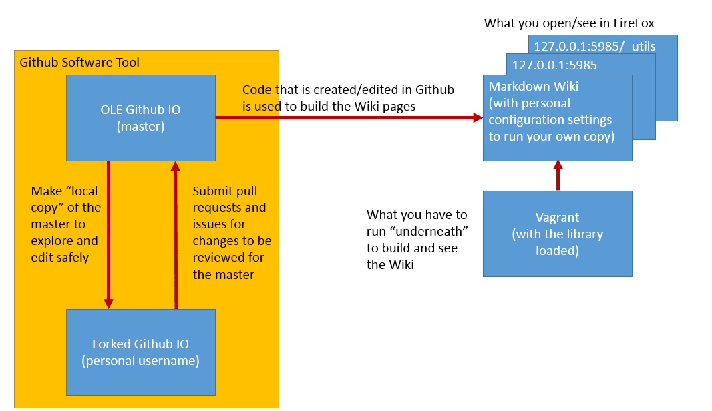
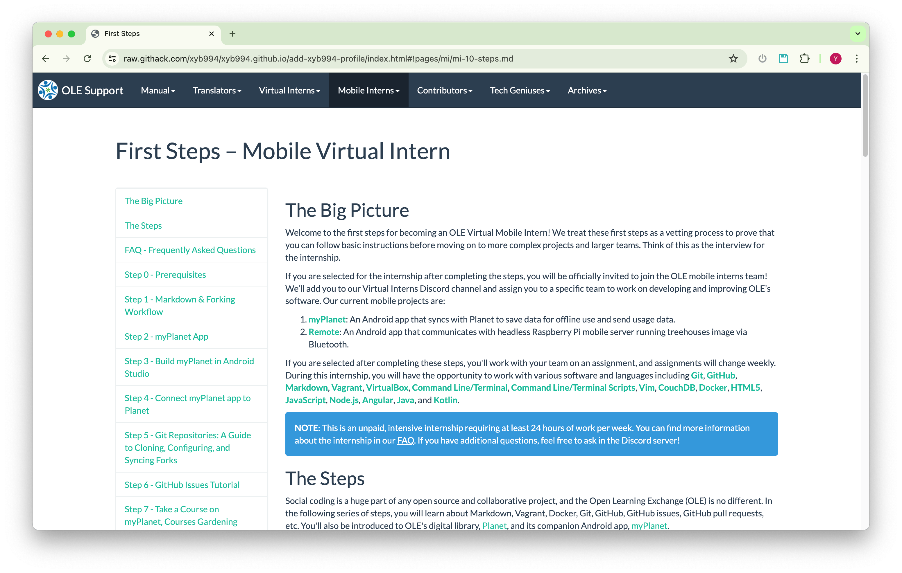

# GitHub Issues Tutorial

## 1. Objectives

- Learn about GitHub Issues, Commits, and Pull Requests
- Understand the collaborative git/GitHub workflow used during the internship
- Create an Issue regarding Mobile Intern First Steps, then create a branch to fix it upon approval
- After resolving the Issue, make a Pull Request to the `open-learning-exchange/open-learning-exchange.github.io` upstream repository
- Work with us to make necessary changes, then merge the branch into the upstream repository
- Comment on an existing Issue

## 2. Introduction

GitHub repositories have a section for Issues, where problems can be categorized, discussed, and fixed. Issues are often opened by our team members to create new features or fix bugs in our projects. This tutorial guides you through the process of creating Issues, branching, making Pull Requests, and collaborating with team members.

We encourage you to file as many issues as possible, whether large or small. If you spot a problem but don't know how to solve it, file an issue so others are aware and can work on a solution. Aim to add as much value as possible with your issues, as this helps support the community and enhances the overall quality of this MDwiki site.

NOTE: Issues are not just about adding new content or improving this MDwiki; they can also involve removing redundant or unnecessary material. The goal is to keep the documentation clear and concise. If you find sections that could be simplified or reduced, feel free to create an issue to help streamline the process.

## 3. Create an Issue

If you've noticed an area for improvement in the Mobile Intern First Steps, let's address it. If not, please look around to find an issue. Begin by checking [existing issues labeled with `mi`, both open and closed](https://github.com/open-learning-exchange/open-learning-exchange.github.io/issues?q=is%3Aissue+label%3Ami), to ensure it hasn't been raised before or addressed. If it hasn't, let's create a new issue:

- Go to the [Issues tab of the upstream repository](https://github.com/open-learning-exchange/open-learning-exchange.github.io/issues) and select "New Issue." Select the "Get started" button next to "First Steps - Mobile Virtual Intern."
    1. Craft a succinct, descriptive title.
    2. Complete the issue template thoroughly, ticking all required checkboxes and providing necessary details.
    3. Drop a link to this issue in our discord channel.
- You can reference [this example](https://github.com/open-learning-exchange/open-learning-exchange.github.io/issues/3300) to see how an issue follows the issue template with a clear structure.
- Once submitted, others can provide feedback to guide the next steps.

**Note**: While creating a Pull Request doesn't require prior approval, it's best to wait for confirmation of the issue from our team before working on a fix. If your suggested changes don't align with project goals, your Pull Request might not be merged, and your work won't count toward "First Steps" progress. By seeking approval first, you can avoid wasted effort and rework.

**Existing Issues:** You can also work on existing issues. If an issue is labeled `mi` and `first step intern`, you can request to work on it by messaging us in Discord. If someone else is already assigned or has stated their intent to work on it in the issue's comment section, don't work on that issue; choose another one instead.

_**Special Note**_:
- Interns often rush through this process to complete their "First Steps." Remember that these steps aim to fix genuine problems and improve the workflow. Take time to examine the "First Steps" materials to find real issues and research the best solutions. Also, ensure the issue hasn't already been identified.

## 4. Synchronize Your Repository

Before you create your branch, sync your repository with the following commands (as we walked you through in the previous step):

1. Fetch the latest changes from the upstream repository:

   ```sh
   git fetch upstream
   ```

2. Switch to your `master` branch:

   ```sh
   git checkout master
   ```

3. Merge the fetched changes from the upstream `master` branch into your local `master` branch:

   ```sh
   git merge upstream/master
   ```

4. Push the updated `master` branch to your forked repository on GitHub:

   ```sh
   git push origin master
   ```
   
**Note:** If you encounter an error when running `git fetch upstream` (for example, `fatal: 'upstream' does not appear to be a git repository`), it means your upstream remote is not configured.  
  
 To fix this, run:  
```sh
git remote add upstream https://github.com/open-learning-exchange/open-learning-exchange.github.io.git
```
 Then retry:  
```sh
git fetch upstream
```

**ATTENTION**: From now on, for the rest of the First Steps, please use the command line to create branches and make commits instead of using GitHub’s web interface. This will give you valuable practice with common Git commands in your terminal, which is essential for working on real code that needs to be tested locally and can’t always be edited directly on GitHub.com.

## 5. Create a New Branch

**Every time you start to work on an issue, you need to create a branch to keep issues you are working on separated from each other.** Make sure to use a descriptive name for your branch in the following fashion: **issueNumber-descriptive-branch-name**.

- To create and switch to a new branch from `master`, run the following commands:

  ```
  # switch to the master branch
  git checkout master

  # create a new branch from the master branch and switch to the new branch
  # avoid using `#` in the branch name to prevent issues with rawgithack preview
  git checkout -b <issueNumber-descriptive-branch-name>
  ```

  Make sure to replace `<issueNumber-descriptive-branch-name>` with your actual branch name, without the angle brackets (`<` and `>`).

More documentation on `git checkout` can be found [here](https://git-scm.com/docs/git-checkout).

Now you can go and make the proposed changes to your local files using any text editor you prefer. You can also use VIM or Nano to edit files from the terminal. [This guide on VIM](https://www.vim.org/docs.php ) and [this guide on Nano](https://www.nano-editor.org/docs.php) contain more information on their proper usage. In the future, we recommend you use  [Visual Studio Code](https://code.visualstudio.com/) for Planet, VIM for treehouse, and [Android Studio](https://developer.android.com/studio) for Android development.

NOTE: Use `git branch` to see which branch you are in. Your `master` branch is the base working branch. It needs to remain untouched just in case you need to revert some changes back to a working version. Make sure you are on right branch using `git checkout <branch-name>` while making proposed changes to your local files and while committing.

If you're still confused, that's quite alright. [Forking Workflow](https://www.atlassian.com/git/tutorials/comparing-workflows/forking-workflow) can be quite challenging at first. See the diagram below. For better context, the new branch you just made is inside your "Forked GitHub IO".



### 5.1. Preview Changes Locally

After making modifications to your local files and before making a commit, you may want to preview the changes locally. To quickly set up a local HTTP server, you can follow [MDwiki's guide here](https://dynalon.github.io/mdwiki/#!./faq.md#Q:_I_don't_want_to_install_nginx_or_apache_locally._What_is_the_fastest/easiest_way_to_setup_a_local_HTTP_server_to_get_started_with_MDwiki_?). However, instead of using the outdated Python method mentioned in the guide, you can use the following command: `python3 -m http.server 8080`.

## 6. Create a Commit and Push the Changes

**NOTE**: Before making your commit, configure the email address you associate with your Git commits by following the instructions in [Setting your commit email address in Git - GitHub Docs](https://docs.github.com/en/account-and-profile/setting-up-and-managing-your-personal-account-on-github/managing-email-preferences/setting-your-commit-email-address#setting-your-commit-email-address-in-git).

Use the following commands to commit and push your changes:

1. Check which files in the working directory have been modified:

   ```sh
   git status
   ```

2. Display file(s) changes:
   - To show specific file(s) change:

     ```sh
     git diff <file1> <file2> <file3>...
     ```

   - To show all file(s) change:

     ```sh
     git diff
     ```

    **Tip:** While viewing the output of `git diff`, press `q` to exit and return to your terminal.

   Verify the changes you made, then proceed to the next step. To understand `git diff` output, checkout [Git Diff | Atlassian Git Tutorial](https://www.atlassian.com/git/tutorials/saving-changes/git-diff).

3. Stage the modified files:
   - To stage specific modified files:

     ```sh
     git add <file1> <file2> <file3>...
     ```

   - To stage **all** modified files that show up in `git status`:
     - **Caution:** Before using this, double-check the modified files listed in the previous step to ensure you are not inadvertently staging unwanted changes.

     ```sh
     git add .
     ```

4. Commit the staged changes with a descriptive message:

   ```sh
   git commit -m "<your_commit_message>"
   ```

   (Refer to the commit message guidelines below).

5. Push the changes to your new branch on GitHub:

   ```sh
   git push -u origin <issueNumber-descriptive-branch-name>
   ```

   For any further commits on the same branch after the first one, you can simply use:

   ```sh
   git push
   ```

**HINT**: If you feel like you've messed something up with Git commands, check out [Dangit, Git!?!
](https://dangitgit.com/) for common mistakes and their fixes.

### 6.1. Commit Message Style Guide

Because the commits you will be making on this markdown wiki are fairly basic, it is not necessary to enforce a wordy commit style. However, in the future, when you start to work on more complex projects, it is helpful to write your commit messages in a certain way. Here is an article on [how to write good commit messages](https://chris.beams.io/posts/git-commit/).

For edits to this markdown wiki, we recommend that your commit messages only consist of the subject line (refer to the article for more on what the subject is).

- Limit the subject line to 50 characters
- Do not end the subject line with a period
- Use the imperative mood in the subject line

Here is an example of how you would write your commit message:
`$ git commit -m "add commit message style guide and add raw.githack section (fixes #841)"`

**HINT**: In your commit message, if you add a keyword like "fixes" or "resolves" followed by "#" and the issue number, once your pull request is merged, the issue will automatically be closed. This is helpful because it helps declutter the issues section. See more [here](https://help.github.com/articles/closing-issues-using-keywords/).

### 6.2. Raw.githack

Raw.githack is an important aspect of the pull request process. After you commit changes to your local branch and push them to your remote branch, you can view these changes by going to `https://raw.githack.com/<YourUserName>/<YourUserName>.github.io/<YourBranchName>/index.html#!pages/mi/mi-10-steps.md` and navigating to the page(s) you have changed. If everything looks correct, you are ready to create a pull request.

For example, [https://raw.githack.com/xyb994/xyb994.github.io/add-xyb994-profile/index.html#!pages/mi/mi-10-steps.md](https://raw.githack.com/xyb994/xyb994.github.io/add-xyb994-profile/index.html#!pages/mi/mi-10-steps.md) will land in the First Steps – Mobile Virtual Intern's main page:



Raw.githack makes it easy to see what the page will look like if your branch is merged, so don't forget to include a raw.githack link in your next step, the pull request.

## 7. Create a Pull Request & Delete Your Branch After Merging

Now follow the instructions on [Creating a Pull Request and Deleting a Branch Tutorial](mi-github-pull-request.md) to create your pull request.

Be aware that a staff member may either submit a code review asking you to modify some of your changes, or accept the pull request and close the issue. You can see the process [here](https://github.com/open-learning-exchange/open-learning-exchange.github.io/issues/15).

NOTE: Remember to always sync your fork before starting to work on a new issue. To sync your fork you can follow the process in the [previous step](mi-github-and-repositories.md#Summary_of_Steps).

This is an exercise to help you familiarize yourself with GitHub issues, committing, and creating pull requests. This is a common process in large open source projects as there is always room for improvement. So, we strongly encourage you to follow this process and continue to post issues and resolve them.

## 8. Comment on an Existing Issue

You will need to make **at least one comment** on an issue you did **not** create.

- Navigate to the [open-learning-exchange/open-learning-exchange.github.io repository's Issues tab](https://github.com/open-learning-exchange/open-learning-exchange.github.io/issues).
- Browse some recent issues and leave a comment on those where you can provide *meaningful and useful feedback*.
- Under "Add a comment", write your comment with Markdown syntax if necessary, click on the "Preview" tab to review, and click the "Comment" button.

## 9. Useful Links

- [Quickstart for GitHub Issues | GitHub Docs](https://docs.github.com/en/issues/tracking-your-work-with-issues/quickstart)
- [FAQ - Helpful Links and Videos](mi-faq.md#Helpful_Links)
- [How to Contribute to Open Source](https://opensource.guide/how-to-contribute/)

#### Return to [First Steps](mi-10-steps.md#Step_6_-_GitHub_Issues_Tutorial)
