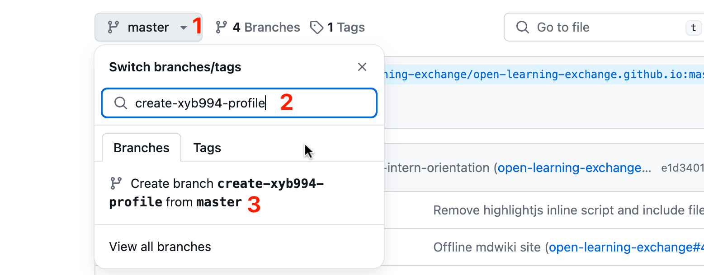

# GitHub Issues Tutorial

## 1. Objectives

- Learn about GitHub Issues, Commits, and Pull Requests
- Understand the collaborative git/GitHub workflow used during the internship
- Create an Issue, then create a branch to fix it upon approval
- After resolving the Issue, make a Pull Request to the `open-learning-exchange/open-learning-exchange.github.io` upstream repository
- Work with us to make necessary changes, then merge the branch into the upstream repository
- Comment on an existing Issue

## 2. Introduction

GitHub repositories have a section for Issues, where problems can be categorized, discussed, and fixed. Issues are often opened by our team members to create new features or fix bugs in our projects. This tutorial guides you through the process of creating Issues, branching, making Pull Requests, and collaborating with team members.

We encourage you to file as many issues as possible, whether large or small. If you spot a problem but don't know how to solve it, file an issue so others are aware and can work on a solution. Aim to add as much value as possible with your issues, as this helps support the community and enhances the overall quality of this MDwiki site.

NOTE: Issues are not just about adding new content or improving this MDwiki; they can also involve removing redundant or unnecessary material. The goal is to keep the documentation clear and concise. If you find sections that could be simplified or reduced, feel free to create an issue to help streamline the process.

## 3. Create an Issue

You might have already noticed something that could be improved by the time you reach this step, if so, please search existing open and closed issues to make sure it's not brought up already and there isn't an open pull request for it. If not, please look around to find one.

- To create an issue, navigate to the ([upstream repository's Issues tab](https://github.com/open-learning-exchange/open-learning-exchange.github.io/issues)) and click "New Issue." Pick a suitable title, then follow the new issue template in the "Write" textbox:
    1. **Problem**: describe the problem in detail
    2. **Steps to reproduce the problem**: Typically, this would be a link to our MDwiki page containing the problem. If you're reporting a bug, provide clear instructions to replicate it.
    3. **Screenshots**: including screenshots can be helpful sometimes
    4. **Proposed solution**: before detailing a solution, research potential fixes or suggestions
- You can reference [this example](https://github.com/open-learning-exchange/open-learning-exchange.github.io/issues/1985) to see how a good issue uses the issue template and follows a clear structure.
- After submitting your issue, others may offer feedback, guiding you to the right approach.

**Note**: While creating a Pull Request doesn't require prior approval, it's best to wait for confirmation of the issue from our team before working on a fix. If your suggested changes don't align with project goals, your Pull Request might not be merged, and your work won't count toward "First Steps" progress. By seeking approval first, you can avoid wasted effort and rework.

**Existing Issues:** You can also work on existing issues. If an issue is tagged `first step intern`, you can request to work on it by messaging us in Discord. If someone else is already assigned or has stated their intent to work on it in the issue's comment section, don't work on that issue; choose another one instead.

_**Special Note**_:
- Interns often rush through this process to complete their "First Steps." Remember that these steps aim to fix genuine problems and improve the workflow. Take time to examine the "First Steps" materials to find real issues and research the best solutions. Also, ensure the issue hasn't already been identified.

## 4. Create a New Branch

**Every time you start to work on an issue, you need to create a branch to keep issues you are working on separated from each other.**

Before you create your branch, sync your repo using the commands:
`git fetch upstream`  
`git checkout master`
`git merge upstream/master`
`git push origin master`
More details in the [previous step](mi-github-and-repositories.md#Summary_of_Steps).

To create a new branch, go to your github repo and create it in a similar fashion as the following image:

Use `git checkout master` to switch to master branch, then use `git checkout -b <name_of_your_new_branch>` to create and switch to a new branch on your local repository. Make sure to remove the angled brackets (< & >) as they are just place holders. More documentation on checkout can be found [here.](https://git-scm.com/docs/git-checkout)

Now you can go and make the proposed changes to your local files using any text editor you prefer. You can also use VIM or Nano to edit files from the terminal. [This guide on VIM](https://www.vim.org/docs.php ) and [this guide on Nano](https://www.nano-editor.org/docs.php) contain more information on their proper usage. In the future, we recommend you use  [Visual Studio Code](https://code.visualstudio.com/) for Planet, VIM for treehouse, and [Android Studio](https://developer.android.com/studio) for Android development.

NOTE: Use `git branch` to see which branch you are in. Your `master` branch is the base working branch. It needs to remain untouched just in case you need to revert some changes back to a working version. Make sure you are on right branch using `git checkout <branch-name>` while making proposed changes to your local files and while committing.

If you're still confused, that's quite alright. [Forking Workflow](https://www.atlassian.com/git/tutorials/comparing-workflows/forking-workflow) can be quite challenging at first. See the diagram below. For better context, the new branch you just made is inside your "Forked GitHub IO".

### 4.1. Preview Changes Locally

After making modifications to your local files and before making a commit, you would want to preview the changes locally. The following link, [how to preview changes](http://dynalon.github.io/mdwiki/#!faq.md), gives all the information about how to preview changes from your machine. There's also another option to preview using online environment. This [link](https://dillinger.io/) takes you to the online environment.

 NOTE: In case you have come up with the wrong edit and if you'd like to revert it back to the previous version of the file follow this        [link](https://githowto.com/undoing_local_changes). This is applicable only before committing the change.

## 5. Create a Commit and Push the Changes
Use the next commands to commit and push the changes:

1.  `git status` to see which files in the working directory have been modified.

2.  `git add .` to stage **ALL** of the modified files shown,
    or `git add <file1> <file2> <file3>...` to stage specific modified files.

3.  `git commit -m "<your_commit_message> (fixes #<issue_no>)"`
  (refer to the commit message guidelines below).

4.  `git push -u origin <name_of_your_new_branch>` to save your changes and push them to your GitHub (for any further commit on the same branch after the first one, you can just use `git push`).

### 5.1. Commit Message Style Guide

Because the commits you will be making on this markdown wiki are fairly basic, it is not necessary to enforce a wordy commit style. However, in the future, when you start to work on more complex projects, it is helpful to write your commit messages in a certain way. Here is an article on [how to write good commit messages](https://chris.beams.io/posts/git-commit/).

For edits to this markdown wiki, we recommend that your commit messages only consist of the subject line (refer to the article for more on what the subject is). Rules 2-5 are the most important:

* Limit the subject line to 50 characters
* Capitalize the subject line
* Do not end the subject line with a period
* Use the imperative mood in the subject line

Here is an example of how you would write your commit message:
`$ git commit -m "Add commit message style guide and add raw.githack section (fixes #841)"`

NOTE: In your commit message, if you add a keyword like "fixes" or "resolves" followed by "#" and the issue number, once your pull request is merged, the issue will automatically be closed. This is helpful because it helps declutter the issues section. See more [here](https://help.github.com/articles/closing-issues-using-keywords/).

### 5.2. Raw.githack

Raw.githack is an important aspect of the pull request process. After you commit changes to your local branch and push them to your remote branch, you can view these changes by going to `https://raw.githack.com/{YourGitHubUsername}/{YourGitHubUsername}.github.io/{YourBranchName}/#!index.md` and viewing the page(s) you have changed. You may need to change the link slightly depending on where the file you want to view is located. If everything looks correct, you are ready to create a pull request. If you need to change the file path try: `https://raw.githack.com/{YourGitHubUsername}/{YourGitHubUsername}.github.io/{YourBranchName}/#!{file path separated by /}`.

For example, http://raw.githack.com/aasenomad/aasenomad-ole.github.io/master/#!index.md will result with this:

Raw.githack makes it easy to see what the page will look like if your branch is merged, so don't forget to include a raw.githack link in your next step, the pull request.

## 6. Create a Pull Request

Now, go to your forked repository on GitHub by visiting `https://github.com/YourUsername/YourUsername.github.io`. GitHub will detect that you recently pushed a new branch.

1. Click on the green button labeled "Compare & pull request." 
2. On the new page, provide a title and description for your pull request.
   - Add ` (fixes #IssueNumber)` to the end of your title when applicable.
   - Follow the pull request template and fill out the necessary details in the description.
     - Make sure you include the raw.githack link in your pull request description.
       - Note on the difference between raw.githack and raw.githubusercontent link.
       - This link allows us to preview the changes rendered by MDWiki. Make sure to open it and ensure it's not in plaintext.
     - Optionally, use a checklist to outline what you've done and what remains to be addressed.
3. Finally, submit the pull request.

NOTE: While you are waiting on two OLE team members to approve your Pull Requests, it is OK to keep creating more Issues and Pull Requests in the meantime. They will all count towards your final Issue/PR total, and PR approval can take time, so do not let a lengthy approval/fix process keep you from moving on in your "First Steps".

## 7. Delete the Branch

*  **Wait for the pull request merge!**
All that remains is posting your pull request in the chat and waiting until one of the OLE staff gets a chance to look at it. Be aware that a staff member may either submit a code review asking you to modify some of your changes, or accept the pull request and close the issue. You can see the process [here](https://github.com/open-learning-exchange/open-learning-exchange.github.io/issues/15).

* **Delete the branch from your remote repository.**
After your pull request has been approved and merged by OLE staff, you might want to delete the branch that is associated with your pull request. It can keep your local and remote (yourUserName.github.io on GitHub) repository away from a mess of defunct branches. To delete the defunct branch in your remote repository, you can click the "Delete branch" button in your pull request (see the picture below).

* **Delete the branch from your local repository.**
To delete the defunct branch in your local repository, use the command `git branch -d <yourLocalBranchName>` (make sure you are not on the branch that you want to delete). Go [here](https://tecadmin.net/delete-git-remote-and-local-branch/) to find out more about how to delete a branch locally.

NOTE: Remember to always sync your fork before starting to work on a new issue. To sync your fork you can follow the process in the [previous step](mi-github-and-repositories.md#Summary_of_Steps).

This is an exercise to help you familiarize yourself with GitHub issues, committing, and creating pull requests. This is a common process in large open source projects as there is always room for improvement. So, we strongly encourage you to follow this process and continue to post issues and resolve them.

## 8. Comment on an Existing Issue

You will need to make **at least one comment** on an issue you did **not** create.

- Navigate to the [open-learning-exchange/open-learning-exchange.github.io repository's Issues tab](https://github.com/open-learning-exchange/open-learning-exchange.github.io/issues).
- Browse some recent issues and leave a comment on those where you can provide *meaningful and useful feedback*.
- Under "Add a comment", write your comment with Markdown syntax if necessary, click on the "Preview" tab to review, and click the "Comment" button.

## 9. Useful Links

- [Quickstart for GitHub Issues | GitHub Docs](https://docs.github.com/en/issues/tracking-your-work-with-issues/quickstart)
- [FAQ - Helpful Links and Videos](mi-faq.md#Helpful_Links)
- [How to Contribute to Open Source](https://opensource.guide/how-to-contribute/)

#### Return to [First Steps](mi-10-steps.md#Step_6_-_GitHub_Issues_Tutorial)
