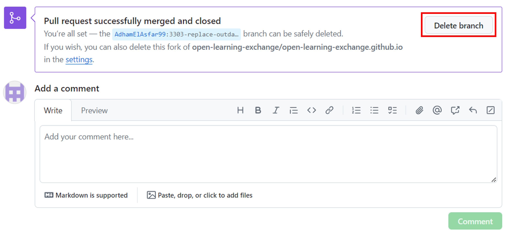

# Creating a Pull Request and Deleting a Branch Tutorial

A pull request is a proposal to merge modifications from one branch into another. It allows collaborators to review and discuss the proposed changes before integrating them into the main codebase. [This guide on Pull Requests](https://docs.github.com/en/pull-requests/collaborating-with-pull-requests/proposing-changes-to-your-work-with-pull-requests/about-pull-requests) contains more information on their propar usage.

## 1. Open a Pull Request

Now, go to your forked repository on GitHub by visiting `https://github.com/YourUsername/YourUsername.github.io`. GitHub will detect that you recently pushed a new branch.

1. Click the "Compare & pull request" button as highlighted in the screenshot below. If it doesn't appear, go to the 'Pull requests' tab and click on the "New pull request" button.

   

2. **Follow the pull request template  carefully and complete the necessary details in the description.**

   

   There are a few things to watch out before clicking on the "Create pull request" button. Make sure you:
      - add title and issue number(when applicaple) in the title field
      - fill the checkboxes
      - write description
      - add RawGitHack Preview link
      - verify you satisfied the requirements you are creating this pull request for

3. Submit the pull request

4. Once redirected to the newly created pull request, complete the tasks listed under "After Creating the Pull Request" by ticking each checkbox as you finish them.

5. Post the link to your pull request in the chat along with any required links. 

    A member of our team will review your changes and notify you on Discord. Reviewers often provide feedback, so be prepared to address their suggestions or corrections. If you receive feedback, make the necessary changes in your branch by navigating to the file in your forked repository or by clicking on the pull request's "Files changed" tab, selecting "...", and then "Edit file." Leave a comment on the pull request once you're finished, and don't forget to notify us on Discord. Any updates you make to your branch will automatically reflect in the pull request.

6. Wait for the pull request merge then come back so you can delete your branch.

## 8. Delete the Branch

* **Delete the branch from your remote repository.**
After your pull request has been approved and merged by OLE staff, you might want to delete the branch that is associated with your pull request. It can keep your local and remote (yourUserName.github.io on GitHub) repository away from a mess of defunct branches. To delete the defunct branch in your remote repository, you can click the "Delete branch" button in your pull request (see the picture below).

* **Delete the branch from your local repository.**
To delete the defunct branch in your local repository, use the command `git branch -d <yourLocalBranchName>` (make sure you are not on the branch that you want to delete). Go [here](https://tecadmin.net/delete-git-remote-and-local-branch/) to find out more about how to delete a branch locally.
