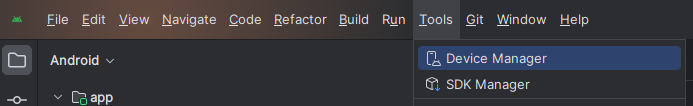
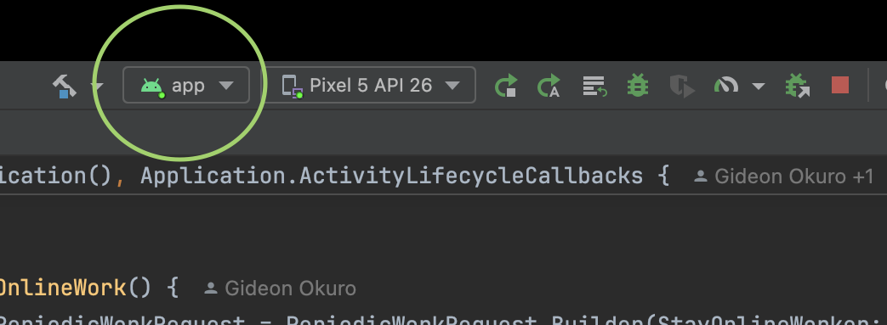

# Step 3 - myPlanet and Android Studio

## Preparation

Follow [Cloning a repository - GitHub Docs](https://docs.github.com/en/repositories/creating-and-managing-repositories/cloning-a-repository) to clone [OLE's myPlanet repository](https://github.com/open-learning-exchange/myplanet) onto your local machine.

## 1. Download and Open Android Studio

- Go to [Install Android Studio | Android Developers](https://developer.android.com/studio/install) and follow the steps to install Android Studio.
- Launch Android Studio on your computer. If this is your first time using Android Studio, it may take a moment to set up the initial configuration.
- Update Android Studio (if already installed). Open Android Studio.
  Navigate to Help -> Check for Updates. Android Studio will check for any available updates.

## 2. Open the Project

- On the welcome screen, click the "Open" button. Alternatively, if you have a project already open, you can navigate to "File" > "Open..." from the top menu bar.
- A file dialog box will appear. Navigate to the location where your project's repository folder is located.

## 3. Gradle Build

After importing the project, Android Studio will perform a Gradle build, which may take a few moments. Gradle is the build system for Android projects, and it will download any necessary dependencies for the project.

## 4. Configure Emulator

To avoid overriding the app on your physical device and to ensure crash reports are sent, we need to set up an Android emulator for this step. Open 'Tools' > 'Device Manager.'   

Click the + icon to create a new virtual device. You should see this pop up:

Follow the prompts to select a hardware, click next and choose a system image. Continue and finish configurations. You may change the device name if you'd like.

## 5. Select Run Configuration

In Android Studio's toolbar, select the desired run configuration from the drop-down menu. It would be `app` in our case.

## 6. Run the App

Click the green "Run" button to install and launch the app on the emulator.

## 7. App Launch

After installing the app on your emulator, it will launch automatically. Approve any permission requests to continue. Once the app is running, take a screenshot from your emulator and share it in the Discord channel to let us know you completed step 3.

## Useful Links

- https://github.com/open-learning-exchange/myplanet?tab=readme-ov-file#getting-started-for-interns

#### Return to [First Steps](mi-10-steps.md#Step_3_-_Build_myPlanet_in_Android_Studio)
