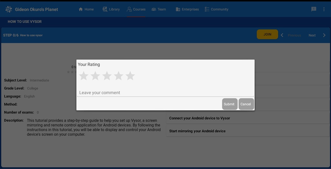

# Take a Course on myPlanet, Courses Gardening

## myPlanet App Dashboard and Courses Overview

After logging into the myPlanet app, you'll land on the dashboard, the central hub where you can access key features and tools. The dashboard offers shortcuts to frequently used features, personalized recommendations, notifications, progress updates, and more.

To access the course catalog, click on the "Courses" section on the dashboard. This will take you to a page displaying all available courses.

To view the courses you've already joined, use the sidebar menu by swiping from the left or clicking the Planet logo in the upper left corner and select "myCourses." This will direct you to a dedicated page showing the courses in which you're currently enrolled.

After completing a course, rate your experience by using the star rating system. Click on the stars to indicate your level of satisfaction with the course content, presentation, and overall usefulness.

Your feedback helps course creators improve content and aids other users in choosing the best courses for them.

## "GitHub Issues and Pull Requests" Course

Follow these steps below to join and take the "GitHub Issues and Pull Requests" course:

- **Explore Available Courses:** Go to the "Courses" tab, where you'll find a list of courses.
  - On smaller devices, open the menu by swiping from the left or clicking the Planet logo in the upper left corner.
- **Select and Join a Course:** Find and choose the "GitHub Issues and Pull Requests" course. Click the yellow "Join" button on the course detail page.
- **Access the Course:** Go to the "myCourse" tab to view your courses. Take a screenshot there.
- **Begin the Course:** Start by reading the course description. Click "Next" to go to course step 1.
- **Engage with Course Materials:** After reading through step 2, complete the test by clicking on the blue "TEST" button.
- **Provide Feedback:** Once you are finished and back to the myCourses screen, rate the course and leave a comment. Take a screenshot there.
- **Sync Your Course Rating Back to the Nation:** Click on the 3-dot menu on the upper right corner of the screen, select "Sync Now".

**NOTE**: Let us know you are on step 7 in the discord channel, send the two screenshots you took. Be sure to tag @okurole_25668 and @dogi in your message.

## Gardening

**Attention**: Please skip this section for now since it's under construction...

There are a few nations we
- vi - for virtual interns like yourself, most suitable for experimenting with things
- learning - android
- guatemala - Spanish speaking

#### Return to [First Steps](mi-10-steps.md#Step_7_-_Take_a_Course_on_myPlanet,_Courses_Gardening)
