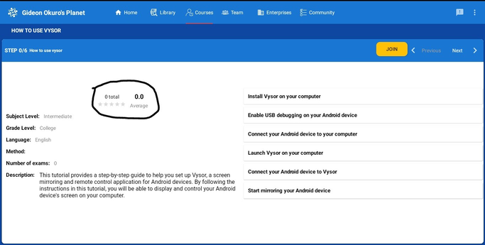

# myPlanet Course

**Attention**: This page is under construction. Please don't hesitate to reach out to us on Discord if you have any questions.

To gain a better understanding of the myPlanet app's capabilities, it's helpful to take courses that explain specific features. In this step, you'll learn how to navigate the myPlanet dashboard and join the "How to Use Vysor" course to understand screen mirroring and remote control. Here's how to proceed:

- After successfully logging into the myPlanet app, users are directed to the myPlanet dashboard, which serves as the home screen of the application. The dashboard provides a centralized and convenient hub where users can access various features, information, and tools available within the app.
- On the myPlanet dashboard, users may find a range of options and widgets tailored to their preferences and needs. These can include shortcuts to frequently used features, personalized recommendations, notifications, progress updates, and more. The dashboard is designed to provide users with a quick overview and easy navigation to different sections of the app.
- To proceed further and access the courses offered within the myPlanet app, users are instructed to click on the "courses" section. This action will take them to a dedicated page or view that presents a list of existing courses available within the app's catalog.
    
     

- To enhance your understanding of Vysor, a screen mirroring and remote control application, you should consider enrolling in the "How to Use Vysor" course. This course can be found within the courses tab of myplanet.
- Once you locate the course, click on it to join and access the valuable content it offers. The course is designed to provide you with a comprehensive understanding of Vysor's features and functionalities. It will guide you through various steps and procedures involved in effectively utilizing Vysor.

  
- In addition to accessing the list of existing courses through the main "courses" section, the myPlanet app also provides a convenient sidebar feature that allows users to easily view and access the courses they have already joined or enrolled in.
- To view the courses a user has joined, they are instructed to select the "myCourses" option within the sidebar. By clicking on or tapping this option, the user is directed to a dedicated page or view that specifically displays the courses they are currently enrolled in.  
    
  
- Throughout the course, you will learn how to connect your device to Vysor, mirror your device's screen onto your computer, and navigate the different control options available. By following the instructions and completing the course steps, you will gain practical knowledge and confidence in using Vysor.
- After you finish all the course steps, it is encouraged to provide feedback on your learning experience by rating the course. To do this, locate the star rating system, which should be displayed in an image or visual representation on the course page.
- Simply click on the stars to indicate your level of satisfaction with the course content, presentation, and overall usefulness.

  
  
- Your rating will serve as valuable feedback for the course creators, helping them improve the course and cater to the needs of future learners. Additionally, your rating will also assist other users in assessing the quality and relevance of the "How to Use Vysor" course

**NOTE**: Capture screenshots of your myPlanet dashboard and myCourses page(with the rated course) and send the screenshots to the discord channel. Be sure to tag @.giddie and @dogi in your message.
