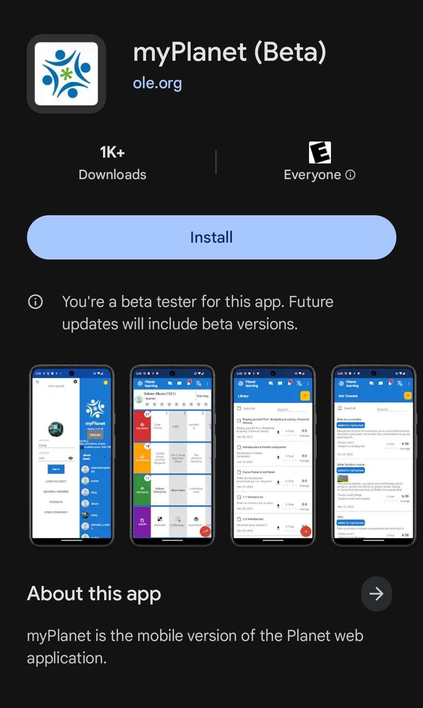
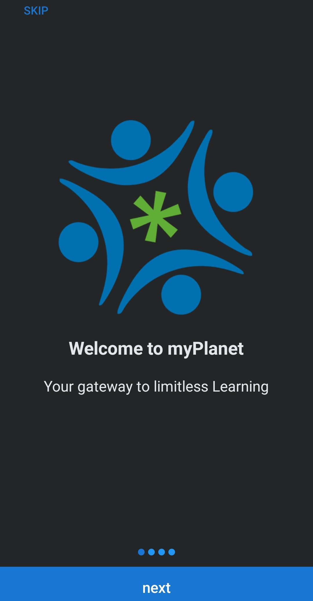

# Step 2 - myPlanet App

myPlanet is an Android app available on the Play Store. You can search for it directly in the Play Store or install it using [this Google Play link](https://play.google.com/store/apps/details?id=org.ole.planet.myplanet).

Before installing, make sure:
- The app name is **myPlanet (Beta)**
- The developer is **ole.org**
- The app icon matches the one shown above

This helps ensure you are installing the correct application.

---
Next, you will see the welcome screen that says **“Welcome to myPlanet.”** Tap **Next** to continue.

## Enroll in Beta Testing

Join as a beta tester to help us improve the app:

- **From a Phone:**  
  Join in Google Play on Android via [myPlanet's app detail page](https://play.google.com/store/apps/details?id=org.ole.planet.myplanet).  
  Scroll to the bottom, under “Join the beta,” and tap **Join**.

- **From a Laptop or Desktop Computer:**  
  Join on the web via [this link](https://play.google.com/apps/testing/org.ole.planet.myplanet).

After enrolling, there may be a delay before the update button appears in Google Play to install the beta version of the app.

## Testing the App

Once you’ve enrolled in beta testing and installed the beta version of the app, follow these steps:

1. Launch the beta version of the app and grant the necessary permissions.
2. Tap the gear icon in the upper-right corner after passing the intro screen.
3. Select the **"planet learning" server** to sync automatically and wait for the sync to complete.
4. Log in as a guest using the **"LOG IN AS GUEST"** option.
5. Explore the app for at least **15 minutes**:
   - Take screenshots.
   - Attempt to crash the app by exploring various features.

6. Update us on Discord with your findings:
   - If the app crashes, report:  
     `I'm on Step 2, spent about xx minutes in the myPlanet app and crashed it when navigating to ...`
   - If the app does not crash, report:  
     `I'm on Step 2, spent about xx minutes in the myPlanet app and it did not crash.`

Details about crashes might take up to 24 hours to appear in the Google Play Console on our end.

[**Return to First Steps**](mi-10-steps.md#Step_2_-_myPlanet_App)
