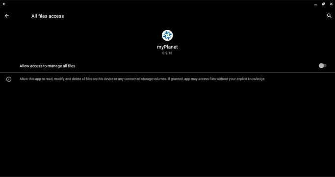
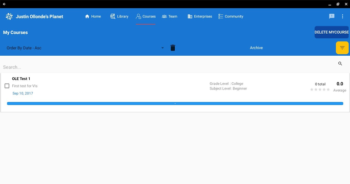
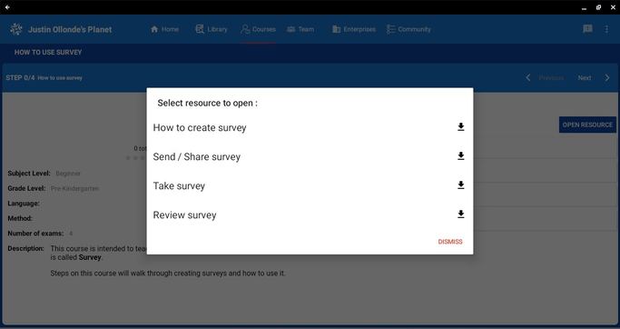

# Overview of myplanet

myPlanet is our mobile effort of Planet application. myPlanet connects with the Planet server to get data. Using myPlanet you can have an offline experience of our Planet application.
We suggest you play around a bit, try to explore and feel comfortable with myPlanet.

## Launching the app

In this section, we will allow permissions required for use in myPlanet.

- To start using myPlanet, the app requires certain permissions from the user. These permissions include access to storage (to save and retrieve data), location (for location-based features or services), audio (possibly for recording or playing audio content), and camera (for capturing images or utilizing augmented reality features, if applicable).
  
    
    

- After granting the necessary permissions, the next step in the process involves configuring the IP address and pin in order to establish a connection with the Planet server. The IP address is likely the network address or hostname of the server where the Planet application's data is stored. The provided pin is a security measure to ensure authorized access to the server.
- Once the IP address and pin have been correctly configured, the user is instructed to click on the "sync" button within the myPlanet app. This action initiates the synchronization process, where the app communicates with the Planet server to retrieve the latest data and updates.
- During the sync process, it is important to allow sufficient time for the app to connect and retrieve the necessary information from the server. The duration of the sync may vary depending on factors such as network speed and the amount of data being synchronized.
- Upon the successful completion of the sync, the user is prompted to enter their login credentials. This typically includes providing a username associated with their Planet account, as well as a corresponding password. These credentials are necessary for the app to authenticate and verify the user's identity, ensuring that only authorized individuals can access the account and its associated data.
- By entering the required credentials and logging in, the user gains full access to the myPlanet app's features and functionalities, including the ability to explore, interact, and enjoy an offline experience of the Planet application
    
    
    

## Dashboard
- After successfully logging into the myPlanet app, users are directed to the myPlanet dashboard, which serves as the home screen of the application. The dashboard provides a centralized and convenient hub where users can access various features, information, and tools available within the app.
- On the myPlanet dashboard, users may find a range of options and widgets tailored to their preferences and needs. These can include shortcuts to frequently used features, personalized recommendations, notifications, progress updates, and more. The dashboard is designed to provide users with a quick overview and easy navigation to different sections of the app.
- To proceed further and access the courses offered within the myPlanet app, users are instructed to click on the "courses" section. This action will take them to a dedicated page or view that presents a list of existing courses available within the app's catalog.
    
            
        
- The courses section is likely designed to provide users with an organized and accessible way to explore the educational or informative content provided by the Planet platform. The list of courses may include various topics, levels of difficulty, formats (such as video-based courses, text-based courses, or interactive modules), and other relevant details.
- By clicking on a specific course from the list, users can access detailed information about the course, including its description, duration, prerequisites, instructor details, and any additional resources or materials associated with it. From there, users can choose to enroll in a course, track their progress, and engage with the course content according to the features and functionalities offered by the myPlanet app.
    
    

- In addition to accessing the list of existing courses through the main "courses" section, the myPlanet app also provides a convenient sidebar feature that allows users to easily view and access the courses they have already joined or enrolled in.
- To view the courses a user has joined, they are instructed to select the "myCourses" option within the sidebar. By clicking on or tapping this option, the user is directed to a dedicated page or view that specifically displays the courses they are currently enrolled in.  
    
    

- Click a course to be able to view the course details. On the course details page download all the resources in that course. After downloading you’ll now be able to go through the course and learn from it
  
    
    

## Useful Links
[myPlanet github repository](https://github.com/open-learning-exchange/myplanet)
