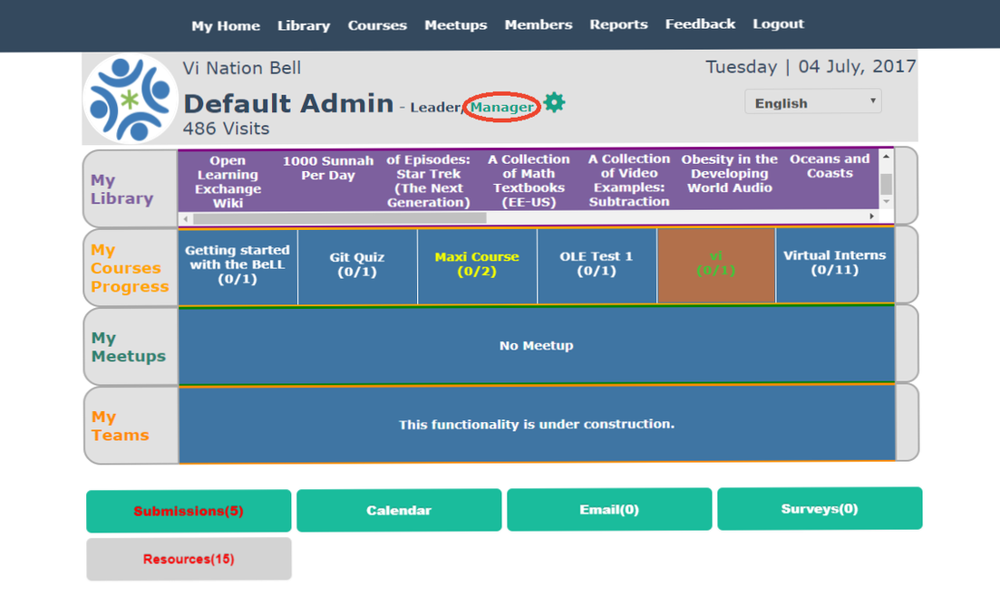

#Nation BeLLs

In step 4, you registered your community BeLL with the nation. Now, you will learn how to keep your community BeLL in sync with the nation.

There should be constant communication between the nation and the communities. While is not necessary for remote communities in the field, it is ideal for our goals of improving the software and testing the increasing forms of communication and feedback between the nation and the communities. This communication takes the form of a syncing process from the community side, where you select material to send to the nation.

After you register your community, but before you can sync with the nation, you need to create an additional dummy user on your community. Therefore, create a quick additional user under "Become a Member" on the login page (NOTE: When creating the dummy user, don't give it a password that you actually use, as other people logged in as admin may be able to see it). Then, login and double-check that you're listed under Members. Then, log out and log back in with your admin account. Now that your community has a user, you can sync with the nation.

As you can see from the picture below, click on "Manager".

Next, click on "Sync with Nation".

Then, "Select All" and click "Send".

You have now sent all activities on your community to the nation. To explain further, the nation receives a number of data points: number of resources opened, number of logins, number of members, resource ratings, technical feedback, and resource requests. We don't get specific information on individual users, but rather usage and feedback as whole.

> On the nation side ([vi.ole.org](http://vi.ole.org)), you can log in as admin/password and check that the sync worked. Click on "Manager" once again.

Then, click on "Communities" to access reports from various communities on the nation.

Then, you should see a list of communities and the option to generate a report if you so wished.

This is the usual syncing process from the community side. There are three other important kinds of updates that you receive on the community side: updates, publications, and surveys.  

As you can see from the image below, there is an update ready to be downloaded. Usually, next to the update, you should also see two publications ready to be downloaded. 

First, click the "Update Available" button and it will reload your homepage with a successful update message. An update refers to a new software update which improves the software. Next, click on "Publications" and sync the publications. Publications add new resources or courses to your library. Last, repeat the process of sending an activities sync to the nation.

##Useful Links

[Helpful links and videos](faq.md#Helpful_Links)

####Return to [First Steps](firststeps.md)
